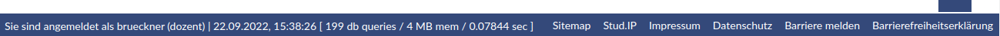
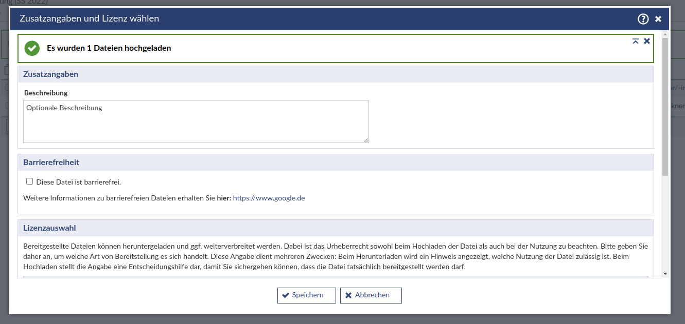
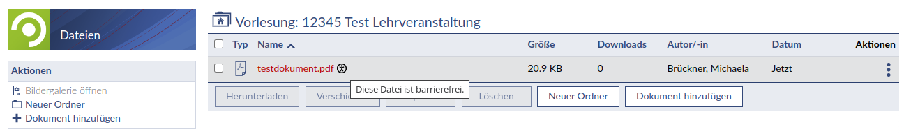
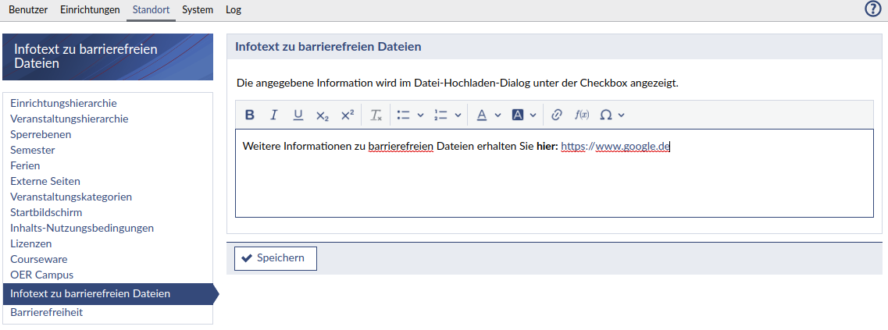

Eine Zugänglichkeit des Lernmanagementsystems soll für ALLE Menschen erreicht werden. Daher geht man heute nicht mehr von dem im Grunde überholten Begriff behindertengerecht aus. Barrierearmut oder sogar -freiheit verbessert die Bedienbarkeit von Software für jede:n und ist damit inklusiv.
Nicht nur Menschen mit permanenten motorischen, visuellen oder akustischen Einschränkungen sind betroffen. Es kann auch immer situative Einschränkungen geben, eine laute Umgebung, grelles Licht oder gleichzeitige Tätigkeiten beim Bedienen wie etwa telefonieren oder eine Verletzung. Daher nutzt uns allen eine Verbesserung von Webseiten und den webbasierten Lernmanagementsystemen wie Stud.IP. Behindert ist man nicht, behindert wird man.

Eine ausführliche Einleitung, die auch auf die gesetzlichen Vorgaben und die Vorgehensweise in Projekt und Community eingeht, 
lesen Sie [hier](a11y/background.md).

Um Barrieren in Stud.IP zu vermeiden, ist es notwendig, die folgenden Hinweise zur Barrierefreiheit zu beachten und bestimmte Konstrukte im HTML-Code, sowie in CSS-Regeln zu vermeiden.

## Erklärung zur Barrierefreiheit der Website/App und Feedbackmechanismus

Es muss eine separate Seite geben, auf der beschrieben wird, inwieweit das Webangebot bzw. die App barrierefrei ist und welche Bereiche (noch) nicht barrierefrei sind. Eine Mustererklärung zur Barrierefreiheit findet sich auf der folgenden Seite in der Dokumentation:
[Mustertext zur Erklärung der Barrierefreiheit](a11y/declaration_template.md)

Zusätzlich muss die Möglichkeit geschaffen werden, dass Nutzende die Seitenbetreiber auf Mängel in der Barrierefreiheit hinweisen. Beide Seiten müssen von jeder Seite aus erreichbar sein. In Stud.IP werden diese daher im Footer platziert. Beispiel:

```php
    $navigation = new Navigation(dgettext("accessibleform", "Barriere melden"));

    $navigation->setURL(PluginEngine::getURL($this, [], 'form/index/'));

    Navigation::addItem('/footer/form', $navigation);
```

Und so sieht der Footer dann in Stud.IP aus:



## Farben und Kontraste

Es gibt Richtlinien für Kontrastverhältnisse von, Text zu Hintergrund, Vordergrundfarbe zum Hintergrund und von Grafiken zum Hintergrund. Damit gemeint ist der Helligkeitsunterschied zwischen zwei benachbarten Farben. Dieser reicht vom schlechtesten Kontrast von 1:1, bei dem Farben identisch sind bis zum bestmöglichen Kontrast von 21:1 (schwarz auf weiß oder umgekehrt).

### Anforderungen zum Kontrastverhältnis

In den WCAG (Web Content Accessibility Guidelines) finden sich drei Punkte (Erfolgskriterien) zum Kontrastverhältnis:

- **WCAG 1.4.3:** Mindestkontrast 4,5:1 bzw. 3:1 (großer Text)
- **WCAG 1.4.6:** Erhöhter Kontrast 7:1 bzw. 4,5:1 (großer Text)
- **WCAG 1.4.11:** Nicht-Text-Kontrast

Diese Anforderungen gelten für Texte und Grafiken, die einen **Informationswert** besitzen. Reine **Schmuckbilder und -schriften** ohne für den Nutzenden relevante Information sind davon **ausgenommen.**

### Textkontraste

Generell gilt: Es wird zwischen kleineren und größeren Schriftgrößen unterschieden. Ein Mindestkontrastverhältnis von 4,5:1 ist für alle Schriftgrößen anzustreben. In Ausnahmefällen reicht ein Wert von 3:1; ideal ist jedoch ein Wert von 7:1.

Für Schriftgrößen unter 24px oder 18pt (18,7px, beziehungsweise 14pt bei fetter Schrift) reicht ein Mindestkontrastverhältnis von 4,5:1.

Für Schriftgrößen ab 24px oder 18pt reicht ein Mindestkontrastverhältnis von 3:1.

#### Linkhervorhebungen

Linkhervorhebungen müssen deutlich gekennzeichnet werden, sowohl mit einem ausreichend hohen Kontrast von (mindestens) 3:1 sowie durch andere Hervorhebungen, beispielsweise Unterstreichungen.

Wird der Link fokussiert (CSS-Pseudoklassen :hover und :focus) muss der Kontrast noch verstärkt werden, beispielsweise durch eine andere Farbe. Auch hier ist auf ausreichenden Kontrast zum Hintergrund zu achten. Wenn dieser nicht ausreichend ist, muss eine Hervorhebung des fokussierten Links erzeugt werden.

### Kontraste von Elementen, die kein Text sind

Dieser Punkt betrifft grafische Elemente, wie zum Beispiel Icons, Diagramme oder Symbole.

Wichtige Elemente des User Interface (Buttons, Icons) sowie grafisch dargestellte Informationen (Diagramme) dürfen Informationen nicht ausschließlich durch Farben vermitteln.

Aktive Menüpunkte oder Icons, die einen aktiven Zustand kennzeichnen (zum Beipsiel Textformatierungswerkzeuge und Checkboxen), müssen von inaktiven Elementen klar unterscheidbar sein. Das Mindestkontrastverhältnis für alle Zustände beträgt 3:1.

Von Farbänderungen ausgenommen sind beispielsweise Flaggen, Hitzekarten, Logos und andere grafische Elemente, bei der sich durch eine Farbänderung eine Änderung der Bedeutung ergeben würde.

### Ausnahmen

Von den Richtlinien ausgenommen sind folgende Elemente:

- rein dekorativer Text, der keinen Informationswert besitzt
- Logos oder Text in Logos
- native UI-Komponenten
- inaktive Elemente wie Schaltflächen, die mit „disabled“ gekennzeichnet sind
- der browsereigene Fokus-Indikator, sofern er die Kontrastvoraussetzungen erfüllt

## Tastaturbedienbarkeit

Tastaturbedienbarkeit bedeutet, dass alle Elemente einer Seite auch per Tastatur erreichbar sind und ohne die Bedienung der Maus oder anderer Eingabeelemente genutzt werden können.

### Steuerung über die Tastatur

Eine sehr grundlegende Steuerung per Tastatur kann über die Tabulator-Taste erreicht werden. Damit kann durch alle fokussierbaren Elemente navigiert werden. Durch die Tastenkombination der Tabulatortaste mit der Umschalttaste navigiert man rückwärts durch die fokussierbaren Elemente.

Bei auswählbaren Elemente wie Checkboxen und Radio-Buttons können die Pfeiltasten zur Navigation durch die Einträge verwendet werden.

Durch Betätigen der Leertaste lassen sich Checkboxen und Radio-Buttons aktivieren oder deaktivieren. Select-Felder lassen sich damit auch öffnen.

Die Eingabetaste dient zum Folgen von Links, Betätigen von Buttons, der Auswahl eines Eintrags eines Select-Feldes und zum Absenden von Formularen.

Screenreader bieten zusätzliche Tastenkombinationen und Tastenbelegungen an, mit denen schnell zu Textabsätzen, Tabellen, Regionen der Seite oder Links navigiert werden kann. Diese sind jedoch je nach verwendetem Screenreader unterschiedlich.

### Zurücksetzen der Fokussierung vermeiden

Es muss sichergestellt sein, dass ein Zurücksetzen der Fokussierung beim Öffnen oder Schließen von Dialogen oder anderen Elementen vermieden wird. Ein Zurücksetzen führt dazu, dass wieder das erste fokussierbare Element der Seite im Fokus ist statt dem Element, mit dem der Dialog geöffnet wurde. Dadurch kann der Weg durch alle fokussierbaren Elemente zurück zum Inhalt der Seite, auf dem man zuvor war, sehr lange und beschwerlich sein. Auch ein Sprung hinter das letzte fokussierte Element muss vermieden werden, da sonst als nächstes das erste fokussierte Element der grafischen Oberfläche des Browsers im Fokus steht und der Weg zurück zum Seiteninhalt nochmal länger ist.

### Skiplinks

Skiplinks erleichern die Bedienung einer Seite, da man dank ihnen direkt zum interessanten Bereich der Seite springen kann und nicht gezwungen ist, alle Elemente einer Seite in der üblichen Reihenfolge durchzugehen, bis man das richtige Element gefunden hat.

In Stud.IP hilft die SkipLink-Klasse bei der Bereitstellung dieser Funktionalität. Es lassen sich damit bestimmte Seitenelemente anspringen und fokussieren. Wird ein Skiplink hinzugefügt, kann dessen Position ebenfalls festgelegt werden.

#### Standardmäßig vorhandenen Skiplinks und deren Positionen

Folgende Skiplinks sind standardmäßig im Stud.IP aktiviert:

| Name | Element-ID | Position\*\* |
|------|------------|--------------|
| Profilmenü | header_avatar_image_link | 1 |
| Hauptnavigation | barTopMenu | 2 |
| Zweite Navigationsebene\* | tabs | 10 |
| Dritte Navigationsebene\*\* | nav_layer_3 | 20 |
| Aktionen\*\* | sidebar_actions | 21 |
| Hauptinhalt | layout_content | 100 |
| Fußzeile\*\* | layout_footer | 900 |
| Suche\*\* | globalsearch-input | 910 |
| Tipps & Hilfe\*\* | helpbar_icon | 920 |

\*= bis Stud.IP 5.0: Erste Reiternavigation

\*\*=erst ab Stud.IP 5.1

#### Skiplink hinzufügen

Es können z.B. in Plugins zusätzliche Skiplinks hinzugefügt werden, wenn diese auf ein Element verweisen, das schnell erreichbar sein soll. Dazu wird die SkipLink-Klasse folgendermaßen aufgerufen:

```php
//Füge den Skiplink mit der Beschriftung „Neuer Skiplink“ hinzu, der auf
//das Element mit der ID „id_zum_element“ verweist. Der Skiplink soll an
//die Position 200 gesetzt werden und nicht von anderen Codestellen
//überschreibbar sein (false):
SkipLinks::addIndex('Neuer Skiplink', 'id_zum_element', 200, false);
```

Neue Skiplinks sollten nur sparsam hinzugefügt werden und nicht zwischen den Skiplinks des Kernsystems platziert werden, damit das „Muskelgedächtnis“ für die Standard-Skiplinks bei der Bedienung mit der Tastatur funktionieren kann.

## Verwendung von ARIA-Rollen und -Landmarks

Nicht alle ARIA-Rollen können sinnvoll in Stud.IP verwendet werden. Andere können zwar im Prinzip verwendet werden, aber besser wäre in dem Fall, das zugrundeliegende HTML zu ändern.

### „menu“ und „menuitem“ nicht verwenden

Die Rollen „menu“ und „menuitem“ sollten in Stud.IP nicht verwendet werden. Hintergrund ist, dass „menu“ ein Menü beschreibt, das genauso bedienbar sein soll, wie das Menü einer Desktop-Anwendung: Pfeiltasten statt Tab oder Umschalt-Tab. Bei einem HTML-Element mit der Rolle „menu“ sagen Screenreader wie JAWS, das Element sei mit Pfeiltasten bedienbar, was im Stud.IP-Kontext bei keinem Menü der Fall ist.

Mehr Informationen zur Problematik der „menu“ und „menuitem“-Rollen findet sich hier: https://adrianroselli.com/2017/10/dont-use-aria-menu-roles-for-site-nav.html


## Testen mit Screenreadern

Um zu testen, dass eine Entwicklung auch für Blinde oder Personen mit sehr eingeschränkter Sicht nutzbar ist, können Screenreader genutzt werden. Mit ihnen wird der Inhalt einer Seite vorgelesen. Über besondere Tastenkombinationen können bestimmte Elemente einer Seite direkt angesprungen werden, um eine langwierige Navigation über die Tabulator-Taste zu vermeiden.

## Welche Screenreader gibt es?

* Für Windows: JAWS oder NVDA
* Für Mac OS X und iOS: VoiceOver
* Für GNU/Linux: Orca
* Für Android: TalkBack in Kombination mit eSpeak

## Kombinationen von Screenreadern und Browsern

Nicht alle Screenreader funktionieren mit allen Browsern gut. Folgende Kombinationen haben sich bei Tests als „harmonierend“ erwiesen:

* JAWS mit Microsoft Edge
* Orca mit Chromium

## Barrierefreiheit in Stud.IP

### Dateimarker für barrierefreie Dateien und dessen Konfiguration

Ab Stud.IP 5.3 gibt es die Möglichkeit, eine Datei beim Upload als "barrierefrei" zu markieren. Dazu wurde der bestehende Dialog umgebaut und um einen Barrierefreiheits-Bereich erweitert. Dort befindet sich eine Checkbox, mit der man bestätigen kann, dass die eben hochgeladene Datei barrierefrei ist.



Ist eine Datei barrierefrei, so taucht in der Dateienliste ein Barrierefreiheitssymbol hinter dem Dateinamen auf.



Der Infotext **unter** der Checkbox lässt sich im Adminbereich auf Wunsch anpassen, beispielsweise um Verlinkungen oder Mailadressen von Ansprechpartner hinsichtlich Barrierefreiheit.



Hinweis: Eine Datei kann jederzeit nachträglich als barrierefrei/nicht barrierefrei gekennzeichnet werden.

### Neue HTML-Struktur (ab Stud.IP 5.3)

Um den Aufbau von Seiten in Stud.IP verständlicher und kompatibler für Screenreader zu machen, wurde für Version 5.3 die gesamte HTML-Struktur überarbeitet. Dokumentation hierzu (inklusive einer Übersicht aller geänderten Elemente) findet sich [in diesem Artikel](https://gitlab.studip.de/studip/studip/-/wikis/Neue-HTML-Struktur-ab-Stud.IP-5.3).

### Drag & Drop

Generell ist die Benutzung von Drag & Drop mit Herausforderungen verbunden, wenn die Lösung barrierearm
sein soll. Nicht nur braucht es JavaScript-Code, der auf Pfeiltasten-Events reagiert und Elemente
entsprechend positioniert. Die Bereiche der Seite, in denen die Drag & Drop Steuerung genutzt
werden soll, müssen auch die aria-Rolle „application“ erhalten, damit Screenreader wissen, dass
in diesen Bereichen keine speziellen Regeln für bestimmte HTML-Elemente angewendet werden sollen.

Eine genauere Beschreibung der aria-Rolle „application“ und deren Auswirkungen sind bei MDN
zu finden: https://developer.mozilla.org/en-US/docs/Web/Accessibility/ARIA/Roles/application_role

## Weiterführende Links

Die Seite [Tipps und Tricks](a11y/tips.md) zeigt Lösungen für konkrete Probleme auf,
die beim barrierearmen Programmieren auftauchen können.

### Farben und Kontraste

- Kontrastrechner zur Berechnung und Überprüfung barrierefreier Farbkombinationen: https://www.leserlich.info/werkzeuge/kontrastrechner/

### ARIA-Rollen

- https://developer.mozilla.org/en-US/docs/Web/Accessibility/ARIA/ARIA_Techniques

### Skiplinks

- https://www.w3schools.com/accessibility/accessibility_skip_links.php

### FAQ der Bundesfachstelle Barrierefreiheit

- https://www.bundesfachstelle-barrierefreiheit.de/DE/Fachwissen/Informationstechnik/EU-Webseitenrichtlinie/FAQ/fragen-antworten-eu-richtlinie-websites-und-mobile-anwendungen.html
