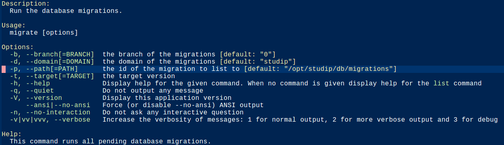

| :pushpin: **Achtung** |
|-----------------------|
| Bis einschließlich **Stud.IP v5.0** finden sich alle Kommandozeilen-Tools als eigenständige Skripte im Ordner `/cli`. Das komplexeste, alte Tool hatte seine eigene Dokumentation: [cli/plugin_manager (alt)](CLIPluginManager) |

Ab **Stud.IP v5.1** sind alle Kommandozeilen-Tools auf die Verwendung der Bibliothek [symfony/console](https://symfony.com/doc/current/components/console.html) umgestellt worden.

## Verwendung

Die Liste aller vorhandenen (Sub-)Kommandos kann mit Hilfe dieses Kommandos angezeigt werden:

```shell
$ cli/studip
```

Daraufhin wird eine Liste ähnlich wie diese hier ausgegeben:


Die dort aufgeführten Kommandos können als erstes Argument zu `cli/studip` verwendet werden. Welche zusätzlichen Optionen zur Verfügung stehen, kann mit Hilfe von `--help` abgerufen werden.

```shell
$ cli/studip migrate --help
```




Jedes der Kommandos bietet ausführlich genug Hilfe zu seiner
Verwendung an.

## Neue Kommandos hinzufügen

Um weitere Kommandos hinzuzufügen, sind drei Schritte notwendig:

- [Dokumentation von `symfony/console`](https://symfony.com/doc/current/components/console.html) lesen
- Neue Klasse in `/cli/commands/{Gruppe}` anlegen. Es gibt schon einige Gruppen. Wenn keine der vorhandenen Gruppen passt, kann eine neue angelegt werden. Gruppen sind gleichzeitig auch Bestandteil des Namespaces der Klasse.
- Klasse in `cli/studip` registrieren. Die neu erstellte Klasse muss dem `$commands`-Array in der Datei `/cli/studip` hinzugefügt werden.

Danach steht das neue Kommando bei Aufruf von `cli/studip` zur Verfügung.
