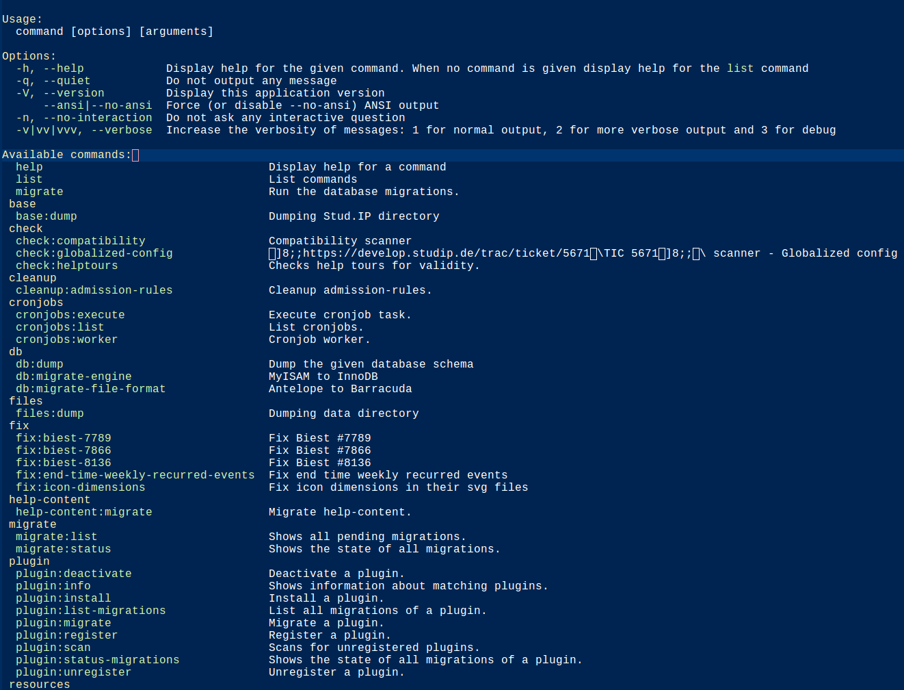

| :pushpin: **Attention** |
|-----------------------|
| All command line tools up to and including **Stud.IP v5.0** can be found as independent scripts in the `/cli` folder. The most complex, old tool had its own documentation: [cli/plugin_manager (old)](CLIPluginManager) |

As of **Stud.IP v5.1**, all command line tools have been switched to using the [symfony/console](https://symfony.com/doc/current/components/console.html) library.

## Usage

The list of all available (sub)commands can be displayed using this command:

```shell
$ cli/studip
```

A list similar to this one is then displayed:



The commands listed there can be used as the first argument to `cli/studip`. The additional options available can be called up using `--help`.

```shell
$ cli/studip migrate --help
```


Each of the commands offers detailed enough help on its
usage.

## Add new commands

To add more commands, three steps are necessary:

- [Read the documentation of `symfony/console`](https://symfony.com/doc/current/components/console.html)
- Create a new class in `/cli/commands/{group}`. There are already some groups. If none of the existing groups fit, a new one can be created. Groups are also part of the namespace of the class.
- Register the class in `cli/studip`. The newly created class must be added to the `$commands` array in the `/cli/studip` file.

The new command is then available when `cli/studip` is called.
