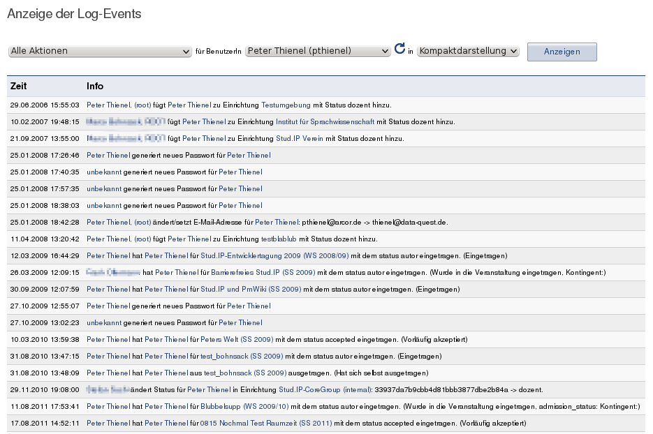

Ab Version 1.3. wurde ein zentraler Logging-Mechanismus implementiert, der bestimmte Aktionen mit Timestamp und Userkennung festhält.

Mit Version 3.0 wurde das Logging so erweitert, dass beliebige Objekte Log-Einträge generieren können.

## Beispiele:

* "Wir nutzen in einigen Fächern Stud.IP zur verbindlichen Anmeldung zu Veranstaltungen, von denen einige sehr hart umkämpft sind. Beim letzten Mal kam es rund ein halbes Dutzend mal vor, dass Studierende behauptet haben, sie hätten sich angemeldet und vor einer Woche noch einen Platz gehabt, aber jetzt sei der weg. Beim momentanen Stand der Dinge haben wir nichts in der Hand, das nachzuvollziehen."
* "Die Zuordnung von Veranstaltungen zu Studienbereichen muss im Zweifelsfall von mehreren Kommissionen genehmigt werden. Stud.IP bietet hier (mit Absicht) keine vollständigen Kontrollmechanismen. Deshalb ist es im Zweifelsfall notwendig nachvollziehen zu können, wer eine Zuordnung vorgenommen hat."
* "Im Zusammenhang mit Raumbuchungen kommt es häufiger zu Fragen, wer einen Raum gebucht hat, oder wann Anfragen geändert wurden."
* "Wir haben ca. 80 Administratoren und es wäre sehr hilfreich nachvollziehen zu können, wer einen Benutzer angelegt, gelöscht, hochgestuft etc. hat."

## Grundlagen:

* Es gibt ein allgemeines Event-System, das von verschiedenen Stellen des Systems aufgerufen werden kann und für einen Event-Eintrag sorgt
* Das Event-System ist datenbankbasiert
* Es gibt eine für Root zugängliche Seite, auf der Log-Events nach verschiedenen Kriterien gesucht und angezeigt werden können
* Die Anzeige erfolgt in gut lesbarer Weise, trotzdem soll die Speicherung ressourcenschonend geschehen und Informationen strukturiert abgelegt werden können.
* Um Datenschutzaspekte angemessen berücksichtigen zu können, kann Root das Logging einzelner Events zentral an- und abschalten (seit Version 1.3. vorhanden) und es kann eine automatische Löschung einzelner Events nach einer bestimmten Zeit aktiviert werden.

### Screenshot:



## Technische Umsetzung

Zugriff auf das Logging erfolgt über die API-Klasse StudipLog, die alle Methoden zur Nutzung des Loggings zur Verfügung stellt.

Jedes beliebigen Objekt kann Ereignisse (die in der Regel das Objekt selbst betreffen) loggen, wenn es die Schnittstelle Loggable implementiert. In der Datenbank registrierte Log-Aktionen können aber prinzipiell an belibiger Stelle genutzt werden.

StudipLog nutzt zwei Modell-Klassen:
* LogAction: Zur Verwaltung der Beschreibung und Daten von Aktionen. Ein LogAction-Objekt ist also eine Vorlage für ein Ereignis, das geloggt werden kann. Z.B. "Austragen des Nutzers X aus Veranstaltung Y durch Nutzer Z".
* LogEvent: Das geloggte oder zu loggende Ereignis. Es enthält die Daten eines konkreten Ereignisses und bezieht sich immer auf eine LogAction. Für die o.g. LogAction wäre das die Daten für X,Y und Z als IDs der jeweiligen Objekte.

Die noch verfügbare globale Funktion log_event() sollte nicht mehr verwendet werden.

### Benutzung der Klasse StudipLog

#### Anlegen einer neuen LogAction

#### Implementierung der Schnittstelle Loggable

Es gibt zwei neue Tabellen:

### log_actions

Entählt Beschreibungen und Daten von Aktionen, wie z.B. "Anlegen einer neuen Veranstaltung".

```sql
CREATE TABLE `log_actions` (
`action_id` INT( 10 ) NOT NULL AUTO_INCREMENT , // ID
`name` VARCHAR( 128 ) NOT NULL , // Bezeichner, wird auch im Code verwendet
`description` VARCHAR(64),  // Kurzbeschreibung für Suchinterface
`info_template` TEXT, // Template für Klartextausgabe
`active` TINYINT( 1 ) DEFAULT '1' NOT NULL , // derzeit aktiv?
`expires` INT( 20 ) , // Anzahl Sekunden bis automatischer Löschung
   PRIMARY KEY ( `action_id` )
  );
```

Ein Eintrag sieht dann z.B. so aus:

```sql
action_id=3,
name=SEM_VISIBLE
description="Veranstaltung sichtbar schalten"
info_template="%user schaltet %sem(%affected) sichtbar."
active=1
expires=NULL
```

Der Info-Template-String kann ein paar Platzhalter enthalten, insgesamt wird daraus bei der Anzeige des Logs der Text generiert, der oben im Scrrenshot zu sehen ist.

expires kann genutzt werden, um Einträge nach einer bestimmten Zeit automatisch löschen zu lassen, z.B. aus datenschutzgründen oder zum Platz sparen. Über ein spezielles Interface (noch nich implementiert) kann das Logging bestimmter Aktionen einfach ein- und ausgeschaltet werden.

Die einzelnen Events werden in einer zweiten Tabelle gespeichert:

### log_events

```sql
CREATE TABLE `log_events` (
`event_id` INT( 20 ) UNSIGNED NOT NULL AUTO_INCREMENT , // ID
`timestamp` INT( 20 ) NOT NULL , // Unix-Timestamp
`user_id` VARCHAR( 32 ) NOT NULL , // Handelnder Nutzer (Subjekt)
`action_id` INT( 10 ) NOT NULL , // Handlung (Verb)
`affected_range_id` VARCHAR( 32 ) , // primär betroffenes Objekt (direktes Objekt)
`coaffected_range_id` VARCHAR( 32 ) , // sekundär betroffenes Objekt (indirektes Objekt)
`info` TEXT, // zusätzlicher Informationstext
`dbg_info` TEXT, // zusätzliche technische Informationen
   PRIMARY KEY ( `event_id` )
);
```

Durch den gewählten Ansatz leistet das Logging zweierlei:

* Lesbare Ausgaben in natürlicher Sprache
* Volle Durchsuchbarkeit nach betroffenen Objekte (Veranst., Räume, Einrichtungen)


## log_event() aufrufen

### Normaler Aufruf

Im Code müssen die Stellen identifiziert werden, an denen eine Aktion ausgelöst wird und meist eine Zeile wie:

```php
log_event("SEM_CREATE",$sem_id);
```

eingefügt werden. Sind mehr als zwei Objekte betroffen, kommen die Zusatzinformationen (nicht durchsuchbar) in den Infotext, z.B. die Angabe über die gebuchte Zeit beim Auflösen einer Raumanfrage. In die Debug-Infos können z.B. Details über die Stelle im Code eingebaut werden, von der aus die Aktion ausgeführt wurde, komplette Queries abegelegt werden etc.

```php
function log_event($action, $affected=NULL, $coaffected=NULL, $info=NULL, $dbg_info=NULL, $user=NULL) {
...
}
```

| Variable | Beschreibung|
| ---- | ---- |
|$action|Text-ID des Log-Events|
|$affected|ID des Objektes, das im Datenbankfeld affected landet (kann je nach Event Veranstaltung, Institut, Nutzer, Ressource, ... sein - da wird nichts gecheckt, sondern einfach eingetragen)|
|$coaffected|ID des Objektes, das im Datenbankfeld coaffected landet (kann je nach Event Veranstaltung, Institut, Nutzer, Ressource, ... sein - da wird nichts gecheckt, sondern einfach eingetragen)|
|$info|Freier Text für Feld info|
|$dgb_info|Freier Text für Debug-Info-Feld|
|$user|Normalerweise wird die user_id des Handelnden aus der Session übernommen. Hier kann eine abweichende user_id angegeben werden, z.B. für Aktionen, die von "[=%%__SYSTEM__%%=]" ausgeführt werden.|

Die Funktion überprüft, ob das Logging eingeschaltet und das gewünschte Event aktiv ist.

TODO: Beispiele... Bis dahin: Im Code nach log_event(...) suchen ;-)

### Fehler beim Logging

Wird ein Event in der Tabelle log_actions nicht gefunden, wird der Event-Call nicht verworfen, sondern unter dem Event LOG_ERROR mit allen übergebenen Parametern im Info-Text gespeichert:

```php
log_event("LOG_ERROR",NULL,NULL,NULL,"log_event($action,$affected,$coaffected,$info,$dbg_info) for user $user");
```

## Eine neue Action hinzufügen

### Eintrag in log_actions

Event-Vorlagen (Actions) werden nicht über die Oberfläche angelegt (würde wenig bringen, da ohnehin Code angefasst werden muss), sondern mit einem SQL-Statement direkt in die Datenbank geschrieben. Die action_id (MD5-Key) kann frei gewählt werden, muss aber eindeutig sein. Es bietet sich an md5(name) zu verwenden.

### Auslösen von Events

Events für die neue Action dann wie oben beschrieben mittels `log_event(<ACTION_NAME>, ...)` ausgelöst werden. Die Semantik der weiteren Parameter ergibt sich aus dem Template in log_actions.

### Abrufen der Events

Die Events stehen anschließend automatisch über das Log-Tool allen Root-Nutzern zur Verfügung (Verwalten globaler Einstellungen -> Tools -> Log). Die neuen Actions sind in der der Auswahlbox links enthalten, angezeigt wird dort der description-Eintrag.

### Beispiel: Action für "E-Mail-Adresse ändern"

Es soll geloggt werden, wer wessen E-Mail-Adresse wann und auf welchen Wert geändert hat.

#### Idee

* WER ändert wird als user_id des Events abgelegt
* FÜR WEN geändert wurde als affected_id
* Der NEUE WERT ist kein Stud.IP-Objekt, muss also als Freitext in info abgelegt werden. Dann besser noch: Neuen UND alten Wert ablegen, also z.B. "von tobias.thelen@beispiel.test auf thelen@anderesbeispiel.test".

#### Der Datenbankeintrag für log_actions:

| Tabelle | Wert |
| ---- | ---- |
|action_id|21b0b3fc30605876686617a1aec92321|
|name|CHANGE_EMAIL|
|description|E-Mail-Adresse ändern|
|info_template|`%user ändert/setzt E-Mail-Adresse für %user(%affected): %info.`
|active|1|
|expires|0|

#### Verwenden des Events:

`log_event("CHANGE_EMAIL",$user_id,*,"von tobias.thelen@beispiel.test auf thelen@anderesbeispiel.test");`

## Standard-Events

```sql
CREATE TABLE `log_actions` (
  `action_id` varchar(32) NOT NULL default *,
  `name` varchar(128) NOT NULL default *,
  `description` varchar(64) default NULL,
  `info_template` text,
  `active` tinyint(1) NOT NULL default '1',
  `expires` int(20) default NULL,
  PRIMARY KEY  (`action_id`)
);

INSERT INTO `log_actions` (`action_id`, `name`, `description`, `info_template`, `active`, `expires`) VALUES ('0ee290df95f0547caafa163c4d533991', 'SEM_VISIBLE', 'Veranstaltung sichtbar schalten', '%user schaltet %sem(%affected) sichtbar.', 1, NULL);
INSERT INTO `log_actions` (`action_id`, `name`, `description`, `info_template`, `active`, `expires`) VALUES ('a94706b41493e32f8336194262418c01', 'SEM_INVISIBLE', 'Veranstaltung unsichtbar schalten', '%user versteckt %sem(%affected) (unsichtbar).', 1, NULL);
INSERT INTO `log_actions` (`action_id`, `name`, `description`, `info_template`, `active`, `expires`) VALUES ('bd2103035a8021942390a78a431ba0c4', 'DUMMY', 'Dummy-Aktion', '%user tut etwas.', 1, NULL);
INSERT INTO `log_actions` (`action_id`, `name`, `description`, `info_template`, `active`, `expires`) VALUES ('4490aa3d29644e716440fada68f54032', 'LOG_ERROR', 'Allgemeiner Log-Fehler', 'Allgemeiner Logging-Fehler, Details siehe Debug-Info.', 1, NULL);
INSERT INTO `log_actions` (`action_id`, `name`, `description`, `info_template`, `active`, `expires`) VALUES ('f858b05c11f5faa2198a109a783087a8', 'SEM_CREATE', 'Veranstaltung anlegen', '%user legt %sem(%affected) an.', 1, NULL);
INSERT INTO `log_actions` (`action_id`, `name`, `description`, `info_template`, `active`, `expires`) VALUES ('5b96f2fe994637253ba0fe4a94ad1b98', 'SEM_ARCHIVE', 'Veranstaltung archivieren', '%user archiviert %info (ID: %affected).', 1, NULL);
INSERT INTO `log_actions` (`action_id`, `name`, `description`, `info_template`, `active`, `expires`) VALUES ('bf192518a9c3587129ed2fdb9ea56f73', 'SEM_DELETE_FROM_ARCHIVE', 'Veranstaltung aus Archiv löschen', '%user löscht %info aus dem Archiv (ID: %affected).', 1, NULL);
INSERT INTO `log_actions` (`action_id`, `name`, `description`, `info_template`, `active`, `expires`) VALUES ('4869cd69f20d4d7ed4207e027d763a73', 'INST_USER_STATUS', 'Einrichtungsnutzerstatus ändern', '%user ändert Status für %user(%coaffected) in Einrichtung %inst(%affected): %info.', 1, NULL);
INSERT INTO `log_actions` (`action_id`, `name`, `description`, `info_template`, `active`, `expires`) VALUES ('6be59dcd70197c59d7bf3bcd3fec616f', 'INST_USER_DEL', 'Benutzer aus Einrichtung löschen', '%user löscht %user(%coaffected) aus Einrichtung %inst(%affected).', 1, NULL);
INSERT INTO `log_actions` (`action_id`, `name`, `description`, `info_template`, `active`, `expires`) VALUES ('cf8986a67e67ca273e15fd9230f6e872', 'USER_CHANGE_TITLE', 'Akademische Titel ändern', '%user ändert/setzt akademischen Titel für %user(%affected) - %info.', 1, NULL);
INSERT INTO `log_actions` (`action_id`, `name`, `description`, `info_template`, `active`, `expires`) VALUES ('ca216ccdf753f59ba7fd621f7b22f7bd', 'USER_CHANGE_NAME', 'Personennamen ändern', '%user ändert/setzt Name für %user(%affected) - %info.', 1, NULL);
INSERT INTO `log_actions` (`action_id`, `name`, `description`, `info_template`, `active`, `expires`) VALUES ('8aad296e52423452fc75cabaf2bee384', 'USER_CHANGE_USERNAME', 'Benutzernamen ändern', '%user ändert/setzt Benutzernamen für %user(%affected): %info.', 1, NULL);
INSERT INTO `log_actions` (`action_id`, `name`, `description`, `info_template`, `active`, `expires`) VALUES ('59f3f38c905fded82bbfdf4f04c16729', 'INST_CREATE', 'Einrichtung anlegen', '%user legt Einrichtung %inst(%affected) an.', 1, NULL);
INSERT INTO `log_actions` (`action_id`, `name`, `description`, `info_template`, `active`, `expires`) VALUES ('1a1e8c9c3125ea8d2c58c875a41226d6', 'INST_DEL', 'Einrichtung löschen', '%user löscht Einrichtung %info (%affected).', 1, NULL);
INSERT INTO `log_actions` (`action_id`, `name`, `description`, `info_template`, `active`, `expires`) VALUES ('d18d750fb2c166e1c425976e8bca96e7', 'USER_CHANGE_EMAIL', 'E-Mail-Adresse ändern', '%user ändert/setzt E-Mail-Adresse für %user(%affected): %info.', 1, NULL);
INSERT INTO `log_actions` (`action_id`, `name`, `description`, `info_template`, `active`, `expires`) VALUES ('a92afa63584cc2a62d2dd2996727b2c5', 'USER_CREATE', 'Nutzer anlegen', '%user legt Nutzer %user(%affected) an.', 1, NULL);
INSERT INTO `log_actions` (`action_id`, `name`, `description`, `info_template`, `active`, `expires`) VALUES ('e406e407501c8418f752e977182cd782', 'USER_CHANGE_PERMS', 'Globalen Nutzerstatus ändern', '%user ändert/setzt globalen Status von %user(%affected): %info', 1, NULL);
INSERT INTO `log_actions` (`action_id`, `name`, `description`, `info_template`, `active`, `expires`) VALUES ('63042706e5cd50924987b9515e1e6cae', 'INST_USER_ADD', 'Benutzer zu Einrichtung hinzufügen', '%user fügt %user(%coaffected) zu Einrichtung %inst(%affected) mit Status %info hinzu.', 1, NULL);
INSERT INTO `log_actions` (`action_id`, `name`, `description`, `info_template`, `active`, `expires`) VALUES ('4dd6b4101f7bf3bd7fe8374042da95e9', 'USER_NEWPWD', 'Neues Passwort', '%user generiert neues Passwort für %user(%affected)', 1, NULL);
```
