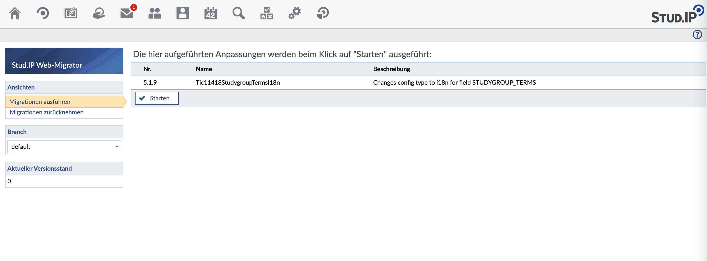

## Basics of migrations

Changes required in connection with an update (especially) to the database schema or content in the database are packaged in *migrations* - these are small, isolated transformations that can be executed in a defined sequence during the update in order to move from one version status to another. If the migrations provide for this, a rollback or downgrade of the database schema is possible in the same way.

There are also migration domains for use in plugins (or for site-specific schema extensions): each domain contains a completely independent collection of migrations that can be executed independently of migrations from other domains. The current schema version is saved separately for each domain, so each plugin in particular has its own space of version numbers for its migrations.

### Structure and numbering

In the simplest case, the migrations form a linear sequence, which was the only possible arrangement up to version 4.3:

```mermaid
graph LR
  subgraph default
  0((0)):::dashed-->1-->2-->3-->4-->5-->6:::current
  end
  classDef current stroke:#000080
  classDef dashed stroke-dasharray:2
```

Exactly one position is marked as the "current schema version" (here in blue). The position "0" must not be assigned as the number of a real migration: It only stands for the position "before all further migrations" (e.g. if none have been carried out yet).

From Stud.IP 5.1 onwards, however, there can also be a "deduction" - this is useful, for example, if you want to add further migrations between status 2 and 3:

```mermaid
graph LR
  subgraph default
  0((0)):::dashed-->1-->2-->3-->4-->5-->6:::current
  2-->2.0
  subgraph two [2]
  2.0((2.0)):::dashed-->2.1-->2.2:::current-->2.3
  end
  end
  classDef current stroke:#000080
  classDef dashed stroke-dasharray:2
```

A branch can be attached at any point, a migration to the corresponding node does not have to exist. A branch always bears the name of the node at which it branches off (in the above example "2"), the versions on the branch are prefixed with this name (followed by a "."), i.e. "2.1" and so on. The position "2.0" is also reserved here and cannot be used as a real migration.

Each branch has its own position marker for the migrations already executed on this branch. In a (mental) linearized sequence of all migrations, all migrations on a branch are arranged between the branch point and its successor node on the parent branch. In this case, this would be: 1, 2, 2.1, 2.2, 2.3, 3, 4, 5, 6.

Of course, branches can also be assigned to branches (as deep as you like):

```mermaid
graph LR
  subgraph default
  0((0)):::dashed-->1-->2-->3-->4-->5-->6:::current
  2-->2.0
  4-->4.0
  subgraph two [2]
  2.0((2.0)):::dashed-->2.1-->2.2:::current-->2.3
  2.1-->2.1.0
  subgraph two-one [2.1]
  2.1.0((2.1.0)):::current-dashed-->2.1.1
  end
  end
  subgraph four [4]
  4.0((4.0)):::dashed-->4.1:::current
  end
  end
  classDef current stroke:#000080
  classDef current-dashed stroke:#000080,stroke-dasharray:2
  classDef dashed stroke-dasharray:2
```

### Structure and numbering in the Stud.IP core

The structure of the migrations in the core currently looks like this (with a small anticipation of 5.2):

```mermaid
graph LR
  subgraph default
  0((0)):::dashed-->1-->5
  1-->1.0
  5-->5.0
  subgraph one [1]
  1.0((1.0)):::dashed-->1.1-->1.2-->1.3-->1.4-.->1.327
  end
  subgraph five [5]
  5.0((5.0)):::dashed-->5.1-->5.2
  5.1-->5.1.0
  5.2-->5.2.0
  subgraph five-one [5.1]
  5.1.0((5.1.0)):::dashed-->5.1.1-->5.1.2-.->5.1.25
  end
  subgraph five-two [5.2]
  5.2.0((5.2.0)):::dashed-->5.2.1-->5.2.2
  end
  end
  end
  classDef dashed stroke-dasharray:2
```

All "old" migrations up to and including 5.0 are on a branch "1", and for current releases ≥ 5.1 there is a separate branch with the name of the release and the associated migrations. For service releases, these branches can be populated with additional migrations independently of each other.

### Structure of migration files (i.e. classes):

Basically, all migration classes must extend the class `Migration`.

They basically consist of at least two functions `up()` and `down()`. The changes for this step are made in `up()` and the changes of the `up()` method are undone in `down()`, if this makes sense. (*->see Irreversible migrations*)

The optional function `description()` provides a short description of the migration to be carried out.

APIs from the core should not be used in core migrations (e.g. `Config`), as there is no guarantee that these will not change. For example, the corresponding database entries should always be made manually. This does not apply to plugins: plugin migrations should always use the corresponding API. However, if plugin migrations use APIs of the plugin, there may be analogous problems to core APIs in core migrations - so be careful here too.

### Naming for the files

The migration files should be numbered consecutively, starting with 1 and always have integer version numbers (1, 2, 3, etc.). There should be no (unnecessary) holes in the numbering, leading zeros may be used (e.g. "001" instead of "1") - these have no effect on the sorting. In addition to the version, there can be a branch that precedes the version number, e.g. "5.1" - the complete designation is then *Branch*`.`*Version*`_klassenname.php`. Examples of this would be 3.1 or 289.5.2. The branch is optional and can be used to subsequently move migrations "between" previous migrations.

As an analogy, the combination of branch and version number can be thought of as a software version designation. This also implicitly results in a sequence of all migrations.

The following numbering scheme is used for the Stud.IP release from version 5.1 onwards (see also the diagram above):

* Old migrations (before 5.1) have numbers on the 1.x branch, i.e. "1.1" etc. New migrations on this branch can no longer exist.
* Migrations from 5.1 onwards are given numbers according to the version from which they were added - e.g. "5.1.1", "5.2.3" etc.
* Migrations with error corrections are given numbers according to the oldest version in which they are to land - but never before 5.1 (because the new schema did not exist before then).

Each domain (i.e. each plugin) has its own count of migration steps and plugins do not have to adhere to the above-mentioned scheme, i.e. they can simply continue to number their migrations consecutively from 1. Plugin migrations can of course also be divided into branches.

### Backporting migrations to old versions

Basically, the idea is that new migrations that need to be backported are directly assigned a version number on the earliest branch to which they are to be ported (i.e. corresponds to the version number on the ticket). This means that the migration has the same name on all release branches.

**Attention**: Of course, this does not work for Stud.IP versions prior to 5.1 - because there are no migrations divided into branches. This means that the migration will have two different numbers if it is ported back to a version prior to 5.1:
- a number with "5.1.x" for Stud.IP version 5.1 and higher
- a number based on the date (old naming scheme) for Stud.IP version 5.0 and below

### Reversible and irreversible migrations

With reversible migrations it is always possible to jump to another version using the `up()` and `down()` methods. In the case of irreversible migrations, the `up()` function changes the existing data in such a way that a call to the `down()` function cannot restore it. In such cases, error handling should take place in the `down()` function of the migration step.

### Execution of migrations

There are two options for executing migrations:

#### Execution via the command line

The `cli` folder contains a script that executes the migrations via the command line. Here it is also possible to trigger migrations in plugins that are not directly supported by the web interface.

##### Possible parameters

| Parameter | Description |
| ------ | ------ |
| d | Domain (default studip) |
| m | File path to the folder with the migration files |
| l | Only list what is to be done, do not migrate |
| t | Target migration (0 for complete reset, otherwise target version number) |
| b | Branch on which the migration should take place (optional) |
| v | verbose (recommended) |

Example: Revert Stud.IP migrations from 6 to 5:
`cli/migrate.php -d studip -t 5 -v`

Example: Output with l parameter:
`cli/migrate.php -d studip -l -t 18`

```
  3 Step87ExternConfigurations Extends table extern_config and converts configurations for the external pages from
    INI-style files to serialized arrays stored in the database.
  4 Step116ParticipantView creates table necessary for StEP116
  5 Step25SpacetimeMigrations modify db schema for StEP00025; see logfile in $TMP_PATH
  6 Step25SpacetimeDbConversion convert dates for StEP00025; see logfile in $TMP_PATH
  7 TableTokenClass creates table for Token class
  8 Step117StudyModule modify db schema StEP00117 study module structures;
  9 StEP00111Admission creates table admission groups
 10 ImageProxy creates table image_proxy_cache and config entry EXTERNAL_IMAGE_EMBEDDING
 11 LockRules creates table for lock rules
 12 Step120Userpic modify existing user pictures according to Step00120
 13 RemoveFieldsFromExtermine removes expire|repeat|color|priority from table ex_termine
 14 StEP00123Admission2 modifies table seminare, adds field `admission_enable_quota`
 15 Step00129EmailRestriction Adds the new Value EMAIL_DOMAIN_RESTRICTION to table config.
 16 Step00126EmbeddingFlashMovies Adds the new values EXTERNAL_
    FLASH_MOVIE_EMBEDDING and DOCUMENTS_EMBEDD_FLASH_MOVIES to table config.
 17 DbOptimierungKontingentierung adds keys in admission_seminar_studiengang, admission_seminar_user and seminar_user
 18 Step00139UploadFileReorg reorganize uploaded files into sub-folders@@
````

#### Execution via the web interface

The *web_migrate* script under `/public/web_migrate.php` has the same functions as the command line version described above, but can be used interactively (see screenshot).



If you select a branch other than "default" on the left, only migrations on or below the selected branch are offered for execution. If there are migrations directly on the selected branch, these can also be selected directly (analogous to the `-t` option in the cli version) - processing then ends when the selected migration is reached.

## Example plugin with migration

Elmar has simply created a small example: the "DummyPlugin" (a plugin, as its use is primarily of interest for the plugin interface). The catalog structure of the plugin looks like this:
```
  DummyPlugin.class.php
  plugin.manifest
  sql/
    sql/dummy_install.sql
    sql/dummy_uninstall.sql
  migrations/
    migrations/1_test.php
    migrations/2_foo.php
```

As before, the SQL files under sql define the "basic layout" for the plugin and are entered accordingly as "dbscheme" (or "uninstalldbscheme") in the manifest, so nothing new so far. What is new is the catalog migrations, which contains the individual deltas that have to be updated from plugin version to plugin version (these are no longer mapped in sql/dummy_install.sql). Each version step of the plugin can have any number of such deltas ( = migrations). All migrations are numbered in ascending order, the file names follow the convention `number_class_name.php`.

Each migration is a PHP class with the operations up() and down(), which can make or undo the respective changes. As an example, here is the content of `migrations/1_test.php`:

```php
  <?
  class Test extends Migration {
      function up () {
          $db = DBManager::get();
          $db->exec("INSERT INTO dummy VALUES (42, 'axel')");
      }

      function down () {
          $db = DBManager::get();
          $db->exec("DELETE FROM dummy WHERE id = 42");
      }
  }
  ?>
```
Instead of entering values in a table, you could of course also create new tables, add or remove fields, convert data or copy it to another table, create files or catalogs, set permissions, etc. (it doesn't have to have anything to do with the DB). (it does not have to have anything to do with the database). The database is accessed as usual via the [DBManager class](Howto/Database access). Everything else happens automatically (for plugins), i.e. when updating a plugin, all necessary changes (i.e. migrations) are carried out on the basis of the current version status or are reversed accordingly when a plugin is downgraded.

PS: If you wish, you can of course also omit "dbscheme" and "uninstalldbscheme" in the manifest and create the complete DB structure for the plugin via migrations.

For an example of the migration of a plugin, here is a small zip file:

[dummy_plugin-v0.3.zip](../assets/0ca19cdf7ae62c47c4a74b0110030059/dummy_plugin-v0.3.zip)
