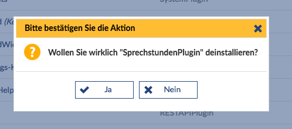

### Server-side generated queries

To create a modal dialog, you can simply use the method `PageLayout::postQuestion();`. This method encapsulates the creation of a corresponding `QuestionBox` object and sets the corresponding parameters. The query is then displayed in the system at the next possible opportunity, analogous to the [`MessageBoxes`](MessageBox).

The `QuestionBox` can send the response both as a `GET` and as a `POST` request. In the standard case with `PageLayout::postQuestion()`, a `POST` request is sent, whereby a simple differentiation between confirmation and rejection of the question can be achieved simply by the request method used.

The function or the creation of a `QuestionBox` requires at least 1, maximum 3 parameters.

#### Parameters
* `$question`: The question or action to be confirmed
* `[$approveParams]`: optional, link parameter for the URLHelper in the event of a positive response, in the form `['name' => value, 'name2' => value2]`.
* `[$disapproveParams]`: optional, link parameter for the URLHelper in the event of a negative response.

The method returns a `QuestionBox` object, which can be manipulated further.

#### Further methods of the QuestionBox

The `QuestionBox` object also provides further methods:

| Function | Description |
| ---- | ---- |
| `setApproveParameters(array $parameters)` | Sets the link parameters for the positive confirmation|
| `setApproveURL($url)` | Sets the URL to be called in case of a positive confirmation|
| `setDisapproveParameters(array $parameters)` | Sets the link parameters for the negative confirmation |
| `setDisapproveURL($url)` | Sets the URL to be called for a negative confirmation |
| `setBaseURL($url)` | Sets the URLs for the positive and negative confirmation to the same value |
| `setMethod($method)` | Sets the request method to be used (it is advisable to always use `POST`; in this case, a valid [CSRF token](CSRFProtection) will always be included in the request) |
| `includeTicket()` | Instructs the QuestionBox to insert a fresh Stud.IP ticket when rendering |


#### Example
```php
PageLayout::postQuestion(_('Do you really want to delete this?'), $accept_url = *, $decline_url = *);
```

#### Screenshot



### Client-side dialogs (*data-dialog "*)

The goals behind this are both a uniform behavior of dialogs within Stud.IP and a simplification for the developer. Ideally, JavaScript no longer needs to be touched in order to use dialogs. The only adjustment on the server side is to mark up the HTML with appropriate attributes and remove the surrounding layout so that only the really relevant content is returned.

#### Integration

Dialogs can be controlled in the HTML at the tags `<a>`, `<button>` and `<form>` via the attribute **`data-dialog`**. Elements marked in this way will display their content in a modal dialog when JavaScript is activated. The content is loaded via AJAX and displayed using jQuery UI's dialog widget. On the server side, a call made from such a dialog can be recognized by the HTTP header 'X-Dialog'.

If a dialog is already open and a correspondingly marked element within the dialog is called, the current dialog is updated, so you remain in the dialog.

Please note: `<script>` tags contained in the return are filtered and executed. This is not a standard behavior of jQuery UI's dialog and should be taken into account (even if such inline javascript should ideally be avoided and global handlers should be used instead).

#### Parameters

The dialog can be controlled via various attribute specifications or HTTP headers, which are explained below. The attribute specifications can also be combined with each other as desired, e.g. `data-dialog="title=foo;size=auto;buttons=false"`.

##### Title

By default, the title of a dialog is the content of the title attribute of the underlying element (if available) and falls back to the text content of the element for the tags `<a>` and `<button>`.  The title can be controlled via various parameters:

| Parameter | Description |
| ---- | ---- |
|`data-dialog="title='Test Title'"` |Sets the title to **Test Title** |
|HTTP-Header `X-Title: Test Title 2` |Sets the title to **Test Title 2** |

##### Size

The size of the dialog is 2/3 of the width and height and the browser window by default. This value can be controlled via optional parameters, whereby the minimum size of the dialog is set to 320x200 pixels:

| Parameter | Description |
| ---- | ---- |
|`data-dialog="width=X"` |Sets the width of the dialog to **X** pixels |
|`data-dialog="height=Y"` |Sets the height of the dialog to **Y** pixels |
|`data-dialog="size=XxY"` |Sets the width of **X** pixels and height of **Y** pixels |
|`data-dialog="size=X"` |Creates a square dialog with **X** pixels width and height |
|`data-dialog="size=auto"` |Tries to adapt the size of the dialog to the loaded content. |
|`data-dialog="size=big"` | Creates a large dialog with a lot of space. |
|`data-dialog="size=medium"` |Creates a dialog with a moderate amount of space. |
|`data-dialog="size=medium-43"` |Creates a dialog with a 4:3 ratio of length to width. |
|`data-dialog="size=big"` |Creates a small dialog that takes up little space. |

##### Buttons

By default, each dialog contains a *Cancel* button at the bottom of the dialog, which closes the dialog.

An attempt is also made to extract buttons from the return so that they can also be placed in the button bar of the dialog. Only the tags `<a>` and `<button>` are considered, which are either directly marked with the attribute `data-dialog-button` or are located below an element which has been marked with the attribute `data-dialog-button`.

Both links and forms can be called up in this way. In particular, this means that a save button of a form can also be located at the bottom of the dialog.

Please note that an existing link/button with the content *Cancel* is overwritten with the standard button, which closes the dialog. This behavior is intentional and should be taken into account during development.

The button bar can be switched off completely using the following mechanisms, which also means that the buttons are not extracted from the returned content:

| Parameter | Description |
| ---- | ---- |
| `data-dialog="buttons=false"` | HTTP header `X-No-Buttons` |


##### Further options

A dialog can be closed using the following mechanisms:

| Parameter | Description |
| ---- | ---- |
| `data-dialog="close"`| HTTP-Header `X-Dialog-Close |
| HTTP header `X-Location: <url>` | When evaluating a return, a reference to another page can also be specified, which exits the dialog. This is done using the following mechanism: |
| `data-dialog="reload-on-close"` | The page surrounding the dialog can be automatically reloaded when the dialog is closed |
| `data-dialog="resize=false"` | The dialog can be set rigidly, i.e. it cannot be resized by the user |
| HTTP header `X-WikiLink: <url>` | The HTTP header `X-WikiLink` can be used to set the page to which the help icon displayed in the title should link: |
| `data-dialog="center-content"` | The content of the dialog can be centered both horizontally and vertically |
| HTTP header `X-Dialog-Execute: <JS function, e.g. STUDIP.Foo.bar>` | Any JavaScript function can be called from the return, to which the body of the request is passed (if this is JSON, it is converted accordingly). If the JavaScript function passed is invalid (not defined or not a function), a corresponding error is thrown. |
| HTTP header `X-Dialog-Execute: {func: <JS function, e.g. STUDIP.Foo.bar>, payload: []}`| Alternatively, a JSON-encoded array with the mandatory entry `func` as the function name and the optional entry `payload` can be passed in this header. This is necessary in situations where the dialog is to be updated (as HTTML via the body of the AJAX response) but changes are also to be made via the specified function `func` using the supplied payload. |


The **CSS class** `hide-in-dialog` can be used to hide content in dialogs.

##### Supported events

JavaScript events are triggered when the dialog is opened and closed to allow the developer to dynamically extend/change the behavior of the content.

* When **opening** the event `dialog-open` is triggered
* When **opening** and **changing** the content of the dialog via AJAX, the event `dialog-update` is triggered
* On **closing** the event `dialog-close` is triggered

Both events are passed the current dialog and the options when called. Exemplary sample code:

```javascript
(function ($) {
   $(document).on('dialog-open', function (event, parameters) {
    var dialog = parameters.dialog;
    var options = parameters.options;

    $(dialog).dialog('title', options.title + ' - adjusted');
  });
}(jQuery));
```

When loading the data via AJAX, the event `dialog-load` is triggered after loading, to which the options and the jQuery-XMLHttp request used (as `xhr`) are transferred.

Depending on how the dialog was called, the events occur at different points:

If the dialog was opened implicitly via the `data-dialog` attribute on an element, the events are triggered on this very element, while in the explicit/programmatic case they are triggered on the global *document* object. The `dialog-update` event is an exception. This is always triggered globally on the *document* object so that it is always called - regardless of whether the triggering element is present or not.

### Client-side dialogs for data input

Dialogs that are loaded on the server side for entering data in forms should display an error message in the dialog in the event of an error. If the data entry is successful, the dialog should be closed and the page that is visible in the background of the dialog (and from which the dialog was loaded) should be reloaded. To make this possible, the following things must be built into the source code:

* The form that is displayed in the dialog must have the data-dialog attribute, which has the value "reload-on-close".
* The dialog is called via a link that also has the data-dialog attribute set with the value "reload-on-close".
* In the action in the controller, an error message is output via PageLayout::postError (or PageLayout::postMessage(MessageBox::error())) in the event of an error.
* If successful, the X-Dialog-Close header is added to the action in the controller and nothing is rendered:

```php
<?php
$this->response->add_header('X-Dialog-Close', '1');
$this->render_nothing();
```

This achieves the behavior of the dialog described above.

### Client-side queries

The method `STUDIP.Dialog.confirm(question, yes_callback, no_callback);` can be used to request confirmation of an action. The parameter `question` contains the text for the confirmation (e.g. "Are you sure you want to delete this element?") and the `yes_callback` is then called if the query was confirmed positively. The `no_callback` is optional and would be called in the event that the query is confirmed negatively.
The handler can also be used as [Deferred](http://api.jquery.com/category/deferred-object/):

```javascript
STUDIP.Dialog.confirm('Are you sure?'.toLocaleString()).done(function () {
    alert('Action has been confirmed');
}).fail(function () {
    alert('Action was not confirmed');
});
```

A Boolean value can also be passed as a question, which means that the query is immediately handled as confirmed or rejected.
