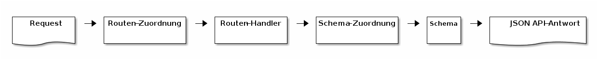

Diese Dokumentation befasst sich mit der Entwicklung von JSON:API-Routen.

Die Stud.IP JSON:API ist zu erreichen unter der URI:

`https://<meine.studip.installation.de>/<eventuell-mit-pfad>/jsonapi.php/v1/<routen>`

Für den Developer-Server also zum Beispiel unter:

`https://develop.studip.de/studip/jsonapi.php/v1/semesters`


### Was ist die Stud.IP JSON:API?
Die Stud.IP JSON:API implementiert eine externe Schnittstelle zum Zugriff auf Stud.IP-Datenstrukturen und entspricht der JSON:API-Spezifikation (https://jsonapi.org/). Zur Verständnis empfiehlt es sich, diese Spezifikation zu lesen.

Geht ein JSON:API-Request ein, werden nacheinander die folgenden Schritte durchlaufen:

* Routen-Zuordnung: Welcher Code wird für welche URI und welches HTTP-Verb ausgeführt?
* Routen-Handler: Liefert eine JSON:API-konforme Antwort. Oft werden ein oder mehrere Stud.IP-Objekte zurückgegeben.
* Schema-Zuordnung: Welche Schemaklasse kann Objekte einer bestimmten Stud.IP-Klasse in JSON umwandeln?
* Schemas: Definiert die Abbildung eines Stud.IP-Objekts in JSON.



JSON:API-Ablauf

### Routen-Zuordnung

In der Datei `/lib/classes/JsonApi/RouteMap.php` werden URIs auf zuständigen Code abgebildet. Dabei beginnen alle URIs immer mit `<STUDIP-URI>/jsonapi.php/v1/`. Sobald ein Request an solche URIs geht, wird mithilfe der `RouteMap` der entsprechende Code, der Routen-Handler, herausgesucht und aufgerufen.

Routen können erfordern, dass Nutzer angemeldet sind: In diesem Fall werden die Routen in der Methode `RouteMap#authenticatedRoutes` definiert. Ist keine Nutzeranmeldung erforderlich, werden die Routen in `RouteMap#unauthenticatedRoutes` definiert.

Da `Slim` für das Routing verwendet wird, lohnt sich ein Blick in die entsprechende [Doku.](https://www.slimframework.com/docs/v3/objects/router.html)

Ausschnitt aus der der Datei `RouteMap.php`:

```php
namespace JsonApi;

class RouteMap
{
    public function authenticatedRoutes()
    {
        //
        $this->app->get('/blubber-comments', Routes\Blubber\CommentsIndex::class);
        $this->app->get('/blubber-comments/{id}', Routes\Blubber\CommentsShow::class);
        $this->app->patch('/blubber-comments/{id}', Routes\Blubber\CommentsUpdate::class);
        $this->app->delete('/blubber-comments/{id}', Routes\Blubber\CommentsDelete::class);
        //
    }
    //
}
```


### Routen-Handler

Routen-Handler sind Unterklassen von `JsonApi\JsonApiController` und implementieren die magische Methode `__invoke`. Routen-Handler verhalten sich JSON:API-konform und bedienen sich dabei insbesondere der geerbeten Methoden:

* `getContentResponse`
* `getPaginatedContentResponse`
* `getCreatedResponse`
* `getCodeResponse`

Die wichtigsten Methoden sind dabei `getContentResponse` und `getPaginatedContentResponse`, da sie verwendet werden, um Stud.IP-Objekte zurückzugeben. Der Unterschiede wird schon im Namen deutlich. Die paginierte Variante funktioniert nur mit Listen von Stud.IP-Objekten.

Beide Methoden werden verwendet, wenn in der JSON:API Stud.IP-Datenstrukturen ausgelesen werden sollen, wenn also ein `GET`-Request an die Stud.IP JSON:API gerichtet wurde.

Dazu übergibt man lediglich das Stud.IP-Objekt an diese Methode und ist fertig:

```php
    // in der RouteMap
    $this->app->get('/blubber-threads/{id}', Routes\Blubber\ThreadsShow::class);
```

```php
class ThreadsShow extends JsonApiController
{
    public function __invoke(Request $request, Response $response, $args)
    {
        if (!$resource = \BlubberThread::find($args['id'])) {
            throw new RecordNotFoundException();
        }

        if (!Authority::canShowBlubberThread($this->getUser($request), $resource)) {
            throw new AuthorizationFailedException();
        }

        return $this->getContentResponse($resource);
    }
}
```

Hier sieht man den generellen Aufruf der Methode `getContentResponse`.

* Der Routen-Handler `ThreadsShow` ist eine Unterklasse von `JsonApi\JsonApiController`.
* Der Routen-Handler implementiert die magische Methode `__invoke`.
* Hier kommt der typische Dreisatz: Auslesen, Authorisieren, Zurückgeben.
* Um den `BlubberThread` auslesen zu können, entnehmen wir der URI den Parameter `id`. Dieser war in der RouteMap definiert worden.
* Nun überprüfen wir, ob der eingeloggte Nutzer diese Daten lesen darf. Dafür verwenden wir die Methode `JsonApiController#getUser`.
* Zum Schluß übergeben wir den ausgelesenen `BlubberThread` an `getContentResponse` und das Ergebnis ist dann auch das Ergebnis des Requests.

### Schema-Zuordnung

Wie kann die Stud.IP-JSON:API wissen, wie aus einem Stud.IP-`BlubberThread`-Objekt spezifikationskonformes JSON wird?

Dafür ist zunächst die Schema-Zuordnung wichtig. Diese befindet sich in der Datei `/lib/classes/JsonApi/SchemaMap.php`. Und darin werden Stud.IP-Klassen auf Schema-Klassen abgebildet:

```php
\BlubberThread::class => \JsonApi\Schemas\BlubberThread::class,
``` 

Wird also mithilfe von beispielsweise `getContentResponse` ein `BlubberThread`-Objekt geliefert, wird die Schema-Klasse `JsonApi\Schemas\BlubberThread` für die Umwandlung verwendet.

### Schemaklassen

Schemaklassen machen aus einem Stud.IP-Objekt eine JSON:API-konforme Repräsentation. Die `User`-Schemaklasse macht zum Beispiel aus diesem Objekt:

```php
$me = \User::findCurrent();
```

diese Darstellung, die JSON:API-konforme ist:

```javascript
{
  "data": {
    "type": "users",
    "id": "205f3efb7997a0fc9755da2b535038da",
    "attributes": {
      "username": "test_dozent",
      "formatted-name": "Testaccount Dozent",
      "family-name": "Dozent",
      "given-name": "Testaccount",
      "name-prefix": "",
      "name-suffix": "",
      "permission": "dozent",
      "email": "dozent@studip.de",
      "phone": null,
      "homepage": null,
      "address": null
    },
    "relationships": {
      "activitystream": {
        "links": {
          "related": "jsonapi.php/v1/users/205f3efb7997a0fc9755da2b535038da/activitystream"
        }
      },
    }
}
``` 

Wenn man die Schemaklassen in aller Ausführlichkeit verstehen möchte, sollte man zuvor den entsprechenden Teil der JSON:API-Spezifikation gelesen haben: https://jsonapi.org/format/#document-structure

Die Schemaklassen bieten alle Möglichkeiten, die in der Spezifikation vorgestellt werden. Am wichtigsten sind sicherlich aber die ID, der Type, die Attribute und Relationships eines `Resource Object`s.

Zunächst ein Beispiel:  Diese Schemaklasse beschreibt die Umwandlung von Stud.IPs `Semester`-Objekten in eine spezifikationskonforme JSON-Form.

```php
<?php

namespace JsonApi\Schemas;

class Semester extends SchemaProvider
{
    const TYPE = 'semesters';

    // [A]: Type
    protected $resourceType = self::TYPE;

    // [B]: ID
    public function getId($semester)
    {
        return $semester->id;
    }

    // [C]: Attributes
    public function getAttributes($semester)
    {
        return [
            'title' => (string) $semester->name,
            'description' => (string) $semester->description,
            'start' => date('c', $semester->beginn),
            'end' => date('c', $semester->ende),
        ];
    }
}
```

#### ID und Type
Laut [Spezifikation](https://jsonapi.org/format/#document-resource-object-identification) benötigt jedes `Resource Object` eine ID und einen Type. Im Beispiel oben werden an Stelle A der Type und an Stelle B die ID definiert. Für alle Stud.IP-JSON:API-Types gilt:

* Der Type steht immer im Plural.
* Der Type muss in `kebap-case` geschrieben sein.

Die ID wird über die überschriebene Methode `getId` festgelegt und muss einen String zurückliefern.

#### Attribute
Die [Spezifikation](https://jsonapi.org/format/#document-resource-object-attributes) ist bezüglich der Attribute von `Resource Objects` sehr klar. In der Stud.IP JSON:API werden sie definiert, indem man die Methode `getAttributes` überschreibt.

* Rückgabewert muss ein PHP-Array sein.
* Schlüssel und Werte müssen UTF-8 kodiert sind.
* Erlaubte Zeichen für Schlüssel werden in der [Spezifikation](https://jsonapi.org/format/#document-member-names) definiert.
* Folgende Schlüssel können nicht gewählt werden: `type`, `id`, `data`.
* Die in Stud.IP-SORM häufig direkt verwendeten Fremdschlüssel `<irgendwas>_id` sollten in aller Regel keine Attribute sondern Relationen sein.
* Etwaige menschenlesbare Versionen von Attributen müssen den Zusatz `-readable` am Attributnamen erhalten.

#### Relationships
Die [Relationships](https://jsonapi.org/format/#document-resource-object-relationships) sind ein sehr mächtiges Merkmal der JSON:API-Spezifikation. Es empfiehlt sich sehr, die entsprechenden Kapitel zu lesen, um die verschiedene Termini zu kennen.

Letztendlich muss auch hier wieder die Methode `getRelationships` überschrieben werden, die ein Array von Relationships liefert. Wesentlich für eine Relation sind sicherlich:

* Die Relationship möchte Daten liefern: `data`
* Die Relationship möchte einen Link zur Relation selbst liefern: `links[self]`
* Die Relationship möchte einen Link auf das verknüpfte Objekt liefern: `links[related]`

Eine Relationship mit diesen drei Merkmalen gleichzeitig, sieht im Beispiel so aus:
```php
<?php

namespace JsonApi\Schemas;

class BlubberThread extends SchemaProvider
{
    //
    public function getRelationships($resource, $isPrimary, array $includeList)
    {
        $relationships = [];
        
        //
        
        $course = \Course::find($resource['context_id']);
        $relationships[self::REL_CONTEXT] = [
            self::SHOW_SELF => true,
            self::LINKS => [
                Link::RELATED => new Link('/courses/'.$course->id)
            ],           
            self::DATA => $course
        ];
    
        //

        return $relationships;
    }
}
```

Die `context`-Relationship eines BlubberThreads möchte:
*  Daten liefern und legt diese unter dem Schlüssel `self::DATA` in der Relationship ab.
* einen Link zur Relationship selbst liefern und ergänzt daher: `self::SHOW_SELF => true`
* einen Link auf das verknüpfte Objekt liefern und setzt daher einen entsprechenden Eintrag im `self::LINKS`-Array.

#### Was ist mit Plugins?

Plugins dürfen ebenfalls Routen und Schemata registrieren. Dazu muss
ein Plugin lediglich das Plugin-Interface `JsonApi\Contracts\JsonApiPlugin` implementieren.

Ein Beispiel:

```php
<?php

use JsonApi\Contracts\JsonApiPlugin;

class MyPlugin extends StudIPPlugin implements StandardPlugin, JsonApiPlugin
{
    //

    public function registerAuthenticatedRoutes(\Slim\App $app)
    {
        $app->get('/whiteboards', WhiteboardsIndex::class);
        $app->get('/whiteboards/{id}', WhiteboardsShow::class);
    }

    public function registerUnauthenticatedRoutes(\Slim\App $app)
    {
        $app->get('/whiteboard-colors', WhiteboardColorsIndex::class);
    }

    public function registerSchema()
    {
        return [
           Whiteboard::class => WhiteboardSchema::class,
           WhiteboardColor::class => WhiteboardColorSchema::class
        ];
    }
}
```

Die darin angegebenen Routen und Schemata werden dann wie oben beschrieben implementiert.

Ein Beispiel zur Einbindung findet sich hier:

https://gitlab.studip.de/marcus/studip-plugin-jsonapi-example
