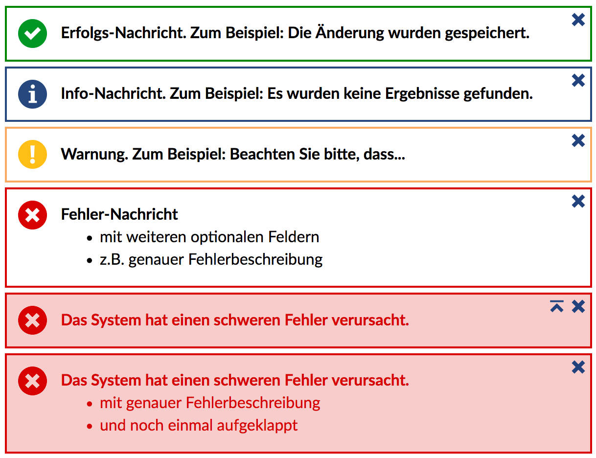

The message boxes are used to display status messages of any kind in Stud.IP.

There are the following five types of message box:

| Parameter | Description |
| ---- | ---- |
| **exception** | Only for system errors. Used by unhandledExceptions. |
| **error** | For error messages of any other type. Missing user rights, incorrect entries, etc. |
| **warning** | For all things that are not real errors but should not simply be dismissed as information/hints. |
| **info** | For general information, no results for search queries |
| **success** | For success confirmations. Storage, modification, etc. |

### Parameters
A minimum of 1 to a maximum of 3 parameters can be transferred. These have the following meaning:

| Parameter | Description |
| ---- | ---- |
| `$message` | The main message to be displayed in the MessageBox. |
| `[$details]` | The 2nd parameter is optional for additional information. These must be passed as an array. |
| `[$closed]` | If this optional parameter `true` is passed, the additional details are collapsed. |

### Show message box on the following page

As a rule, you do not want to display the status message on the current page,
but on the following page.

The method `PageLayout::postMessage()`, to which a MessageBox is passed, is available for this purpose.

For the sake of simplicity, there is a suitable `post<type>` method of the class [`PageLayout`](PageLayout) for all MessageBox types, such as `PageLayout::postSuccess()` or `PageLayout::postError()`.

The parameters of the methods are analogous to the parameters of the methods of the class `MessageBox` described above.


### Function notes
```php
// Example of a simple info message
echo MessageBox::info('Message');

// Example of an error message with additional details
echo MessageBox::error('message', ['optional details', 'more details']);

// Example of a success message with additional details, which are, however, collapsed.
echo MessageBox::success('Message', ['optional details'], true);

// Example of a success message on the following page
PageLayout::postSuccess('The following users have been created', [
    'Max Mustermann',
    'John Doe',
]);
```


### Screenshots


