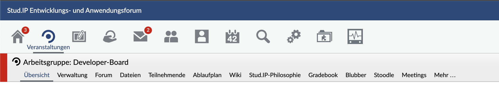

The navigation API is used to manipulate the global navigation structure in Stud.IP. This should make it easier to make dynamic changes to the navigation and at the same time reduce the maintenance effort for the central files. The term "navigation" includes not only the tab navigation, but also the icons in the header -- hereinafter referred to as "top navigation" -- and the links on the personal start page, as well as any navigation points in the info box (if there are any).


### General


The entire navigation is managed by the 'Navigation' class in Stud.IP, i.e. navigation points are generally created as objects. Each navigation point can have any number of sub-points, so that the set of all navigation points together forms a tree (at least as long as a point is only attached at one point in the navigation). Individual navigation points can be addressed via their path in the tree. An image can be assigned to each navigation object, but currently only the top navigation points are displayed. Navigation points that do not have a URL are automatically hidden. The same applies to top navigation items that do not have an image set.


If a navigation item that has further sub-items does not have its own URL, the URL of the first sub-item that has a URL is automatically used. This is particularly useful if the first point of the sub-navigation is sometimes not displayed, depending on the permission level. In this way, the parent tab always automatically refers to the first visible tab of the sub-navigation. If the sub-navigation does not contain any (visible) elements, the parent tab is also automatically hidden.


### Creation of a navigation point


There are essentially four operations for creating and configuring a navigation object:


```php
__construct($title, $url = NULL, $params = NULL)
```
Creates a navigation point and sets the title and (optionally) URL and, if necessary, URL parameters.


```php
setTitle($title)
```


Sets the title of the navigation object. Whether this is displayed depends on where the navigation object is placed.


```php
setURL($url, $params = NULL)
```


Sets the title or URL. Further URL parameters can be passed as an array of key/value pairs as with the `URLHelper`.


```php
setImage($image, $options = [])
```
Sets an image for the navigation point, either via the path to an image file (e.g. in a plugin) or via an image name from the assets area (the normal case in the core system). Additional attributes for the `img` tag can also be transferred (*title*, *style* or similar). The set images are also displayed in the respective tab navigation in events and institutes.


```php
setActiveImage($image, $options = [])
```


Sets an image for the active state of the navigation point, either via the path to an image file or via an image name from the assets area. If there is no separate image for the active state, the normal image is used. Additional attributes for the `img` tag can also be transferred (*title*, *style* or similar). The set images are also displayed in the respective tab navigation in events and institutes.


A small example:


```php
$navigation = new Navigation('Admin');


$navigation->setURL('adminarea_start.php');
$navigation->setImage(
    'header_admin',
    ['title' => 'To your administration page')];
```


Example for images in the tab navigation



### Attaching a navigation point in the plugin


If a plugin requires a navigation point, this is created and added in the plugin's constructor. The following three lines of code add a navigation element to the start page of a SystemPlugin:


```php
$navigation = new Navigation(dgettext('PluginName', 'A plugin name'));


$navigation->setURL(PluginEngine::getURL($this, [], 'controller/index'));


Navigation::addItem('/start/pluginname', $navigation);
```


Assuming that the name of the plugin is PluginName, the above example would create a navigation object on the start page that points to the path /public/plugins.php/pluginname/controller/index.


The first line creates a navigation object and gives it a name. To enable simple translation, the name is made translatable using dgettext. The URL is then set using the getURL function of the PluginEngine class. This first requires the plugin instance, then an array with parameters for the URL and finally the path below plugins.php to which the reference is to be made. In the third line, a new entry is added to the start page navigation based on the new navigation object. The path /start/pluginname does not specify a URL, but simply gives the new entry in the navigation a unique name. The navigation object itself provides the appropriate URL path.


### Attaching a navigation point in a Stud.IP controller


New navigation points, which refer to a Stud.IP controller, are written directly into the navigation classes, which reflect the navigation tree. For this purpose, there are various classes for different areas of the navigation in the Stud.IP main directory in the subfolder /lib/navigation/, all of which are derived from Navigation.php. The assigned class names correspond to the paths of the first navigation level.


They can be added to the existing navigation structure either via the static method `Navigation::addItem($path, $navigation)` or via the method `addSubNavigation($name, $navigation)` of the parent navigation object. Accordingly, there is also the method `Navigation::removeItem($path)` or `removeSubNavigation($name)` to remove an entry again. The method `Navigation::insertItem($path, $navigation, $where)` inserts an entry at a specific position in the existing navigation.


For example, to add a new tab "Demo" with two sub-items "Test 1" and "Test 2" to an event, you would first create the corresponding navigation objects:


```php
$demonav = new Navigation('Demo', 'dispatch.php/demo/index');
// URL: dispatch.php/demo/index?test=1
$test1nav = new Navigation('Test 1', 'dispatch.php/demo/index', array('test' => 1));
// URL: dispatch.php/demo/index?test=2
$test2nav = new Navigation('Test 2', 'dispatch.php/demo/index', array('test' => 2));
```


These are then hooked into the global navigation structure:


```php
Navigation::addItem('/course/demo', $demonav);
$demonav->addSubNavigation('test1', $test1nav);
$demonav->addSubNavigation('test2', $test2nav);
```


Alternatively, mounting can also work as follows:


```php
Navigation::addItem('/course/demo', $demonav);
Navigation::addItem('/course/demo/test1', $test1nav);
Navigation::addItem('/course/demo/test2', $test2nav);
```


To remove a link, removeItem is used as follows. In the example, the link "My events" is removed from the start page:


```php
Navigation::removeItem('/start/my_courses');
```


The following example redirects the item "Upload personal picture" of the homepage to a separate page in a plugin:


```php
$navigation = Navigation::getItem('/homepage/image');
$navigation->setURL(PluginEngine::getURL($plugin));
```


#### Activation of the navigation


The "active" navigation point on the current Stud.IP page must be marked so that the correct tab navigation can be selected and this point can be highlighted there accordingly. The "old" method of setting the global variable `$reiter_view` no longer works. Instead, a navigation point must be explicitly activated:


```php
Navigation::activateItem('/course/demo/test1');
```


Alternatively, you can also use the class `AutoNavigation` instead of the class `Navigation`, which *automatically* reports a navigation item as activated if the URL of the current page corresponds to the URL of the navigation and all URL parameters set in the navigation object are also present in the current request and have the same value there. In the example described above, this would look like this:


```php
$demonav = new Navigation('Demo', 'demo.php');
$test1nav = new AutoNavigation('Test 1', 'demo.php', array('test' => 1));
$test2nav = new AutoNavigation('Test 2', 'demo.php', array('test' => 2));


[...]
```


### Global navigation structure


The global navigation structure currently looks like this:


* **/** [-root node of the navigation-]
  **start** [-personal start page-] (`StartNavigation`)
  * **my_courses** [-my events-]
  * ...			...
    * **browse** [-events and facilities-] (`BrowseNavigation`)
    * **my_courses** [-my events-]
    * **courses** [-search / add events-]
    * ...           ...
      * **course** [-selected course / institution-] (`CourseNavigation`)
      * **main** [-overview-]
        * **details** [-short info-]
        **admin** [-Administration of the course (only for lecturers and upwards)-]
        **leave** [-unsubscribe from the course (only for authors)-]
      **admin** [-administration (only for lecturers and tutors)-]
        * **details** [-basic data-]
        **study_areas** [-study areas-]
        **dates** [-times/rooms-]
        **admission** [-access authorizations-]
        **aux_data** [-additional data-]
        **copy** [-copy event-]
        **archive** [-archive event-]
        **visibility** [-change visibility-]
        **news** [-Set news-]
        **vote** [-manage polls & tests-]
        **evaluation** [-evaluations-]
      **forum** [-Forum-]
        **view** [-view topics-]
        **unread** [-New posts-]
        **recent** [-Last posts-]
        * **search** [-Search-]
        * ***create_topic*** [-Create new topic (only for tutor and lecturer)-]
      **members** [-participants (only in courses)-]
        **view** [-participants-]
        **aux_data** [-additional data (not always activated)-]
        **view_groups** [-functions / groups-]
        ***edit_groups*** [-manage functions / groups (only for tutor and lecturer)-]
      **faculty** [-staff (only in institutions)-]
        **view** [-staff-]
        ***edit_groups*** [-manage functions / groups (only for tutor and lecturer)-]
      **files** [-file area-]
        **tree** [-tree structure-]
        **all** [-All files-]
        **schedule** [-schedule-]
        **all** [-All dates-]
        **type1** [-Session dates-]
        **other** [-Other dates-]
        * ***topics*** [-edit schedule (only for tutor and lecturer)-]
      **scm** [-Free information (customizable tab name)-]
        * ...                [-any number of tabs with MD5_id as path name-]
      **literature** [-literature-]
        **view** [-literature-]
        **print** [-printview-]
        * ***edit*** [-edit literature (only for tutor and lecturer)-]
      * **wiki** [-Wiki-]
        **show** [-WikiWikiWeb-]
        **listnew** [-New pages-]
        **listall** [-All pages-]
        **export** [-Export-]
      **resources** [-Resources-]
        **overview** [-Overview-]
        **group_schedule** [-overview assignment-]
        **view_details** [-details-]
        **view_schedule** [-assignment-]
        **edit_assign** [-edit assignment-]
      * ...                 [-... plugins and eLearning modules-]
    **messaging** [-system-internal messages-] (`MessagingNavigation`)
      * ...         ...
    **community** [-who is online-] (`CommunityNavigation`)
      * **address_book** [-addressbook-]
      **chat** [-Chat-]
      **studygroups** [-studygroups-]
      **score** [-ranking-]
    **profile** [-profile page-] (`ProfileNavigation`)
      **view** [-personal homepage-]
      **avatar** [-upload personal picture-]
      * ...         ...
    **calendar** [-appointments and timetable-](`CalendarNavigation`)
      * **calendar** [-calendar-]
      **schedule** [-Schedule-]
    **search** [-The new search page-] (`SearchNavigation`)
      **courses**
      **archive**
      **studygroups**
      **persons**
      * **institutes**
      * **literature**
      * **resources**
    **tools** [-The new tools page-] (`ToolsNavigation`)
      * **news**
      * **votes**
      * **literature**
      * **elearning**
    **admin** [-Administration area-] (`AdminNavigation`)
      **course** [-events-]
      * **config** [-global settings-]
      * ...         ...
    **links** [-link list top right-]
      **account** [-account settings of the user-]
      * **search** [-search-]
      * **logout** [-logout-]
      * ...         ...
    * **login** [-menu on the login page-] (`LoginNavigation`)
      * **login** [-Login-]
      * **register** [-Register-]
      * ...           ...
    * **footer** [-Footer-] (`FooterNavigation`)
      * **help** [-Login-]
      **sitemap** [-Sitemap-]
      **stud.ip** [-Stud.IP website-]
      * **blog** [-blog-]
      * **imprint** [-imprint-]


Note: The items "course", "links" and "login" have no symbol in the top navigation.
