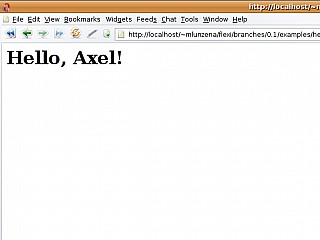
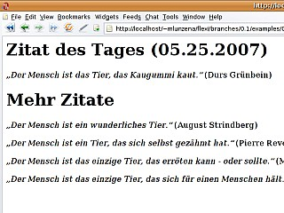
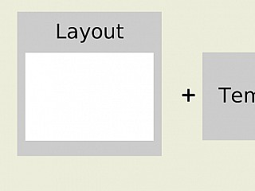

## General


Templates are located either in the `/templates` folder or under `/app/views`. The former contains templates for the page navigation and generally used templates, while the latter contains templates that are automatically loaded by trail controllers for certain actions, unless other templates are selected manually.


Stud.IP templates are generally HTML files that are enriched with PHP code snippets in order to output certain things that have been loaded in a trails controller, for example.


### PHP code in templates


PHP code is introduced with short "tags". Instead of `<?php`, simply `<?` is written. If the PHP code is to be output at the position where it is located, the opening tag is `<?=`. The longer notation `<? echo $VARIABLE` should not be used.


A PHP code fragment closes with `?>`.


### Tables


#### Stud.IP design


For tables to appear in the Stud.IP design, they must have the class `default`. This automatically adds various highlights to the table.


#### Tablesorter


To make a table sortable on the client side, the jQuery plugin Tablesorter can be integrated. No separate JavaScript code needs to be written for the integration. It is sufficient to add the class `sortable-table` to the `<table>` element and to add the attribute `data-sort` to the header columns (`<th>` elements), which specifies how the columns are to be sorted.


The following sorting methods for columns are common in Stud.IP:


* `digit`: sorting by numerical value
* `text`: alphabetical sorting
* `time`: sorting by time
* `htmldata`: Sorting according to the specification in the attribute `data-sort-value` at the respective cell


Further sorting methods can be found in the tablesorter documentation:


https://mottie.github.io/tablesorter/docs/example-option-built-in-parsers.html


To define a standard sorting, the attribute `data-sortlist` is added to the table element. This consists of a two-dimensional array, whereby the second dimension consists of two values: The column number (starting at 0) and the sort order (0 = ascending, 1 = descending).


Example: If you have a table with 3 columns and want the second column to be sorted in descending order by default, set `data-sortlist` to the value `[[1, 1]]`. If, on the other hand, the second column is to be sorted in ascending order, the value for `data-sortlist` is `[[1, 0]]`.


## Flexi-Templates


### Example 1: "Hello World"


As it should be, the first example is the well-known "Hello world". We need two things for this:


* a template file that works like a cloze,
* a PHP script that fills and outputs this cloze text.


For reasons of hygiene, the template file is located in a separate `templates` directory. The example then looks like this:


index.php
templates/hello_world.php


The gap text is stored in the file `templates/hello_world.php`. The Flexi_Template engine uses the extension of a template file to recognize its type. A ".php" extension indicates a `Flexi_PhpTemplate`. This type of template is simply a plain vanilla PHP script. So what does our template look like?


```php
<h1>Hello, <?= $name ?>!</h1>
```


Obviously the placeholder `$name` is used to display the name of the person being greeted.


So how do you fill in this blank text? Let's take a look at the `index.php` file:


```php
<?php


# load flexi lib
require_once dirname(__FILE__) . '/../../vendor/flexi/flexi.php';


# where are the templates
$path_to_the_templates = dirname(__FILE__) . '/templates';


# we need a template factory
$factory = new Flexi_TemplateFactory($path_to_the_templates);


# open template
$template = $factory->open('hello_world');


# set name of the greetee
$template->set_attribute('name', 'Axel');


# render template
echo $template->render();
```


First, the Flexi library is obviously loaded, then a variable is filled with the path to the directory where our template is located and then a `Flexi_TemplateFactory` is created with this.


As the name suggests, this factory is used to create templates. And this is exactly what happens next. By sending the factory the message #open, you receive a template object. All you have to do is pass the name of the template file as an argument. As the factory is a bit clever, it only needs the name of the file without the extension (which you could of course also specify; you just don't have to). For our template `hello_world.php` a "hello_world" is sufficient.


Using the name without an extension allows a feature that we will come back to later.


Back to the topic: In a further step, we set the "name" attribute for the template to the value "Axel". And finally, we evaluate the template and output the result (a string).


Unsurprisingly, after execution in the browser, you get:





### Example 2: "Would you like a little more?"


We have just filled a "gap" with a string. Next, let's try this with things other than strings.


First, let's take a look at the PHP script that will fill our template.


```php
<?php


# load flexi lib
require_once dirname(__FILE__) . '/../../vendor/flexi/flexi.php';


# where are the templates
$path_to_the_templates = dirname(__FILE__) . '/templates';


# we need a template factory
$factory = new Flexi_TemplateFactory($path_to_the_templates);


# open template
$template = $factory->open('quotes');


# set quotes
$quotes = [
    [
        'author' => 'August Strindberg',
        'quote' => 'Man is a strange animal.
    ],
    [
        'author' => 'Pierre Reverdy',
        'quote' => 'Man is an animal that has tamed itself.
    ],
    [
        'author' => 'Thomas Niederreuther',
        'quote' => 'Man is the only animal that thinks it is human'
    ],
    [
        'author' => 'Durs Grünbein',
        'quote' => 'Man is the animal that chews gum'
    ],
    [
        'author' => 'Mark Twain',
        'quote' => 'Man is the only animal that can - or should - blush.
    ]
];


# select one randomly
shuffle($quotes);
$quote_of_the_day = array_shift($quotes);


$template->set_attributes([
    'quotes' => $quotes,
    'quote_of_the_day' => $quote_of_the_day
]);


# set current time
$time = time();
$template->set_attribute('time', $time);


# render template
echo $template->render();
```


Nothing special awaits us here. Lines 1-13 are the same as in the first example. The Flexi library is loaded, the path to the templates is set and a template factory is created with it, which we then use to open the template called "quotes".


Then (lines 16-27) a vector of quotes is created and then in lines 29-31 this vector is mixed and the first one is chosen as the quote of the day.


Things get more interesting in line 33, where we send a new #set_attributes message to our template. So instead of calling #set_attribute twice in a row, which would look like this:


```php
template->set_attribute('quotes', $quotes);
template->set_attribute('quote_of_the_day', $quote_of_the_day);
```


we directly set an array of key-value pairs instead.


Lines 37-39 demonstrate that you can set further attributes afterwards as usual. This would also have been no problem the other way round (i.e. first #set_attribute and then #set_attributes). The #set_attributes message only overwrites, i.e. does not delete all previously entered attributes.


Lines 42-43 should then look familiar again. We evaluate the attributes in the context of the template file and output them.


The template file is again a Flexi_PhpTemplate, i.e. an ordinary PHP script. This time, however, we have added a little surprise. We want to demonstrate a bit of output logic:


```php
<h1>Quote of the day (<?= date('d.m.Y', $time) ?>)</h1>
<p>
  <em>
    &#8222;<?= $quote_of_the_day['quote'] ?>&#8220;
  </em>
  (<?= $quote_of_the_day['author'] ?>)
</p>


<? if (sizeof($quotes)) : ?>
  <h1>More quotes</h1>
  <? foreach ($quotes as $quote) : ?>
    <p>
      <em>
        &#8222;<?= $quote['quote'] ?>&#8220;
      </em>
      (<?= $quote['author'] ?>)
    </p>
  <? endforeach ?>
<? endif ?>
```


Interesting here are probably the calls to output functions such as #date in line 1, the use of an `if` construct in line 10 (and of course its end in line 20) and the use of `foreach` in line 12 (and 19).


So if you disregard the use of the alternative syntax for `if` and `foreach` (http://de.php.net/manual/en/control-structures.alternative-syntax.php), the content of the template should be absolutely standard code for a true PHP connoisseur.


An example output would look something like this:





### Example 3: "And now in pretty"


If you have completed many different templates, you will notice at some point that text is repeated at the beginning and end of a template. It is not uncommon for the templates to have something like the following structure:


```php
<!-- here is a "header" -->


<!-- then the content follows -->
Hello World


<!-- and finally a footer -->
```


As the header and footer are the same in all files, it makes sense not to always repeat yourself (DRY - Don't Repeat Yourself). The Flexi templates have a special mechanism for this purpose: "Layouts".


In the following, the collection of quotations from example 2 is embedded in a layout.


But first the theoretical side: layouts are an example of Martin Fowler's "Decorator Pattern". Templates are embedded in other layout templates. These layout templates form a common structure for the embedded content templates. The layout template decides where the content of the embedded templates is inserted.





Layout templates are normal templates, but with two additional properties:


* The output of the content template is provided in the "content_for_layout" attribute.
* All attributes that the content template receives, as well as all variables that the content template sets during its evaluation, are inherited by the layout template.


A layout template then looks like this in principle:


```php
header
<?= $content_for_layout ?>
footer
```


If the content template then generates the following output:


`Hello, world!


the end result would be:


```shell
header
Hello, world!
footer
```


To assign a layout to a template, simply call the #set_layout method:


```php
$template->set_layout('my_chunky_layout');
```


Back to the quote collection from example 2. To embed our quotes in a layout, we just need to:


* send the template object the message #set_layout
* create a layout template


The first point is done quickly. In the PHP script that created our template object in example 2, we add the following line:


```php
[..]
# open template
$template = $factory->open('quotes');


# set layout
$template->set_layout('layout');


# set quotes
[..]
```


This leaves only point 2: create a layout template called 'layout':


```php
<html>
<head>
  <meta http-equiv="Content-type" content="text/html; charset=utf-8" />
  <title><?= $title ?></title>
  <link rel="stylesheet" type="text/css" href="style.css" media="screen"/>
</head>
<body>
  <?= $content_for_layout ?>
</body>
</html>
```


The stylesheet is not displayed at this point. Only line 8, in which the output of the content template is inserted, is important.


In addition, the use of variables set in content templates is now demonstrated. In contrast to the 'quotes' template used in example 2, this now also contains the following line:


```php
[..]
<? $title = "Quotes"; '>
[..]
```


Now that the variable 'title' has been set in the content template, it can be used in the layout template. (see line 4 in the layout template above)


All the important mechanisms of the Flexi templates have now been introduced. Here are a few more gimmicks...


### Meanwhile, in another place &hellip;


Before we get to the gadgets, a brief overview of the API offered by the Flexi templates.


First of all, a brief overview of the methods offered by a Flexi_Template object. It should be noted that these objects of this class cannot be instantiated directly, as a template factory is required for this.


```php
class Flexi_Template {


  function get_attribute($name);
  function get_attributes();


  function set_attribute($name, $value);
  function set_attributes($attributes);


  function clear_attributes();
  function clear_attribute($name);


  function render($attributes = null, $layout = null);


  function set_layout($layout);
}
```


The first six methods:


* #get_attributes
* #get_attributes
* #set_attributes
* #set_attributes
* #clear_attributes
* #clear_attributes


are used to set, query and remove attributes. Usually, only the two setters


* #set_attributes
* #set_attributes


are usually only needed. While #set_attribute assigns a value to a key:


```php
$template->set_attribute('key', new Value());
```


The #set_attributes method can be used to set an entire (associative) array of key-value pairs:


```php
$attributes = [];
$attributes['title'] = "a title";
$attributes['content'] = "some content";


$template->set_attributes($attributes);
```


It should be noted that this method #set_attributes does not remove the already set attributes, but only updates existing keys:


```php
$template->set_attribute('key', 'value');
$template->set_attribute('title', 'former title');


$attributes = [];
$attributes['title'] = "a title";
$attributes['content'] = "some content";


$template->set_attributes($attributes);
```


While the #set_attributes replaces the old value of the 'title' attribute with the new value, the 'key' attribute is retained.


Now the methods #set_layout and #render remain.


The first method #set_layout was already introduced in example 3 and has the template to be used as the layout template as the only parameter.


The last method #render has also already been used, but has two additional parameters that have not yet been shown. However, these are only for convenience. While we have seen the following usage so far:


```php
$template = $factory->open('hello_world');


$template->set_attribute('name', 'Axel');


$template->set_layout('layout');


echo $template->render();
```


can be written with this code with the two additional method parameters like this:


```php
$template = $factory->open('hello_world');
echo $template->render(['name' => 'Axel'], 'layout');
```
