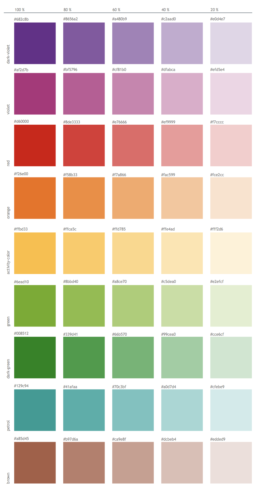
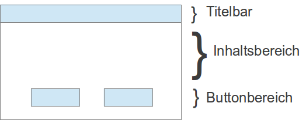

The Stud.IP Styleguide is always a work in progress.

For current design questions, we from the Styleguide team (André, Cornelis, Marcus, Sabine, Marco) offer a design consultation hour via video conference every Thursday at 14.00 until further notice. The conference will take place in Skype.

# Introduction

Stud.IP accompanies students through many years of their studies and is a constant companion for teachers in their daily work. This requires Stud.IP to have a certain constant ability to motivate students, to integrate new functions consistently and harmoniously into the overall picture and to ensure that repetitive work processes can be completed as easily and quickly as possible.
These and other requirements are reflected in the Stud.IP design philosophy that guides this style guide:

Ease of use instead of a wide range of functions: less is more and therefore Stud.IP should only provide those functions that help the majority of users. The aim is to support the needs of 80% of users instead of overburdening the larger group with the special requirements of the remaining 20%.
The same range of functions for all events instead of individual adaptation to specific needs: Users thus receive a reliable environment regardless of use in very different teaching and learning situations.
Reliability in operation: Similar functions should always be implemented consistently. Proven patterns are used throughout the system. New approaches should be used consistently so that the entire software benefits from further development, even if this means greater effort during implementation.
Careful integration of new technologies: The use of new Internet, browser or media technologies should not should only be used if an improvement is technically available to a large proportion of users. At the same time, it must be ensured that older configurations are supported to an appropriate extent so that usability is guaranteed.
Stud.IP is fully usable on mobile devices as well as on desktop computers. However, there is no pure "mobile first" principle: mobile pages can offer limited functionalities in certain areas (especially for administrators).

## Four general design principles for Stud.IP

"...the basic principles of design that appear in every well-designed piece of work."
> Robin Williams, The Non-Designer's Design Book

### Visual design

There is a lot to consider when it comes to the visual design of elements within a page. A simple way to quickly increase the usability of the respective page is to observe the four C.R.A.P. principles:
* Contrast
* Repetition (Repetition)
* Alignment
* Proximity

The rules presented below are also available as a poster Attach:studip-design-poster-final.pdf.

### Contrast
* Contrast is used as a design tool to clearly distinguish different page elements from one another.
* Contrast can be used to focus on important content.
* Elements that are not the same should be clearly distinguishable from one another.
* Contrast can be achieved using various design elements, e.g. font, color, sizes, shapes, proximity, etc.

#### Negative examples
* Upload files in events - 9 identical-looking buttons in a row

### Repetition (repetitions):
* Repetition creates consistency in the system
* Consistent design improves the usability of the system
* Consistency can be created through the repeated use of various design elements:
  ** Abstract: menu structures, function sequences
  ** Concrete: icons, fonts, labels

#### Examples
* Main navigation bar remains the same
* Footer remains the same
* Infobox/sidebar

#### Negative examples
* Different search form variants for the person search

### Alignment:
* Content elements should not be placed randomly on a page, but should be aligned horizontally and vertically with other elements.
  Tips
* Text should be aligned to the left or right, but not both at the same time on one page.
* Spacing should be even.
* No right-aligned text in a right-hand side column. This creates too much whitespace.
* Draw guidelines to detect deviations

#### Negative example
* Wizard for creating events

### Proximity
* Content elements that are close together give the impression that they belong together:
* Related content elements should therefore be grouped close to each other.
* There should be enough space between different content elements, otherwise an impression of togetherness is created.
* The grouping of elements increases clarity and content is better structured.

#### Negative example
* Group management - participants of an event or calendar/address book - button for adding to a group is too far away

### Further information
* http://www.userfocus.co.uk/articles/A_CRAP_way_to_improve_usability.html
* http://www.dailyblogtips.com/crapthe-four-principles-of-sound-design/
* http://lab.christianmontoya.com/designing-with-crap/designing-with-crap-cc.pdf
* http://www.colorado.edu/AmStudies/lewis/Design/graprin.htm#summary
* http://blog.teamtreehouse.com/how-crap-is-your-site-design

# Page structure
Each page of Stud.IP is structured in the same way and contains the following elements:

Header: Introductory line containing a system-wide search. If the main navigation is moved out of view by scrolling, it is included in compact form in the header. The header can be extended by the operator.
Main navigation: It introduces each page and is the fixed navigation element that connects the system areas. The composition of the header depends on the user's global rights. The header represents the 1st navigation level.
Scopes: Scopes connect certain functions of a main area, such as the messaging system or all functions within events. A scope has an area or an icon in the main navigation and refers to several functions. A scope always represents or contains the 2nd navigation level.
Sidebar: This is located on the left-hand side of the screen and contains several widgets in a defined form, such as navigation (of the selected function in the selected scope), actions, views, export and possibly other widgets.
Navigation widget: This widget always appears as the first widget and, if available, represents the 3rd navigation level.
Content area: All content is displayed here. A content area is made up of tables and content boxes or input fields. There are fixed elements for the content area from which it must be designed.
Footer: This contains further links and references, which can be expanded by the operator in the same way as the header.

//TODO: Screenshot of a typical page

The actual page consists of a sidebar and content area. Both areas are introduced by a
page title. In contrast to the design up to Stud.IP 3.5, the content area now does not have its own title
(previously partially designed as an h1 object).

## Indicator of the page title:

* The title must have the same name as the entry in the navigation in the sidebar
* For events, the name of the event is automatically displayed (the same applies to the institution area for the selected institution)

## Further specifications for the page structure:

* Each page must contain a sidebar.
* Each sidebar contains at least one decorative image.
* Access to help (question mark icon) is provided on the right-hand side as the end of the page title.
* Sidebar actions (found in the widget of the same name) are executed in dialogs.

Further information on the sidebar: see section [Style#sidebar](Sidebar)

# Navigation

The navigation in Stud.IP is organized in several levels. A distinction is made between:

* Main navigation: The header of the system. Complete functional areas are accessed from here. Each
  of these areas corresponds to one of the main points in the sitemap and each of these areas is presented with its own tab system.
* Scopes: Each main area (e.g. profile or community) has a scope that contains the functions of an area.
  of an area. A scope corresponds to the second level in the sitemap. A function may only be attached to a single
  only one position in a scope. This means that each function has a unique assignment to one of the main areas.
* Navigation in the sidebar: Various tasks within a function can be found in the navigation area of the
  sidebar. These lead to a new page call at this point (in contrast to actions in the sidebar).
* Links to other main areas are also possible from the sidebar navigation, but should be avoided.
  Ideally, the navigation of a function should also remain within its own tasks or within the respective scope.
  respective scope. An entry in the sidebar navigation corresponds to the third level in the navigation.

Further information on the structure of the sidebar and its various widgets can be found in the corresponding [section
of the style guide](#Sidebar)

## Header

The header introduces each page and provides access to all core components of Stud.IP:

Mini:kopfzeile.png

Depending on the permission level of the registered user and the system plugins set up, different system areas are made accessible from here.

The header provides the greatest scope for customization to the operator's corporate identity.

The following customizations are possible here:
* Insert your own logo in any position (suggestion: to the right of the Stud.IP logo)
* Insert your own links in the header (suggestion: to the left of the global search)

A few more notes on customizing the header:
* Do not remove the icons from the header, as the icons repeat their design within the system
appear repeatedly within the system and thus create a link to this navigation
* Do not remove the labeling of the icons, as users receive important explanations via this labeling
  and the text is also available in other system languages.
* Do not change the order of the icons or divide the icons into several lines.
* Do not arrange headers in other places (e.g. as a sidebar). The Stud.IP system sometimes requires a very
  some places a very wide display. The header is best adapted to the system in this form.

## Rides (scopes)
Scopes summarize the function of a main area (e.g. all functions within a course or within the messaging system).

Mini:style_reiter.jpg

Stud.IP automatically adds an "overflow" in a scope (as well as in the main navigation), which lists all icons in a drop-down menu.
drop-down menu contains all icons that no longer fit into the horizontal display (depending on the screen width).
would. When designing new functions, care should be taken to choose the shortest possible names,
so that as many functions as possible fit next to each other. The width of the respective labels determines the width of the scope!

## Sidebar

### Preliminary remark

The concept of the info boxes (Stud.IP versions up to 3.0) has changed fundamentally to the sidebar concept (from Stud.IP
3.1), which incorporates many of the functions from the old info boxes, but does not directly replace them. As part of this
changeover, the 3rd navigation level was moved to a navigation widget in the sidebar as a line below the tabs.

Attach:Style/Sidebar-dafault.jpg

### Short description
The sidebar is located in a fixed position on the left-hand side of a Stud.IP page. The sidebar replaces the info box of older Stud.IP versions and contains at least one, usually several widgets. The sidebar contains the elements of the 3rd navigation level, actions, view options, page-internal search options and export functions within these widgets. If these standard widgets are not suitable, a page can have additional widgets.
The sidebar also has an orientation image in the header area, which contains the name of the page, shows the baisis icon of the respective area and can include an avatar.
Every page should have a sidebar.

### Structure & elements

#### Orientation image
The orientation image is 520px wide and 200px high. Corresponding orientation images are delivered for all basic functions (or based on their icons). In principle, locations can swap these images, but should ensure that the image content and brightness match the surrounding design. If in doubt, the Stud.IP GUI group is available to create additional images or provide tips on how to integrate your own images.

#### Types of widgets
| Type | Description |
| ---- | ---- |
| Navigation | Automatically contains the 3rd navigation level according to the Stud.IP navigation structure (formerly 3rd navigation level below the tab bar). Navigation points jump to other pages but ideally remain within a navigation context (= tab system). The currently selected page is marked with a blue arrow. Navigation points do not show any icons. |
| Actions | Contains actions that influence the content of the current page. Actions always open a dialog and therefore do not leave the current view that the user sees. |
| Views | These contain view options or filters that restrict the content displayed on the respective page. The selected view or filter is marked with a yellow arrow. |
| Search | A search widget is page-specific, i.e. it allows you to search within the content of the page. Ideally, a search here only filters within the content that I can see or reach on this page as a whole. If the content of a page itself provides a search result (e.g. for all search functions in Stud.IP), this search must be implemented outside the sidebar, e.g. in a content box in the content area of the page. A search widget could then theoretically limit the content found dynamically, ideally without reloading the page.
| Export | All functions that specifically offer a file (e.g. PDF, XLS export, CSV file) for download are included here. |

Pages generally start with navigation and actions, followed by other widgets (usually search, views or export). The other widgets can be placed according to the frequency of use of the respective page, the first two positions are fixed in order.


#### Other types of widgets

The following types occasionally appear:

| Type | Description |
| ---- | ---- |
| Settings | For settings that have a direct effect on the page and can be made quickly in the sidebar |
| watchlist | For caching any objects |


### What does not belong in the sidebar

* Help texts: Previously often used in the info box, explanatory or introductory texts about the function of a page no longer belong in the sidebar. The best place for this is the new help tab created in version 3.1, where tours can also be started and the link to the help wiki can be found.
* Forms: With the exception of an input field for the search widget, forms do not belong in the sidebar.

### Other things to note

* There is a fixed API for the sidebar that must be used to create it.
* The conversion of the admin area is expected to take place as part of the work on version 3.2, until then only the navigation has been moved to the corresponding widget.
* Except in the navigation widget, clear and matching icons in the color blue should be used in the sidebar and be clickable. Actions in particular benefit from being easy to find using icons + text.

## Content area

The content area includes all content that is displayed or edited by the respective function.

All object manipulations and content display take place in this area. It is crucial that only objects (which are marked as such, see later), methods that manipulate them and various other (meta) information about these objects should actually be placed in this area. Explanatory texts, references to other parts of the system and other navigation elements must not appear in this area.

Standardized graphic elements should be used for the design; functions that already exist in the system in a similar way must be based on them in terms of operation. In the content area in particular, the declared aim must be to work with familiar elements in order to offer the user a familiar environment, even with new functions.

Some basic tips for designing the content area:
* Avoid placing text freely in the content area of pages. There are a number of graphic design options, which are described below, with which you can mark any content within the content area and separate it from other objects.


## Content elements

As a general rule, all elements in the content area must be framed by suitable objects. These are usually content boxes (or field areas in forms) or tables. Texts and input options must not be placed freely on the (white) background.

### Text
Continuous text should be structured in Stud.IP by using semantically appropriate HTML attributes. This also applies to the formatting of the text image. The content and logical structure of the text is thus transferred to the source code. This not only makes the text more readable for the developer, but also more accessible for screen readers.

#### Overview of HTML markups

##### Headings
Headings are no longer used in the content area since Stud.IP 4.0. Corresponding markups of headings may only be used in the content of the respective function (such as wiki texts, information pages or forum posts), but are no longer used to structure or describe the content area.

##### Simple lists and enumerations
The `<ul>` markup is used to display simple lists in Stud.IP.
Corresponding list elements are inserted using `<li>`. Lists are also enclosed by structuring elements (usually content boxes).

Example:

```html
<ul>
<li> Entry 1</li>
<li> Entry 2</li>
...
<li> Entry N</li>
</ul>
```

Further elements are described in more detail in the corresponding sections of this style guide:

##### Tables
##### Forms
##### Content boxes
##### Search


# Design
## Colors and color space
Colors are one of the most important design tools. Used correctly, colors can help users to perform tasks more easily.

The standard colors of the current Stud.IP design were defined by the Core Group
GUI managers in collaboration with a designer.

The color scheme is based on a few basic colors and fixed contrast distances.

In principle, every Stud.IP installation can be changed in color by adapting the CSS files. It should be noted, however, that only the base color should be adjusted. This will change other colors according to the specified color values.
(However, this assumes that the colors in the less files are adjusted and compiled with the less compiler. It should also be noted that the complete implementation of the Stud.IP CSS files will only be implemented in future versions).
The color climate includes 20% attenuations of all basic colors, which are automatically generated by the less compiler.

### Meaning and selection of colors in Stud.IP

Colors should be chosen with care, as they act like visual methaphors and appeal to emotions. It is therefore important to use colors consistently. So far, colors have been used in Stud.IP as follows:


PDF Download: [170804_Studip-Farbset.pdf](../assets/6d14189aa9093eb042bfa56eae8c7dc2/170804_Studip-Farbset.pdf)

#### Blue (base-color and content-color)
Blue is the default background color for the current Stud.IP theme in various shades.
The base color is #28497c. The color value #899ab9 is used as the base for content (i.e. content within the page design).

Blue is also used for clickable objects, i.e. text links and clickable icons are marked in blue.

Blue is also the background color for [MessageBoxes](MessageBox) with information messages.

The base-color can be adapted by the operator to his own colors, e.g. to match his own CD. The content-color should not be adjusted.

#### Gray (light-gray, dark-gray)

There are different shades of gray that can be used freely to highlight different areas (e.g. info boxes, navigation). The base values are #69767f (light-gray) and #3c454e (dark-gray).
Content (i.e. tables, text contributions, messages, forms) may only be highlighted with the content-color (blue). Other objects can also be highlighted in gray.

### Highlight colors

In addition to the basic colors, colors are also used for different markings/categorizations. The colors permitted for this are also defined:



#### Red
Red is used as a signal color in several places:

On the one hand, red indicates critical actions and is therefore used, for example, as a frame color for error messages. The icon in an error message is also colored red.

On the other hand, everything new (from the point of view of the respective user) is highlighted in red. For example, red icons are used on the "My events" page if one of the areas of an event contains new content for the user. There are also red markings for new posts in several places in the event areas.

The base color for red is: `#d60000`.

#### Green
Green is only used for positive feedback. For example, green is the frame color for messages with confirmation of success.

Green must not be used in the design of Stud.IP content or other elements!

#### Yellow (activity-indicator)
Yellow is only used as a marking color.

For example, the indicator of which view has been selected in a page with several views is a yellow arrow.

In the forum or the wiki, the color yellow marks locations in the hit list.

Yellow move arrows for rearranging objects are no longer permitted in the current design.

Base color is `#ffbd33`

#### Black and white
Black and white are used as font and contrast colors. Fonts and symbols are drawn in black or white depending on the background.

#### Notes
The hexadecimal values of the colors are defined in LESS files (`public/assets/stylesheets/mixins/colors.less`) and must be transferred to the stylesheets with an appropriate Less compiler for adjustments.
The manual adjustment of individual color units in the CSS files is expressly not recommended, as some colors are also defined/generated in dependencies on each other (e.g. from the base color).

The use of colors for icons is described in more detail in the section on [Icons](Visual-Style-Guide#Icons).

### General notes on color selection

#### Use colors carefully and sparingly
Colors should be used sparingly. To identify areas in the [content area of a Stud.IP page](http://hilfe.studip.de/develop/Style/DesignSeitenlayout) by color, ISO 9241-12 recommends using no more than six different colors (in addition to black and white). The colors used should be easily distinguishable by the user.

#### Do not use color as the sole visual aid
Colors should not be used as the only visual means to convey information or identify elements. For users with color vision deficiencies, it may be difficult to distinguish between two objects that differ only in color. Differences should also be indicated by, for example, different shapes, positions or a textual description.

#### Use colors with the same degree of saturation
In order to achieve a harmonious color design, colors with the same degree of saturation should be used. Saturation (or chroma) refers to the amount of grey in a color. The less grey a color contains, the brighter it appears.

Large areas should not be designed in bright (saturated) colors. These become difficult to read and can sometimes cause headaches.

#### Is the contrast between elements and their background sufficient?
If the hue of the foreground and background colors is too similar, differences are difficult to see.

Tips for checking the contrast of a color combination:
* To check whether there is sufficient contrast, it is advisable to print the page in black and white. If the printout is easy to read, there is typically sufficient contrast.
* The online tool [Color Contrast Checker](http://www.snook.ca/technical/colour_contrast/colour.html) can be used to check directly whether there is sufficient contrast between two colors.
* On some operating systems, the display can also be switched to grayscale as the default setting in order to test the contrasts.

#### Avoid cluttered and distracting backgrounds
Patterns or images in the background that cause uneven contrast, distract the eye from the text and thus make it difficult to read are unfavorable.

### Further links
* Tutorial: Colors in web design [http://metacolor.de/](http://metacolor.de/)
* [Color/contrast analyses with reference to a11y criteria](http://www.blog.mediaprojekte.de/grafik-design/farb-kontrast-analyse-die-accessibility-der-farben-testen)
* http://e-campus.uibk.ac.at/planet-et-fix/M8/8.5.2_Praesentationen/links/farben.html


# Icons

Since version 2.0 Stud.IP comes with a standardized icon set. The set is characterized by a clear and uniform design, colour sets separated according to tasks and areas of use, barrier-free operation through clear shapes/visual additions for certain tasks and a number of other features that standardize the Stud.IP design language. Furthermore, all icons are already available as vector graphics so that they can be used in other contexts (e.g. print) and the icon size in Stud.IP can be changed in the future (e.g. for improved touch operation).
The icon set is basically used for all graphic buttons, markers, object representations, etc. application. The only exceptions to this in Stud.IP are text buttons and a few special shapes or non-iconic graphic elements (e.g. lines or separators).


#### Design

The icon landscape has been significantly streamlined, modernized and made more efficient. Scalability and a simple, clear design language were the focus of development. The new icon set is functional and self-explanatory. This promotes the clarity of the functions and intuitive operation. The new icons now have a uniform look for all sizes and areas of application. The use of fixed basic shapes together with formal and color-coded additions that mark functions and states ensures low-barrier usability with a high recognition effect.

Icons in Studip 2.0 are designed according to a fixed grid and are minimalist in color and shape. They are always monochrome in fixed colors. Line thickness and color fillings are used to give the icons a uniform visual weight. These rules are to be applied to all icons used in Stud.IP in future.

In addition to normal project development, there are certainly many plug-ins and extensions for which there is a need to adapt existing icons or create new ones. The necessary work is carried out by Stud.IP e.V., which provides a certain amount of budget for the development. Coordinates the development via the Stud.IP e.V. board.

#### Icon roles

From version 3.4, icons are addressed via the icon API. Previously, icons were integrated like file names. This meant that the color used was hard-coded. If adjustments were made to the university's color scheme in Stud.IP installations, the code therefore had to be changed or unsightly "hacks" made.

As of Stud.IP v3.4, icons are no longer referenced by their color, but by the role they want to take on.
An example: Previously, all icons that were displayed as or in a link were hardcoded in the code with the color blue: `Assets::img('icons/blue/seminar')` If a university preferred to display all link-like icons in the color
green, green icons had to be placed in the "blue" directory (which does not always work, however,
if, for example, the background color is the same as the icon color) or replace all corresponding occurrences of `blue` in the code with `green`.

With the new icon API, the role is now hard-coded. The global assignment of roles to colors then takes over the corresponding translation.

#### Roles

Currently (Stud.IP v3.4) the assignment of roles to colors can be found
in the "Icon" class (`lib/classes/Icon.class.php`):

| Role | Color | Meaning |
| ---- | ---- | ---- |
| `Icon::ROLE_INFO` | black | Old description: *These icons are used exclusively in the info boxes and are never clickable. They graphically explain the actions that the info box offers. For example, actions can be shown here with the corresponding icon, information can be illustrated with an "I" or references to other system areas can be supplemented with the icons that match these areas.* | |
| `Icon::ROLE_CLICKABLE` | %blue%blue | Old description: *The blue icons are the standard for all clickable icons, regardless of the context in which they are used (exception: "My events" overview). Free-standing actions in particular should always display such an icon next to the link text. * |
| `Icon::ROLE_ACCEPT` | %green%green | Old description: *Green is only used in the event that the confirmation checkmark is shown.
| `Icon::ROLE_STATUS_GREEN` | %green%green | Old description: *Green is only used in the event that the confirmation tick is shown.
| `Icon::ROLE_INACTIVE` | %grey%grey | Old description: *This variant is used when icons are not clickable and are not used within infoboxes. They also often express a status and are used for all objects such as news, votes or files to classify such an object. One exception is "My events". Here, too, the gray icons express a status ("only known objects of one type") but can still be clicked, as the respective areas can also be accessed directly from here. However, this special case only applies to "My events "* |
| `Icon::ROLE_NAVIGATION` | %ltblue%lightblue | |
| `Icon::ROLE_NEW` | red | Old description: *The color red is used to represent or highlight something new. Red icons are used on "My events" when one of the areas of an event contains new content for the user. For reasons of barrier-free operation, the red color alone is not sufficient, the addition "new" must always be used to give the icon a unique shape, unless the combination of color and shape of the icon itself is unique (such as a red X).
| `Icon::ROLE_ATTENTION` | red | Old description: *The color red is used to represent or highlight something new. Red icons are used on "My events" when one of the areas of an event contains new content for the user. For reasons of barrier-free operation, the red color alone is not sufficient, the addition "new" must always be used to give the icon a unique shape, unless the combination of color and shape of the icon itself is unique (such as a red X).
| `Icon::ROLE_STATUS_RED` | red | Old description: *The color red is used to represent or highlight something new. Red icons are used on "My events" when one of the areas of an event contains new content for the user. For reasons of barrier-free operation, the red color alone is not sufficient, the addition "new" must always be used to give the icon a unique shape, unless the combination of color and shape of the icon itself is unique (such as a red X).
| `Icon::ROLE_INFO_ALT` | %bgcolor=black white%white | Old description: *The white variant is always used when icons are used within a dark environment (usually the header of free-floating windows with a dark blue line). Gray table headers may also have white icons. As a rule, these are not clickable. The white icon cannot be seen on a white background.
| `Icon::ROLE_SORT` | %bgcolor=black yellow%yellow | Old description: *Yellow icons are used exclusively for moving objects. Therefore, only triangles and arrows in all variants exist in this set.* |
| `Icon::ROLE_STATUS_YELLOW` | %bgcolor=black yellow%yellow | Old description: *Yellow icons are used exclusively for moving objects. Therefore, only triangles and arrows in all variants exist in this set.* |


#### Additions

There are a number of graphical additions that can be used in a variety of ways to visualize actions behind icons or states. As a rule, additions are always displayed in red. The yellow Move addition is an exception.

As of Stud.IP v3.4, additions to icons are referenced via the icon API. For example, if you want to add a `seminar` icon as a link with the addition `add` (i.e. add): `Icon::create('seminar+add')`

| status | image | description
| ---- | ---- | ---- |
| `accept` |   | **Accept**: The checkmark indicates that a confirmation is displayed here in the context of the object. |
| `add` |  | **Add**: The plus sign indicates that a new object can be created here. The creation of an object or the jump to an area in which creation is possible is marked with this addition. It can be used on blue icons with a click or black and gray icons.
| `decline` |  **Action blocked**: Sometimes actions are displayed as "not possible". In this case, an X is added to the action icons. |
| `edit` |  | **Edit**: The pencil on an object indicates that an object can be edited by clicking on this icon. |
| `export` |   | **Export**: This icon is used to export one or more objects of the corresponding type (e.g. as a CSV file)|
| `move_right` |  | Move**: To move an object, there is the addition of an arrow. Up to version 2.4 these additions were yellow, since version 2.5 all additions are red.
| `new` |  **New**: The asterisk indicates new content. The asterisk is combined with a red icon (except in the header).
| `remove` |  | **Delete/Remove**: The option to delete the corresponding object is marked with a minus sign.|
| `visibility-visible` |   | **Visible**: An object is made visible by clicking on this icon. |
| `visibility-invisible` |   | **Invisible**: An object is made invisible when this icon is clicked.  |


The icon set contains further additions in the kit, but these are not currently used. There are arrows in all four directions, a pause sign, a confirm sign (as a counterpart to the "X"), a minus sign (as a counterpart to add) and refresh.

#### Sizes

Icon sizes can be specified using the render methods of the Icon API. Icons are now delivered as freely scalable SVG.
Since version 5.0, the size is no longer specified in the icon (previously 16 * 16 pixels, unless otherwise specified).

#### Directory structure

Whereas the modular directory structure used to be important, the icon class now hides these implementation details. When using the icon API, you no longer come into contact with it.

Historically, the icons were in approximately this directory structure:
`icons/<size>/<color>/<addition>/<icon name>.png`

#### List of available icons

##### Master icons

For all objects available in Stud.IP, there are root icons from which all other forms or variants are logically derived. The following root icons currently exist:

(In many cases there are both filled and transparent or inverted variants of a root icon. As a rule, the normal version should be used here and not the alternative).

| Image | License | Description
| ---- | ---- | ---- |
|  | 60a | **License according to §60a** Document redistribution under the §60a license (current)|
|  | CC | **License under CC** Document distribution under CC |
|  | license | **General license** |
|  | own-license | **Your own license** Document distribution under your own license/created by yourself |
|  | public-domain | **Free license** Document distribution under a free license|
|  | accept | **Accept/accepted** This symbol is the basic form for positive feedback to the user. |
|  | action | **Action menu** Icon for initiating or anchoring the action menu|
|  | activity | **Activity stream** |
|  | no-activity | **no activity in the activity stream** empty activity stream |
|  | add | **add** |
|  | add-circle | **Add** for popover |
|  | admin | **Administration** All administrations of the system |
|  | archive | **Archive** for everything that has to do with archiving |
|  | archive2 | **Archive alternative** Alternative that can also be used for folders or similar |
|  | archive3 | **Archive Alternative** Alternative, which can also be used for folders or similar |
|  | assessment | **Exams/Assessments** general icon for exams |
|  | audio | **Audio element** general icon for audio content |
|  | audio3 | **audio element** general icon for audio content, variant for audio media object |
|  | billboard | **Blackboard** Icon for blackboards in Stud.IP |
|            | block-accordion | **Block icon for accordion** Icon for the courseware block Accordions|
|  | block-canvas | **block icon for canvas** Icon for the courseware block canvas|
|            | block-comparison | **Block icon for Comparison** Icon for the courseware block Image comparison|
|            | block-eyecatcher | **block icon for Eye-catcher** Icon for the courseware block Blickfang|
|            | block-eyecatcher2 | **block icon for eye-catcher** Alternative icon for the courseware block Blickfang|
|  | block-gallery | **Block icon for gallery** Icon for the courseware block image gallery|
|            | block-gallery | **Block icon for gallery** Alternative icon for the courseware block image gallery|
|            | block-imagemap | **block icon for imagemap** Icon for the courseware block imagemap|
|            | block-imagemap2 | **Block icon for canvas** Alternative icon for the courseware block Imagemap |
|  | block-tabs | **Block icon for tabs** Icon for the courseware block Tabs |
|            | block-tabs | **block icon for typewriters** Icon for the courseware block Typewriter |
|  | blubber | **Blubber** Icon for the blubber function |
|  | brainstorm | **Brainstorm** Icon for the brainstorm plugin |
|  | bus | **Bus** Icon for navigation functions, e.g. in campus apps |
|  | campusnavi | **Campus-Navi** Icon for navigation functions in general, e.g. in campus apps |
|  | category | **category** general icon for categories |
|  | cellphone | **Phone/mobile phone** Phone number, smartphone etc. |
|  | chat | **Chat** Chat/Forum/Messenger) |
|  | check-circle | **Accept/accept** for popover |
|      | checkbox-checked | **marked checkbox** Checkbox in the form of an icon, marked |
|    | checkbox-unchecked | **unchecked checkbox** Checkbox in the form of an icon, unchecked |
|    | checkbox-indeterminate | **indistinct checkbox** Checkbox in the form of an icon, indistinct (for multiple selection) |
|   | radiobutton-checked | **marked radiobutton** Radiobutton in the form of an icon, marked |
|  | radiobutton-unchecked| **unchecked radiobutton** Radiobutton in the form of an icon, unchecked |
|  | classbook | **classbook** classbook |
|  | clipboard | **Clipboard** Copy to clipboard |
|  | cloud | **cloud service** generic icon for cloud services |
|  | code | **Program code** generic icon for program code |
|  | code-qr | **QR code** QR code |
|  | computer | **computer** generic computer icon |
|  | comment | **Comment** |
|  | comment2 | **comment** alternative for comments|
|  | community | **Community** |
|  | computer | **Computer** general icon for computers (analogous to phone/smartphone)|
|  | consultation | **consultation hours** |
|  | content | **content** general icon for content|
|  | courseware | **basic courseware icon** |
|  | crop | **Cropping** Cropping of images (e.g. avatar images) |
|  | crown | **crown** |
|  | date | **date** |
|  | date-single | **single date** |
|  | date-cycle | **regular date** |
|  | date-block | **block date** |
|  | decline | **decline** This symbol is the basic form for negative feedback to the user. |
|               | decline-circle | **decline** Decline variant in a circle|
|  | dialog-cards | **business cards** Icon for business cards/addresses |
|  | doctoral-cap | **exams/degrees** general icon for exams |
|  | doit | **Do.IT**Do.IT plugin and other task-related functions |
|  | door-enter | **Login/Enter** |
|  | door-leave | **Logout/Exit** |
|  | download | **Download** |
|  | dropbox | **Cloud-Service Dropbox**Alternative |
|  | edit | **edit** general edit icon |
|  | elmo | **Elmo** icon for Elmo plugin |
|  | eportfolio | **ePortfolio icon** |
|  | euro | **Euro** currency symbol/money |
|  | evaluation | **Evaluation** general icon for evaluations |
|  | exclaim | **Note** |
|  | exclaim-circle | **Note** for popover |
|  | export | **Export** |
|  | facebook | **Facebook** Facebook connection or link * |
|  | favorite | **Favorite/Like** favorite icon * |
|  | file | **document** |
|  | files | **Documents/File Area** |
|  | file-archive | **Zip file** |
|  | file-audio | **audio file** |
|  | file-audio2 | **audio-file** |
|  | file-sound | **Audio file** Alternative, e.g. for loud audio files|
|  | file-pic | **image file** |
|  | file-pic2 | **image file** alternative|
|  | file-pdf | **PDF file** |
|  | file-presentation | **presentation file** generic variant, without Power Point reference
|  | file-spreadsheet | **spreadsheet file** generic variant, without Excel-int reference
|  | file-office | **Office document** Word/PowerPoint/Excel |
|  | file-excel | **Excel document** |
|  | file-video | **Video file** |
|  | file-video2 | **video-file** alternative |
|  | file-word | **Word document** |
|  | file-ppt | **PPT-document** |
|  | file-text | **Text file** (e.g. Word) |
|  | file-generic | **generic file type** |
|  | filter | **search filter, view filter** |
|  | filter | **search filter, view filter** alternative|
|  | fishbowl | **goldfish in a bowl** unused|
|  | folder-broken | **unreachable folder** |
|  | folder-date-full | **filled date folder** |
|  | folder-date-empty | **empty appointment folder** |
|  | folder-edit-empty | **empty editable folder** |
|  | folder-edit-full | **full editable folder** |
|  | folder-empty | **empty folder** |
|  | folder-full | **filled folder** |
|  | folder-group-empty | **empty group folder**|
|  | folder-group-full | **filled group folder**|
|  | folder-home-empty | **empty home folder**|
|  | folder-home-full | **filled home folder**|
|  | folder-inbox-full | **filled Inbox folder** |
|  | folder-inbox-empty | **empty inbox-folder**|
|  | folder-lock-full | **filled protected folder** |
|  | folder-lock-empty | **empty protected folder** |
|  | folder-parent | **parent folder** |
|  | folder-plugin-market-empty.svg) | **empty plugin-marketplace folder** |
|  | folder-plugin-market-full.svg) | **Folder Plugin-Marketplace filled** |
|  | folder-public-empty.svg) | **public folder, empty** |
|  | folder-public-full.svg) | **public folder, filled** |
|  | folder-topic-empty | **empty topic folder** |
|  | folder-topic-full | **filled topic folder** |
|  | forum | **forum** |
|  | fullscreen-on | **fullscreen on** |
|  | fullscreen-off | **fullscreen off** |
|  | globe | **globus/worldmap** |
|  | glossary | **glossary** |
|  | graph | **graph/evaluation** general icon for graphical evaluations (e.g. evaluation evaluation) |
|  | group | **Permalink** new, formerly grouping |
|  | group2 | **Group/gruppieren** Gruppen (Menschen) |
|  | group3 | **group/hierarchy** groups/hierarchy |
|  | group4 | **group/grouping** group by color |
|  | guestbook | **guestbook** |
|  | hamburger | **Hamburger menu** for mobile view|
|  | home | **home page** |
|  | info | **Information** |
|  | info-circle | **Information** for popover |
|  | infopage | **Free info page** |
|  | inbox | **message inbox** |
|  | outbox | **Messages outbox** |
|  | install | **Plugin Installation** |
|  | institute | **Setup** |
|  | item | **General object for comments** comment object |
|  | key | **Password** Password(-management) |
|  | knife | **pocket knife/tool** alternative for tool icon |
|  | learnmodule | **Learning module** |
|  | lightbulb | **lightbulb** e.g. for tips, ideas or brainstorming|
|  | link-external | **external link** |
|  | link-internal | **internal link** |
|  | link2 | **external link** Alternative, right-oriented pages|
|  | link3 | **external link** Alternative, left-oriented sites|
|  | literature-request | **literature-request** |
|  | literature | **literature** |
|  | lock-locked | **lock in closed state** |
|  | lock-unlocked | **lock/lock in open state** |
|  | log | **log/log** |
|  | mail | **message** |
|  | maximize | **maximize** for widget system|
|  | medal | **exams/achievements** general icon for exams |
|  | mensa | **Mensa** Mensa, vegetarian |
|  | mensa2 | **Mensa** Mensa |
|  | metro | **subway, train** e.g. for campus app |
|  | microphone | **microphone** e.g. for media |
|  | module | **Module** in contrast to learning module or plugin |
|  | money | **Mensa** payment processes, chargeable items |
|  | network | **Network** unused |
|  | news | **announcements** announcements |
|  | notification | **notification** notification |
|  | notification2 | **Notification** Notification, Alternative |
|  | outer-space | **Planet/Worldspace** unused icon, free for use |
|  | oer-campus | **OER-Campus** basic icon for the OER-Campus|
|  | opencast | **Opencast** Icon for the Opencast plugin|
|  | perle | **Perle** Icon for Perle Plugin |
|  | permalink | **Permalink** Icon for retrieving/linking a permalink |
|  | person | **person/profile** |
|  | persons | **persons** |
|  | person-online | **person online** person is online |
|  | picture | **picture** general icon for pictures, e.g. in Courseware|
|  | phone | **phone** classic phone, differentiated from cell phone|
|  | place | **Place** location/geoinformation/place |
|  | plugin | **Plugin** General icon for plugins |
|  | powerfolder | **Clound-Service Powerfolder** |
|  | print | **Print** Print functions, print view |
|  | privacy | **Privacy settings** |
|  | remove | **Remove** Remove, also in the sense of moving (corresponds to the remove addition) |
|  | add | **Add** Add, also in the sense of increase (corresponds to the add addition) |
|  | question | **question** |
|  | question-circle | **question** for popover |
|  | ranking | **Ranking** |
|  | radar.              | **Radar** |
|  | refresh | **update** |
|  | resources | **resource/resource management** |
|  | resources-broken | **broken resource** |
|  | resource-label | **resource-label** |
|  | rescue | **support/help alternative** |
|  | roles | **roles** |
|  | roles2 | **role/rights alternative** |
|  | rotate-left | **Rotate image left** |
|  | rotate-right | **Rotate image editing right** |
|  | room | **base icon for rooms** |
|  | room2 | **Base icon for rooms** Alternative |
|  | room-clear | **room free** |
|  | room-occupied | **room occupied** |
|  | room-request | **room request** |
|  | remove | **Remove** |
|  | remove-circle | **Remove** for popover |
|  | rotate-left | **rotate counter-clockwise** for image editing |
|  | rotate-right | **rotate clockwise** for image editing |
|  | rss | **RSS-Feed** |
|  | schedule | **calendar/schedule** |
|  | settings | **Settings** |
|  | settings2 | **Settings** Alternative for settings |
|  | share | **Share/Export** general icon for sharing objects |
|  | search | **search** |
|  | seminar | **event** |
|  | seminar-archive | **event archive** |
|  | smiley | **Smiley/Emoji** |
|  | skype | **Skype** |
|  | span-empty | **Level/Progress: 0%** |
|  | span-1quarter | **Level/Progress: 25%** |
|  | span-2quarter | **Level/Progress: 50%** |
|  | span-3quarter | **Level/Progress: 75%** |
|  | span-1third | **Level/Progress: 33%** |
|  | span-2third | **Level/Progress: 66%** |
|  | span-full | **Level/Progress: 100%** |
|  | spiral | **Spiral** unused |
|  | sport | **sport** e.g. for campus app |
|  | smiley | **Smiley** |
|  | staple | **attachment** |
|  | star | **Rating star** |
|  | stat | **Statistics** |
|  | studygroup | **studygroup** |
|  | support | **Support** |
|                   | table-of-contents | **table-of-contents** |
|  | tag | **Tag** Tags on system objects |
|  | tan | **TAN** Assignment, use of TANs, checks |
|  | tan2 | **TAN** Assignment, use of TANs, checks, alternative |
|  | test | **Test** |
|  | timetable | **Timetable** |
|  | tools | **Tools** |
|  | topic | **Topic** for topics in events |
|  | trash | **trashcan/delete** |
|  | twitter | **Twitter** |
|  | twitter2 | **Alternative Twitter** |
|  | twitter3 | **Alternative Twitter** |
|  | ufo | **Ufo** does it really exist?|
|  | unit-test | **Unit-Tests** Unit-Tests |
|  | upload | **Upload** |
|  | vcard | **vCard/business card** |
|  | video | **video** video |
|  | video2 | **video** video/film |
|  | view-list | **switch list/tile list** |
|  | view-wall | **Switch List/Tiles Tiles/Wall** |
|    | visibility-checked | **visibility on** Visibility toggle: on |
|    | visibility-visible | **visible/visibility on** Object is visible or visibility toggle: off |
|  | visibility-invisible | **invisible** Object is invisible |
|  | vote | **poll** |
|  | vote-stopped | **paused poll** |
|  | wiki | **Wiki** |
|  | wizard | **wizard** Icon for wizards |
|  | youtube | **Youtube** |
|  | zoom-in | **zoom in** zoom for image upload |
|  | zoom-in2 | **zoom in** zoom for image upload, alternative |
|  | zoom-out | **zoom out** zoom for image upload|
|  | zoom-out2 | **zoom out**Zoom for image upload, alternative |


##### Play Pause and Stop


##### Lists and arrows


 Arrows, scroll function (e.g. page forward, forward/back)\\


 Arrows for moving (e.g. enter object, swap objects use.)\\


 Arrows for jumping to the end of a list (jumping to the end of a table, finer list of objects, etc.)

# Font

## Preliminary remark

A standardized font is used in Stud.IP. In contrast to earlier versions, in which the operating system and browser determined the font (usually Arial or Helvetica, sans serif fonts), this is now determined by the Stud.IP stylesheets. This offers a number of advantages (fixed formatting sizes, tends to be more like in print designs) but also disadvantages (different display, readability, problems with web fonts in certain browsers).

## Lato font

The Lato font is used throughout Stud.IP. Lato is a freely available Google font:

https://www.google.com/fonts/specimen/Lato

## CSS (overview)

## Interaction elements
 Text still needs to be updated

* What should be clickable?
  * Navigation elements
  * Buttons with text
  * Text links: Text links should not appear in the body text of system components (e.g. in info boxes), even if this has often been done in the past. Text links only appear in the body text of a field (user input or system field) and are provided with the link icon by the formatting functions in this case. Only in this case can the user easily distinguish this link from the body text.
  * Icons: In principle, icons should only be clickable in the blue variant (the color corresponds to the normal link color), exceptions currently exist on the "My events" page and for some object icons. The exceptions should remain exceptions, i.e. new clickable icons should always be in blue. For actions such as creating, deleting or moving, there are additions (usually red) that indicate the special function of this icon. (see under [Icons](Visual-Style-Guide#Icons))

* When do you use a text link for interaction, when a tab, when a button with text and when an icon?
  * Tab: Switching between different views/aspects of an object
  * Text link: Navigation to another page, not an "action" in the narrow sense.
  * Icon: Triggering an action
  * Button: Triggering an action
  * When to use an icon and when to use a button?

* How should buttons be named?
  * Example: "accept" vs. "send" vs. "OK" vs. "save" vs. ...

* Which icons stand for which actions?
  * Example: yellow double arrow (sort? move objects? copy objects? scroll further?)
  * Would have to be gone through for all icons.
  * Icon list

* Basic information
  * What are icons used for?
  * When should interactive icons be used, when buttons, when text links?
  * Buttons
    * for triggering actions
      * in the content area
  * Icons
    * to trigger actions
    * outside the content area
    * or where there is not enough space for buttons (e.g. in tables)
  * Text links
    * to switch to other pages within Stud.IP or from Stud.IP
    * not for triggering actions
    * everywhere (in the content area, in info boxes etc.)

### Buttons

Stud.IP uses clearly recognizable buttons to confirm and complete actions and occasionally to initiate main actions in the system.  The main purpose of buttons is to complete actions, especially at the end/footer of a dialog or when deleting objects.
The rule of thumb for when a button and when an icon can be used is as follows:

* Initiation: In the Rel, most actions in Stud.IP are initiated by icons (sometimes with text placed next to them). Typical examples are the sidebar, icons in table headers or rows and all icons in the main navigation. On the one hand, this is due to size restrictions (icons require significantly less space) or the presence of a large number of actions (three or more icons next to or even below each other are easier to display for usability than the same number of buttons). However, there are also contexts in which buttons can be used for initiation. This is particularly useful if the environment of the page offers sufficient space and no standard elements (tables or content boxes generally only use icons) are used. At the same time, buttons can be used if an action is particularly important (e.g. deleting an object).
* Confirmation and completion: A good use of a button is always to confirm and complete an action, for example at the end of a dialog after entering a large amount of data. Deleting at the end of a dialog or a form and canceling dialogs are also typical uses of a button.

It should be noted that a button always shows an action as a written word, but usually without an icon. Icons, on the other hand, are often only visible in their graphic form, but are often supplemented with text (sidebar, action menu). Nevertheless, a button is always the "weightier" interaction element, as it is larger, offers a hover effect and is also easier to use (compared to icons) due to its large surface area. This is especially true for touch devices.

#### Labeling and labeling

Buttons are usually labeled with the action of the name as nouns (the "Complete", the "Cancel" and the "Save"). Noun-verb constructions should be avoided ("Save" would be preferable to "Save file"). Entire sentences ("Save this file.") are not permitted. A button containing only one word is therefore ideal.
The label should describe the function of the button as clearly as possible. It should be clear what will happen when the button is pressed.
However, specific substantive verbs should be used in the choice of words. "OK" is not a good button, as it is not clear what will happen. "Save", on the other hand, describes a button correctly.
In the standard design, the label is automatically centered.


#### Appearance
Buttons appear in Stud.IP as white buttons with a thick, dark blue border. Buttons are always colored blue as a clickable object. Red or green or other colored buttons are not allowed. A dangerous action (e.g. "Delete") must be protected on the one hand by suitable placement of the button and by further safeguards (warning dialog), but not by warning colors of the button.
In some cases, icons can still be seen in buttons (tick, X or similar). This addition of icons to a button is no longer permitted.

#### Placement and alignment of buttons

Buttons must not be placed in the text flow and must always be free-standing. Ideally, there should be no other objects to the left or right of one or more buttons in the designable area (e.g. dialog, table row, content box).
In forms, buttons should be left-aligned, in dialogs centered. However, there are exceptions if the function of the button implies a certain position. For example, "Back" and "Next" buttons within a dialog should be left-aligned and right-aligned accordingly.

#### Sequence of several buttons next to each other:
A specific sequence should be followed for buttons:
1. positive, confirming button ("Save", "Apply", "Yes")
2. negative button ("No")
3. harmless/cancel button that does not change the status ("Cancel", "Close")

### Behavior
In addition to active buttons, Stud.IP also has inactive buttons. These are grayed out and cannot be clicked, but indicate that under other circumstances this button would be clickable (here an info "i" icon with tooltip next to it can explain why the button is not clickable).
If a default button is defined that is activated when a key is pressed (e.g. Enter), this must always be a harmless button ("No", "Cancel" or "Close"). In the event that data has already been entered in an associated form, there is a property (at least in dialogs) that prevents the dialog from being closed after input without further confirmation. In general, it is important to ensure that a default option cannot result in data loss.

----

**General** \\
Use confirmation buttons according to the following design patterns:


| **Pattern** | **Commit buttons** |
| ---- | ---- |
| Question dialog (with buttons) | One of the following specific identifier groups: Yes/No, Yes/No/Cancel, [Do it]/Cancel, [Do it]/[Don't do it], [Do it]/[Don't do it]/Cancel|
| Selection dialogs | **Modal dialog:** OK/Cancel or (Do it)/Cancel
|**Non-modal dialog**: Close button in the dialog box and the title bar|

## Action menus


An action menu encapsulates a list of context-related actions and can be used in the following places:
* For actions for an element in a list or table.
  * Examples: Participants, events, questionnaires
* For actions for an area that encloses content and does not have its own action buttons.
  * Examples: Tables, groups of people, widgets on the start page

In this case, the action menu is on the far right, where the action icons are usually listed individually. In general, an action menu should be used instead of a list of icons if there are more than three actions directly next to each other (including inactive or hidden actions) or if the icons are not self-explanatory and should be explained by text.

General guidelines when using an action menu:
* The primary action of an element (e.g. Edit, Show, Expand) is not part of the menu.
* The primary action is always accessible by clicking on the element itself (or its icon).
* If the element can be expanded, expand or collapse is always the primary action.
* Inactive actions should not be completely hidden, but only displayed as inactive (gray, not clickable).
* If the primary action is not available, the element is not clickable, only the actions in the menu are available.
* Up to two icons may be placed outside the menu (i.e. in front of it) if they are used frequently.
* If a column of a table uses the action menu, all rows of the table should use it consistently.
* Icons in the action menu should not be used to indicate the status of an object.

Suggested order of actions in the menu, if the individual actions are available:
* View (or Preview)
* Download
* Update
* Edit
* Add (or Assign)
*
* Move
* Copy
* Export
*
* Delete (or unsubscribe)

Open questions:
* Should the menu be broken down into individual action icons on sufficiently wide displays or by a user setting?
* Should the action menu also appear with three or fewer actions on mobile devices or "small" display widths?
  * Does this also include any icons (up to two) explicitly placed in front of the menu?
* Should the action icons generally have a hover effect? Example: Cliqr

# Dialogs (modal dialogs)

Dialogs are used to obtain input or confirmations from the user.
Since the introduction of the sidebar, dialogs are also generally regarded as a representation of actions.
Actions remain on the respective page and avoid a context change

Nevertheless, dialogs should not be used excessively. If possible, interaction should take place directly on the page,
on which the information or elements to be processed are also displayed.


## General
Dialogs should be kept simple and not too complex, i.e. only one associated action should be executed per dialog.

Dialogs should be self-explanatory and contain as little (explanatory) text as possible.

Dialogs should not be stacked, i.e. a dialog should not open in a dialog (except e.g. date picker, where no button needs to be pressed). For more complex dialogs, wizards should be used in which several dialogs are connected in series or areas within the dialogs are expanded and collapsed.

## Modal and non-modal dialog windows
With modal dialog windows, the user cannot continue working in other windows of the application, but only in the dialog window. In contrast, non-modal dialog windows also allow the user to interact with the background window. Non-modal dialog windows are used in Stud.IP, for example, in the timetable for entering appointments. However, the majority of dialog boxes in Stud.IP are modal.

When a modal dialog window is called up, the background window is marked as inactive by suitable optical manipulation ("greying out" or darkening with an overlay in dark blue).

Dialogs must be distinguished from notifications, which are never modal and do not appear as a separate window.

## Pop-up window

Pop-up windows, i.e. windows that open separately, must not be used.

## Properties
Dialog windows are usually [form-like](Visual-Style-Guide#Forms).

Dialogs should be readable without requiring scrolling in the dialog. Vertical scrolling is an exception: If it cannot be avoided (for example, because content, long lists or drop-down elements do not fit the dialog box), scrolling is allowed within the dialog box.

The page size within a dialog box should not change during editing. Exceptions to this restriction are, for example, the dynamic reloading of elements in a drop-down list or the dynamic display of completion instructions for mandatory fields.

## Behavior
If you click next to a dialog window, it should not close.

If the user presses the Escape button, the dialog window closes, unless entries have already been made. The auto-formsaver must be activated here so that the user is notified of any lost content.


### Schematic structure of a dialog window


#### Layout/Design

Dialogs are generally designed in such a way that they are introduced by a dark blue header (Stud.IP-Brand-Color, see [DesignColor](DesignColor)) and have a white background. They have a thin white border, a slight shadow and darken the page behind them. Buttons have a separate footer, similar to tables or forms.

Example of the design:


#### Text in the title bar
The title text should be meaningful and specific so that users know exactly what they are supposed to do. Duplication with the content must be avoided.

#### Buttons
Each dialog has an X icon on the right in the title bar to close the dialog. There is also a separate "Cancel"/"Close" button, as many users overlook the x icon in the title bar.

A tick icon is displayed on the accept button.

The text on the accept button should be a specific verb such as "Delete" or "Create" and not just "OK".

### Security queries
Security prompts are used especially when deleting important elements or for other critical and irrevocable actions.

Security prompts are a simplified form of the modal dialog.

They contain a message or question text and two buttons for confirming and rejecting.

# Forms

Forms should be designed uniformly in Stud.IP in accordance with LifTers014. A standard form is defined as follows:

```php
<form class="default" ...>
    ...
</form>
```


## General
Long explanatory texts at the beginning of the form should be avoided. Explanations can be realized via tooltips on the elements (see below) or, if necessary, texts in the help tab.

## Grouping of the form fields
Form fields (or input elements) should be grouped together if they are related in terms of content or function so that this relationship is clear. Each group should have a suitable heading.

```php
<form class="default" ...>
      <fieldset>
          <legend>Group heading 1</legend>
          ...
      </fieldset>
      <fieldset>
          <fieldset>Group heading 2</fieldset>
          ...
      </fieldset>
</form>
```

Forms with only one grouping are also permitted. In dialogs, however, a single grouping is removed!

#### Show/hide groups

Individual groups can be hidden or shown by giving either the `fieldset` (for a specific group) or the entire form (for all groups within) the class `collapsable`. By clicking on the 'legend' of the 'fieldset', the group is hidden or displayed again. If the group is to be hidden in the initial display, the `fieldset` must also be marked with the class `collapsed`.

```php
<form class="default" ...>
      <fieldset>
          <legend>Group heading 1</legend>
          ...
      </fieldset>
      <fieldset class="collapsable collapsed">
          <legend>Group heading 2</legend>
          ...
      </fieldset>
</form>
```

### Labels
In general, the HTML markup `<label>` should be used analogous to LifTers010. Example:

```html
<form class="default" ...>
       <fieldset>
           <legend>Label</legend>
           ...
           <label>Input A
           <input name="input_a" type="text" placeholder="Text input A" required>
           </label>
           ...
       </fieldset>
 </form>
```

* The first word of the label should be written with a capital letter.
* The label should not end with a colon.

Wording:
* Meaningful labels should be chosen.
* Technical terms should be avoided.
* No complete sentences.

### Input fields that cannot be changed / deactivated

If a field in a form may not be changed in the current context, the attribute `disabled` must be attached to the input field. It is not permitted to simply output the text WITHOUT a form element!

Example from lib/classes/StudipSemTreeViewAdmin.class.php
```php
<form class="default" ...>
    <fieldset>
        <legend><?= _("Edit area") ?></legend>

        <label>
            <?= _("Name of the element") ?>
            <input type="text" name="edit_name"
                <?= $this->tree->tree_data[$this->edit_item_id]['studip_object_id'])? 'disabled' : * ?>
                   value="<?= htmlReady($this->tree->tree_data[$this->edit_item_id]['name']) ?>">">
        </label>
    ...
    </fieldset>
</form>
```

### Alignment of the form fields

Narrow form fields may be arranged in several columns. With narrower displays, these fields automatically wrap when used correctly.

Form fields arranged one below the other should be left-aligned. If several form fields form a logical sequence or belong directly together for other reasons, they should be arranged in a horizontal grouping (hgroup).

#### Regular elements arranged next to each other

To display elements next to each other on a suitably large screen, they are arranged in columns. There are a total of 6 columns and you can assign elements a width of 1 - 6 columns. The classes col-1 to col-5 are available for this - no specification means full width (equivalent to col-6).

These elements are then automatically displayed one below the other for narrower displays.

```php
<form class="default" ...>
    <label class="col-3">
        First name
        <input type="text" name="first-name">
    </label>

    <label class="col-3">
        Last name
        <input type="text" name="last-name">
    </label>
</form>
```


#### Horizontally grouped elements

To group elements horizontally in a line, a wrapper element with the class `.hgroup` is required. This element assumes the same size as the elements and initially distributes the space within itself equally, but the individual elements can also be influenced by the known size specifications.

The hgroup is only permitted for combined input fields, such as telephone numbers, dates etc. and radio buttons with very short labels (e.g. gender: m/f/kA, switch: yes/no/kA, etc.). Do not use fields that are too large and/or label texts that are too long for horizontal grouping!

```php
<form class="default" ...>

     <!-- ... -->

        <div>
            <?= _('gender') ?>
        </div>

        <section class="hgroup">
            <label>
                <input type="radio" <? if (!$gender) echo 'checked' ?> name="gender" value="0">
                <?= _("unknown") ?>
            </label>

            <label>
                <input type="radio" <? if ($gender == 1) echo "checked" ?> name="gender" value="1">
                <?= _("male") ?>
            </label>

            <label>
                <input type="radio" name="gender" <? if ($gender == 2) echo "checked" ?> value="2">
                <?= _("female") ?>
            </label>
        </section>
     <!-- ... -->
</form>
```

There is a second variant that can be used if the title is actually the label of a subsequent form element. Example from the user administration:

```php
<label for="inactive">
    <?= _('inactive') ?>
</label>

<section class="hgroup">
    <select name="inactive" class="size-s" id="inactive">
    <? foreach(array('<=' => '>=', '=' => '=', '>' => '<', 'never' =>_('never')) as $i => $one): ?>
        <option value="<?= htmlready($i) ?>" <?= ($request['inactive'][0] === $i) ? 'selected' : * ?>>
            <?= htmlReady($one) ?>
        </option>
    <? endforeach; ?>
    </select>

    <label>
        <input name="inactive_days" type="number" id="inactive" value="0">
        <?= _('days') ?>
    </label>
</section>
```

#### Combined variant with col and hgroup specifications

It is also possible and permissible to divide horizontally grouped elements into columns:

```php
<label class="col-3">
    phone number
    <section class="hgroup">
        + <input type="text" size="3">
        <input type="text" maxlength="5" class="no-hint" size="5"> /
        <input type="text" maxlength="10" size="10">
    </section>
</label>

<label class="col-3">
    Fax
    <section class="hgroup">
        + <input type="text" size="3">
        <input type="text" maxlength="5" class="no-hint" size="5"> /
        <input type="text" maxlength="10" size="10">
    </section>
</label>
```

### Alignment of the labels
The labels should be aligned to the left and above the input fields. This makes it easier to read the labels and clarifies the connection between the field labels and the input fields.

Attach::formlabel2015.png

If vertical space is limited, the labels should be left-aligned and placed to the left of the form fields. This maintains legibility and saves vertical space. In this case, the labels should be chosen so that they differ as little as possible in length so that the gaps between the labels and the input fields are not too large.

The labels should be arranged uniformly within a context.

### Placeholder
The placeholder attribute is used to fill input fields with short notes. This content disappears as soon as a user clicks in the input field.
* Placeholders should not be used as an alternative to the label.
* Placeholders should be used sparingly.

Example of a correctly used placeholder attribute:
TODO: Screenshot


Example of an **incorrect** placeholder attribute:
Attach::wronglabel.png


## Type of form fields
The type of input fields should be chosen in such a way that you can recognize which inputs are possible. A text field is used for the free input of characters without restrictions (except for the number of characters). [Checkboxes](Checkboxes), [Radio Buttons](Visual-Style-Guide#RadioButtons) or [Drop-Down Lists](DropDown) are used to limit the number of options or for entries where users easily make mistakes.


## Size of the form fields
Input fields should be large enough to accept typical entries without "writing over the right edge". The size of the form fields should be chosen so that it is clear which entries are possible there. Example: The input field for the course number should be shorter than the one for the course title.

The Stud.IP stylesheet suggests three sizes by default (CSS classes "size-s", "size-m" and "size-l"):

* size-s: 10em (intended for short entries such as numbers)
* size-m: 48em
* size-l: 100%

```php
<form class="default" ...>
...
    <label>
        Short input
        <input type="text" class="size-s">
    </label>

    <label>
        Medium input
        <input type="text" class="size-m">
    </label>

    <label>
        Longer input
        <input type="text" class="size-l">
    </label>
...
</form>
```

Attach::formsizes2015.png

The default setting is "size-m". Exception: For the input types "number" and "date", the default setting is "size-s".
```php
<form class="default narrow" ...>
    ...
</form>
```

### Narrow forms

Sometimes it is necessary to make a form particularly space-saving by default (see e.g. Admin > Location > Event hierarchy).
The "narrow" class can be added to the form for this purpose. This ensures that the individual form elements are somewhat closer together in order to avoid premature wrapping.

Attach::narrow_form.png

## Marking of mandatory fields

```php
<form class="default" ...>
       <fieldset>
           <legend>Label</legend>
           ...
           <label>
               <span class="required">Input A</span>
               <?= tooltipIcon(_('Please enter only one number here')) ?>
               <input type="number">
           </label>
           ...
       </fieldset>
 </form>
```


Mandatory fields must be marked with a superscript red asterisk to the right of the field label. This can be implemented in a label using `<span class="required">` in the source code.

### Note texts for the form fields [#Note texts](#Note texts)

As the labeling of a form field should be as short as possible, it is possible that further information or explanatory notes on the corresponding field are required. A required information or description text for a form field is implemented using a tooltip. The tooltip is positioned via the existing logic `<?= tooltipIcon(_('...'))?>` to the right of the label and, if necessary, behind the label of a mandatory field.

Attach:formtooltip2015.png


## Format specifications and input validation
If entries may only be made in a certain format, this should be indicated, either by
* appropriate selection or design of the form fields,
* an "intelligent" interpretation of the entries (e.g. recognition of 15 or 1500 as the time 15:00) or
* Notes in the input field [see Note texts](#Note texts).
* Use of corresponding input types (see [Input validation](Howto/Input validation))

Input validation should, if possible, take place directly after leaving the respective input field. For each mandatory field that has not been filled in or for each input field that has otherwise been filled in incorrectly, the correction note should be displayed directly next to the respective input field so that the user's attention is drawn directly to the entries that still need to be made or corrected.

Further information: [Input validation](Howto/Input validation)

## Buttons
The button for submitting/saving/accepting the entered data ("primary action") should be left-aligned with the form fields and located directly below the form in the `<footer>` element. This makes it clear which data is accepted by clicking on this button.

A button for canceling or resetting ("secondary action") should be avoided. If it is required, it should be visually different from the button for the primary action.

```php
<form class="default" ...>
...
    <footer>
        <?= \Studip\Button::createAccept(_("Save")) ?>
        <?= \Studip\Button::createCancel(_("Cancel")) ?>
    </footer>
</form>
```


Attach:formfooter2015.png


* TODO: Formulate more precise specifications for the design of buttons for secondary actions

#### Exception: Buttons for wizards
* Where should the buttons for "back" and "next" be placed on multi-page forms?
  ** centered, what is the distance between the two buttons?

** for longer forms (that extend over one screen page): "Double" the buttons, i.e. display them at the top and bottom of the page e.g. "back" and "next" buttons

* http://patternry.com/p=multiple-page-wizard/
* further research on buttons at Wizards
  ** Attach:labelsonform.pdf
  ** Source: http://de.slideshare.net/cjforms/labels-and-buttons-on-forms/


### Further information

#### General

* Cheat Sheet For Designing Web Forms http://uxdesign.smashingmagazine.com/2011/10/07/free-download-cheat-sheet-for-designing-web-forms/ Attach:formsheet.pdf
* http://uxdesign.smashingmagazine.com/2011/11/08/extensive-guide-web-form-usability/
* http://www.formsthatwork.com/Articles
* http://www.slideshare.net/cjforms/labels-and-buttons-on-forms
* [Paper](http://www.intechopen.com/download/pdf/10814) "Simple but Crucial User Interfaces in the World Wide Web: Introducing 20 Guidelines for Usable Web Form Design"

#### Placeholder
* http://mentalized.net/journal/2010/08/05/dont_use_placeholder_text_as_labels/
* http://dev.w3.org/html5/spec/single-page.html#the-placeholder-attribute
* http://laurakalbag.com/labels-in-input-fields-arent-such-a-good-idea/


## Checkboxes

### Usage
Checkboxes are used to activate or deactivate options.

### Appearance
* Checkboxes should be arranged one below the other if possible. This makes them easier to read.
* The label should be placed to the right of the box.
* Boxes and labels should be left-aligned below each other.

### Labeling
Negative labels should be avoided:
* marked checkboxes activate settings and do not deactivate them

```html
  <form ... >
        <fieldset>
            <legend>Label</legend>

            <fieldset>
                <legend>Checkbox group</legend>
                <input class="studip_checkbox" id="cb1" type="checkbox" name="cb" value="1">
                <label for="cb1">Answer option 1</label>
                <input class="studip_checkbox" id="cb2" type="checkbox" name="cb" value="2">
                <label for="cb2">Answer option 2</label>
                <input class="studip_checkbox" id="cb3" type="checkbox" name="cb" value="3">
                <label for="cb3">Answer option 3</label>
            </fieldset>
            ...
        </fieldset>
  </form>
```
### Order of the checkboxes
If there are several checkboxes on a page, they should be listed in a logical order, e.g. the options that are used most frequently first.

## Radio Buttons [#RadioButton](#RadioButton)

### Use
Radio buttons allow users to select exactly one option from mutually exclusive alternatives, e.g. send email as text or in HTML.

If there are more than four/six options, a [Drop-Down List](#Visual-Style-Guide#DropDown) is the better choice.

### Behavior
If possible, a sensible default option should be preselected.

```html
<form class="default" ... >
        <fieldset>
            <fieldset>Label</fieldset>

            <fieldset>
                <legend>Checkbox group</legend>
                <input class="studip_checkbox" id="cb1" type="checkbox" name="cb" value="1">
                <label for="cb1">Answer option 1</label>
                <input class="studip_checkbox" id="cb2" type="checkbox" name="cb" value="2">
                <label for="cb2">Answer option 2</label>
                <input class="studip_checkbox" id="cb3" type="checkbox" name="cb" value="3">
                <label for="cb3">Answer option 3</label>
            </fieldset>
            ...
        </fieldset>
  </form>
```

#### Appearance
Radio buttons should be arranged one below the other if possible. This makes them easier to skim.
The name should be to the right.

## Drop-down lists [#DropDown](#DropDown)

Drop-down lists allow users to select exactly one option from two or more mutually exclusive options. They are used instead of [Radio Buttons](Visual-Style-Guide#RadioButtons) for long lists of options.

### Sorting the options
The options should be arranged in a logical or natural order, e.g. Monday, Tuesday first for weekdays. If there is no logically sensible order, the options should be arranged alphabetically (or alphanumerically).

http://uxmovement.com/forms/stop-misusing-select-menus

### Behavior
Drop-down lists should preferably have a default value.

## List boxes
### Use
List boxes can be used as an alternative to a series of [Radio Buttons](Visual-Style-Guide#RadioButton), which allow you to select exactly one option from a series of mutually exclusive options. Or serve as an alternative to [Checkboxes](Checkboxes), which allow you to select any number of choices from a list of options. They take up less space on the screen than a list of radio buttons or checkboxes.

List boxes should only be used very sparingly.

## Date entries
* Create/edit event date
* Create appointment in the appointment calendar
* Define time range for export in the appointment calendar
* Create/edit regular time
* Define date to be displayed in the booking plan
* Enter/edit resource allocation
* Validity period of
  * News
  * Votings
  * Evaluations
* Define registration period for events
* Enter your own "event" in the timetable
* Generic data fields of type "Date"?

# Information presentation

## Audio / Video

## Lightbox

Simple image galleries can be created in Stud.IP by including and linking a preview of the image. This link receives the attribute `data-lightbox`, whereby the linked image is then displayed in a dialog-like "lightbox". If several images are to be combined, the attribute `data-lightbox` of all linked images must be filled with the unique name of the corresponding lightbox, e.g. `data-lightbox="blubber"`.

## Tables

Stud.IP has a standardized and simple table layout that should be used for all tabular representations. The core elements are a very easy-to-use CSS and a pleasant and unobtrusive graphic design.

A table is structured roughly as in this example of the participant page:


### Structure & elements
Each table consists of a label for the entire table, the header row with the column labels, optional separator rows to separate segments in tables, a footer row and the normal table rows. Tables themselves are transparent, the background color (simple white in Stud.IP) shines through.

The columns are structured as follows:

* Area for bulk actions: If bull actions are provided, these take up the first column. In this case, the first column consists of checkboxes; a checkbox for activating all checkboxes must be provided in the header.
* Icon: The appropriate icon for the object
* Name/Label: The name of the object that represents the table row. The name is usually clickable if it enables access to the object (e.g. download in the file area, link to the event on the "My events" page).
* Further columns with the name of the author/creator, further metadata of an object
* Action column: This either takes up to three action elements (in the form of icons), or, if more than three actions are possible, the action menu. This one is defined here:

Clicking on the header of a column sorts it, if sensibly possible. Another click reverses this sorting.

Action elements can also be found in the following places:

* Elements that refer to the entire table: Above the table (label row) in the form of icons/action menu.
* Elements that refer to a row: Per column on the right-hand side in the form of icons/action menu.
* Elements that refer to selected rows: In the footer of the page with associated checkboxes on the left-hand side in each table row (The checkbox in the table header next to the column headings marks all visible rows in the table).

### CSS

The following example illustrates a simple table that is structured according to current specifications:

```html
<table class="default">
  <caption>
      <span class="actions">
         <!-- Area for action icons that encompass the entire table -->
      </span>
    Tutors
  </caption>
  <colgroup>
    <col width="20">
    <col>
    <col width="80">
  </colgroup>
  <thead>
    <tr class="sortable">
      <th>No.</th>
      <th>Last name, first name</th>
      <th style="text-align: right">Actions</th>
    </tr>
  </thead>
  <tbody>
    <tr>
      <td style="text-align: right">01</td>
      <td>Kater, Cornelis</td>
      <td>
        <!-- Area for action icons that include the row table -->
      </td>
    </tr>
  </tbody>
  <tfoot>
    \\
    <tr>
      <td colspan="3">
        <!-- Area for action icons that cover the entire table -->\\
      </td>
    </tr>
  </tfoot>
</table>
```


The example shows that relatively few CSS styles need to be used to achieve the standard Stud.IP design. The table is defined as a default class, which already results in most of the appearance.
Not shown in the example is a separate class called `collapsable`, which is assigned in a `<tboby>` element, if tables have divided (and collapsible) areas.

Further notes:

* Each table must have a label that clearly identifies the table
* Further design elements should not be introduced (if necessary, please consult the GUI group)
* Table areas can be designed to be expandable and collapsible
* Hierarchical table structures are no longer planned for the future. Instead, selecting a node (which usually corresponds to a row) should jump to the next level, which is then displayed in full (higher levels are hidden). An example of this is the implementation of the file area as of Stud.IP 4.0
* This new table layout only applies to purely tabular displays. System areas that previously used tables to influence the general page layout must not be converted to these styles. It is recommended that you either retain the existing look (for the time being) or create new ones without HTML table structures. Forms are usually the better alternative here.


# Element lists

## State of affairs
In Stud.IP, various objects/elements are displayed in list form: People (e.g. event participants), events (e.g. on the "My events" page), facilities, news, votes, study programs and much more.

The consistent use of the new Stud.IP tables has already greatly improved the uniformity of the presentation. Some old pages still need to be converted to the new design or templateized (as of August 2015)


## Presentation
* The individual elements of a list are arranged **below each other** in individual rows.
* There is **no line break** in the lines of an element list.
* Each line contains the name of the element or as little information as possible that identifies the element (e.g. date and time for appointments).
* If the elements are to be subordinated to each other hierarchically, this **hierarchy is represented by indentations**
* The current table design of Stud.IP applies (see there).
* Each element list should be **tabular**. This increases the readability of the content.
  * A table has a **table header** which provides a heading for each column of the table.
  * The **horizontal alignment** within each column should be chosen sensibly depending on the content and its purpose.
  * The alignment in the table header and table body should be the same.
  * For long element lists, it may be useful to interrupt the list with **subheadings**. In such cases, the table header should be repeated above each sub-list.
* If the element list is too long to be displayed on a single page, **pagination** should be provided.
  * For scrolling, the pages on which the entire list is distributed are displayed on the right below the element list.
  * Clicking on a page number takes you to the relevant page
  * There is also a "back" link to the left of the page numbers (except on page 1) and a "next" link to the right of the page numbers (except on the last page).
  * (for further details see pagination on score.php)

## Actions
* Single actions
  * Single actions are actions that refer to individual elements of a list.
  * A distinction must be made between standard actions and extended actions.
  * Standard actions are actions that can be applied to most types of list elements. They are triggered by icons (not buttons!) in the heading line of the list element. Standard actions are
    * Delete
    * Expand and collapse
    * Sort/change order
  * Extended individual actions are actions that go beyond the standard actions. They can only be used for individual types of list elements and/or require more extensive forms or similar, which would not fit into the header line simply because of the space available. Examples of extended actions are setting the duration of evaluations or booking a room for an appointment.
  * In order to be able to carry out extended individual actions, the user must first expand the respective list element. An area then opens under the list element in which the interaction elements are displayed with which the action can be carried out.
  * Delete
    * A list element can be deleted by clicking on a trash can symbol on the right in the title bar of the list element (not by clicking on a delete button, which only becomes visible after the list element has been expanded).
  * Expanding and collapsing
    * You often need the option to expand a list element. This is regularly the case ...
      * ... if you want to show additional information for an element that does not fit into the heading line of the list element (e.g. information about participants in an event)
      * ... if you want to provide extensive editing options that do not fit into the heading line of the list element (e.g. for surveys or evaluations)
      * ... if you want to show additional list elements that are hierarchically subordinate to the list element (e.g. in the event hierarchy)
      * ... if you want to show objects that are contained in the list element (e.g. persons in a status group)
      * ... if you want to show objects that are assigned to the list element in a different way (e.g. individual appointments of a regular event)
    * To expand and collapse, a ">" icon must be displayed at the left end of the title bar. Click on it to expand the respective list element. The icon is then replaced by one with the top pointing downwards.
    * If JavaScript is activated, the expansion and collapse should be realized without page reload.
    * In principle, it should be possible to change the basic information contained in the title bar of the list element by expanding it. For this purpose, a corresponding form field filled with the current values is displayed in the title bar where the respective information/property is displayed in the collapsed state.
    * Sometimes it makes sense to print all list elements at once. This is realized by an icon that shows an arrow pointing upwards and downwards. This icon is inserted in a line between the table header and the table body.
  * Sort/change order
    * An element list should always be sortable. This enables users to display the content according to their wishes and usage objectives. Sorting is not necessary for hierarchical or nested lists.
    * The list should be sortable according to the criteria represented by the headings in the table header, if this makes sense.
    * When the list is first called up, it should already be sorted according to a meaningful criterion.
    * The criterion and direction (ascending or descending) by which a list is sorted is indicated by a small blue triangle to the right of the relevant heading in the table header. Ascending sorting is indicated by a triangle pointing upwards, descending sorting by a triangle pointing downwards.
    * The list is sorted by clicking on the respective heading in the table header or on the yellow triangle. If the list is already sorted according to the
    If the list is already sorted by the criterion you click on, the sort order is reversed.
    * The possibility of clicking on the name is indicated by blue text (standard color for links), the color corresponds to the color of the triangle.
  * In certain cases, it may be useful to specify the order of the elements manually (i.e. no sorting according to a criterion).
    * If the user has activated JavaScript in their browser, they should be able to specify the order using drag and drop.
    * (specify)
    * If JavaScript is switched off in the user's browser, yellow sorting arrows should be available in the right-hand area of the respective line, which can be used to specify the order. These are arranged in two columns: The arrows pointing downwards are in the left-hand column, the arrows pointing upwards are in the right-hand column. The top line contains only a down arrow, the bottom line only an up arrow.
    * If the element list is very long, it can be difficult for the user to move individual list elements to a more distant position within the list. In such a case, the user can be provided with additional radio buttons and angled arrows with which individual list elements can be selected and sorted to a specific position (example: user management in facilities).
* Collective actions
  * A collective action is an action that is applied to several list elements at the same time.
  * The list elements for a collective action are selected using checkboxes on the left in the title lines of the list elements.
  * A drop-down box is available below the element list from which you can select the desired action. Click on the "OK" button to execute the collection action.
  * In addition, options for changing the selection are available in the drop-down box (at least "Select all", "Select none" and "Reverse selection").

## Expand and collapse

* If there is more information about an element than can be displayed in a line of text, this should be displayed by expanding and collapsing the element. To do this, a triangle pointing to the right should be displayed on the far left of the corresponding line. Clicking on this triangle causes the detailed information to be displayed below the selected element, possibly with options for editing it. The elements below the expanded element slide down accordingly. The triangle that was clicked to expand the element points downwards when the element is expanded. Another click on it "closes" the expanded element again. It should also be possible to expand and collapse the element by clicking on the name of the element.
* How should the editing of element properties be implemented? Should it always work identically? If not: What deviations should be allowed and under what conditions should they be allowed?
  * Variant 1: When expanding, the title bar remains unchanged, all information (including that shown in the title bar) is shown in form fields below the title bar and can be saved by clicking on the "Apply" button. This means that the information in the title bar and the form field in which this information is currently being changed temporarily contradict each other. (Example: Schedule, groups/functions in facilities)
  * Variant 2: Initially, nothing can be edited when the form is expanded. To do this, you must first click on the "Edit" button (which only becomes visible when you expand the form). The attributes contained in the title bar are made editable in the title bar; additional information is made editable below this. Clicking on the "Apply" button (below the editable information) saves everything. (Example: file area, forum)
  * Variant 3: Like variant 2, but the information from the title bar is not made editable in the title bar itself, but (as in variant 1) below the title bar. (Example: Literature management)
  * Variant 4: All information is already made editable by expanding. The information from the title line is made editable itself. Clicking on the "Apply" button below all the information saves the changes and closes the element. (Example: Single appointment on spacetime page)
  * Variant 5: By expanding (or by clicking on an edit icon in the title bar), the information from the title bar is made editable and saved by clicking on the "Apply" button (which is located within the title bar). At the same time, the element is collapsed. (Example: regular time on spacetime page)
  * Variant 6: All information is made editable by expanding it. The information from the title bar is made editable, and additional editable information is displayed below the title bar. Clicking on the "Apply" button (below all the information) saves the changes and closes the element. (Example: Grouping and question blocks in evaluations)
  * Variant 7: By expanding, additional information and properties are displayed and made editable and saved by clicking on the "Apply" button, whereby the element is closed at the same time. However, the information in the title bar cannot be changed. To do this, you must click on the "Edit" button in the title bar. This takes you to a new page where you can edit the information from the title bar as well as a range of other information/properties for the element. (Example: Evaluations and evacuation templates)
  * Variant 8: Like variant 7, except that nothing is made editable by simply expanding it. Instead, you have to click on the "Edit" button in the title bar to edit all the information, which takes you to another page. (Example: Votings)
  * Variant 9: The element cannot be expanded. To change the element properties, click on the "Edit" button in the title bar. This takes you to a new page where you can edit all the properties. A click on the "Apply" button (or on a text link "Back" or similar) takes you back to the previous page. (Example: News, exams and exercise sheets in Vips)
  * Variant 10: There is an edit icon in the title bar. Clicking on it changes the background color of the title bar to indicate that it is in edit mode. At the top of the page, an existing form (which is used to define the properties of newly created elements) is replaced by a similar form that is filled with the values of the selected element, allowing it to be edited. A click on the "Save" button within this form accepts the changes and resets the background color of the title bar and the form. (Example: groups/functions in events, group management in Vips works similarly)

## Delete

If it should be possible to delete individual list elements, this should be symbolized by a trash can icon. This icon is located on the far right of the respective line. Clicking on it causes the element to be deleted or removed from the respective abstract "container" (event, status group, etc.). The trash can icon is available both in the collapsed and expanded state.

## Sort

### Free
* If the order of the elements is to be changed permanently (i.e. if not only the current display of e.g. search results is to be changed), interaction elements must be provided with which this can be done.
* Examples of sortable elements: people, files, forum posts, events, literature, dates, topics, resources, status groups, news, votes, evaluations, messages, room requests, study areas, ...
* JavaScript activated
  * Drag and drop: For this purpose, a handle icon must be displayed on the left edge of the respective line. (If there is an expand and collapse triangle, the handle is displayed directly to the right of it). By clicking and holding this icon, you can move the respective line up or down in a straight line and sort it to another position by releasing it. This drag and drop is available both in the expanded and collapsed state.
* JavaScript deactivated
  * Sorting arrows: Yellow double triangles are to be displayed instead of the ripples. The top and bottom elements of a sortable list contain only one double triangle pointing downwards and upwards respectively. All other lines contain two double triangles, one of which points upwards and the other downwards. Clicking on a double triangle moves the respective element one place up or down, while the element previously above it takes the position of the moved element.
  * Radio buttons plus angle arrows: In certain contexts, it is sometimes necessary to move several elements one after the other by a large number of positions. An alternative sorting function can be offered for this purpose. With this solution, you select an entry using a radio button (to the left of the expand/collapse triangle) and click on an icon (in the form of an angled arrow to the left of the respective radio button) to select the position at which the selected entry is to be sorted.
### by criterion
* Sometimes you want to sort list items according to a specific criterion (name, file size, date, etc.). The following rules apply:
  * List elements can only be sorted according to criteria whose values are visible on the interface. For example, a list of files should not be able to be sorted by date if the date of the file is not also displayed.
  * Sorting is done by clicking on a column heading, below which the values of this criterion are listed for each list element.
  * In principle, it should be possible to sort the element list in ascending and descending order according to the respective criterion by clicking several times on a column heading.
### Problems/questions when sorting:
* How do you sort the elements of different levels within hierarchical structures (example: groups/functions in events)?
* How do you deal with pagination? Do you sort the entire list or only the visible elements?

# Language (language style)

## Language
* General: No unnecessary texts, especially none that tell the user what they can or cannot do on this page
* Use the first name vs. the last name
* ...

## Writing style

* TODO: Adopt and translate rules http://developer.android.com/design/style/writing.html

## Terminology
* General: No technical terms: Speak the User's Language
* "Vocabulary list"
  * Event
  * Content elements
  * Announcements
  * ...

# Messages

Where is feedback displayed?
* User is at the bottom of the page
* It makes no sense to display the info message at the top

Query when deleting objects whether they should really be deleted?
* currently different in Stud.IP


## Security queries
* as a modal dialog?
* sometimes these are not displayed as a dialog, but on the page


Source: http://developer.android.com/design/patterns/confirming-acknowledging.html

## Further links
* http://patternry.com/p=feedback-messages/
* http://www.userfocus.co.uk/articles/errormessages.html
* http://uxmag.com/articles/are-you-saying-no-when-you-could-be-saying-yes-in-your-web-forms

Book:
Designed for Use Chapter 6 on Text Usability

# Other

## Logos
Since 1999, Stud.IP has had a fixed logo in two versions (with figurative mark and font only), which was modernized in 2014 with the release of version 3.0.

Variants until 2014


Variants from 2014/version 3.0


The download package with all logo variants can be downloaded permanently at the following address:

http://bit.ly/studip-logo

This package contains the two basic forms in different color variants as well as extensions (logo for Stud.IP e.V., Stud.IP mobile etc.). The package will be updated regularly when further variants are created by the graphic designer.

### Usage

In general, the colored version with the figurative mark will be used in the future. For dark backgrounds, there is a variant that is predominantly white. Only in selected cases (e.g. in continuous text or as a watermark) can the variant without the figurative mark and, if necessary, in the single-color version be used.

## Search
## State of play
* Objects that can be searched for (and what to do with them)
  * People
    * Address book: add to address book; add to a group in the address book
    * Global settings: Change global properties
    * Events: add to an event as a lecturer/tutor
    * Events: add as participant to an event
    * Messaging: add to recipient list
    * General person search: call up personal homepage, send message
    * Facilities: add to the list of employees
    * Resource management: enter as local/global resource admin
  * Events
    * Event search for students: switch to individual events (= switch to overview page); call up personal homepage of individual events
    * Event search for admins: select event for editing, perform various "batch actions" (visibility, lock levels, etc.)
    * In the archive: various actions (call up details, download file collection, permanently delete, ...)
    * Event hierarchy: add event(s) to study areas
  * Institutions
    * Switch to the institution in Stud.IP
    * Go to the website of the institution
    * Write an e-mail to the contact person
  * Resources
    * Various actions (which you can also perform on resources: Call up occupancy plan, edit properties, ...)
  * Areas (in news, voting and evaluation management)
    * Create new voting/new test in an area
    * Select an area (to subsequently create/edit a news item there)
  * Forum posts
    * Various actions (which you can also perform on forum posts: reply, quote, edit, ...)
    * Public evaluation templates
    * Add to your own evaluation templates
  * Wiki pages
    * Call up wiki pages
  * Literature (= entries in literature lists)
    * Call up details
    * Add to watch list
    * Switch to the entry in the external catalog (OPAC)
* Formulate the search query
  * Variant 1: only a single-line text field
  * Variant 2: text field(s) plus additional form fields (e.g. event search, person search, resource search)

* Auto-complete
  * ...

* Triggering the search query
  * Variant 1: Click on the "magnifying glass" icon (e.g. search for lecturers on admin_seminare1.php, search for a desired room on admin_room_request.php)
  * Variant 2: Click on the "Start search" button (e.g. search for events on sem_portal.php, search for resources, search in the archive,
  * Variant 3: Click on the "Search" button (e.g. search for people on browse.php, search for literature on lit_search.php)

## Possible guidelines
* Search terms are always entered in a single-line text input field (input type="text").
* If the search form only consists of this text field, the search is triggered by clicking on a magnifying glass icon to the right of the text field.
* If the search form consists of several form fields (e.g. to limit the search results), the search is always triggered by a button with the text "Start search".

## Display of search results

### State of play
**Variant 1:** Drop-down list replaces input field (examples: Assigning a lecturer to a course on admin_seminare1.php; selecting a desired room when formulating a room request)
** **Variant 2:** Expandable (or already expanded) list elements (e.g. resource search, literature search)
**Variant 3:** Simple list (e.g. event search sem_portal.php, person search browse.php and_new_user_md5.php)
**Variant 4:** Expanded elements within a hierarchical list of otherwise collapsed elements (search for institutions institut_browse.php)
* **Variant 5:** Multi-line select box (free search for persons in the group management in institutions, group management in the address book)

### Possible guidelines
* The number of elements found should be displayed above the search results.
* Differentiation according to the intended use of the results
  * Selection of exactly one element in the results list** (e.g. assignment of a lecturer to a course, selection of a desired room in a room request)
  * Selecting several elements of the results list** (e.g. assigning courses to study areas in the study area administration, assigning persons found by search in the group administration in institutions)
  **Click on exactly one element of the results list to access it** (e.g. event search [sem_portal], person search [browse.php])

### Questions/ideas
* How are the guidelines for search results related to those for element lists? In other words: When should search results be output in the form of element lists, for which the rules defined there then automatically apply?
  * Idea: Search results are always displayed in the form of element lists. (Possibly with defined exceptions, e.g. lecturer search on admin_seminare1.php)
* What can/should the type of display depend on?
  * Intended use of the search results (see above)
  * Type and display of the search form from which the search results originate
  * Space available (e.g. within expandable and collapsible element lists, example: person search within the group administration in institutions)
  * Type of elements searched for (persons vs. events vs. resources vs. ...)
  * Predictability of the hit list (iframe or selectbox for potentially large hit lists)
  * %blue% A matrix with two criteria is conceivable, in which a separate set of display rules is defined for each combination of criteria values
* Scroll
  * Should it be possible to scroll (in principle or according to defined criteria) within the search results?
  * If so, how should the scrolling be displayed? (If applicable, general rules for scrolling function)
### Settings

* Good ideas here: http://developer.android.com/design/patterns/settings.html

# Paths to the graphics

In general, all graphics are stored in the `assets` folder `images` in the `public` folder. These have been restructured and tidied up in 2.0. This results in the following structure:

| path | description |
| ---- | ---- |
| `public/assets/images/calendar` | All background graphics required for the calendar and timetable are stored here. |
| `public/assets/images/crowns` | The crowns that a user can receive as an award |
| `public/assets/images/header` | `deprecated` (These icons are still being deleted) |
| `public/assets/images/icons` | The new folder for all icons, see below for detailed information. |
| `public/assets/images/infobox` | All images with rounded corners in black and white for the infoboxes |
| `public/assets/images/languages` | Country icons for the available languages |
| `public/assets/images/locale` | Here are all language-dependent icons |
| `public/assets/images/logos` | Here are all logos that are used anywhere in Stud.IP |
| `public/assets/images/vendor` | This is where graphics are stored that belong to other packages, frameworks etc. and were not created by us (e.g. jQuery-UI) |

# Icons

All new icons are stored uniformly in a specific scheme. This includes size, color, addition and name.

Sizes:
* 16
* 32

Colors:
* white
* black
* gray
* green
* blue
* red
* yellow

Add-ons:
* new
* reload
* add
* remove
* left
* right
* up
* down

**If you want to *display* icons, just use the icon API and don't have to deal with the above specifics.
