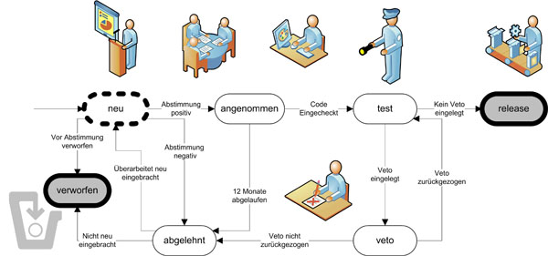

Stud.IP is open source software. Official release versions are published by the Stud.IP Core Group under an open source license.

# Test and development server

The main communication tool for Stud.IP development is the test and development server at http://develop.studip.de. Every active Stud.IP developer should visit this server regularly to follow current discussions and contribute their own questions and suggestions.

# Version control and ticket management

A git installation is maintained for Stud.IP development, the respective main version is located at https://gitlab.studip.de/studip/studip.git.
Gitlab is used for ticket management and can be accessed at http://gitlab.studip.de.

## Assignment and use of write permissions

Write permissions in the svn are granted on request by the respective responsible person in the core group.
In the main branch and the release branches, only checkins that comply with the regulations listed below may be made.

# Core group

## Composition of the core group
The core group consists of people who are committed to the development and maintenance of the official release version of Stud.IP
and have the trust of the core group. There is no size limit and no proportionality rules for the core group.

## Admission to the core group
Potential new members must be proposed for admission by a member of the core group in the form of an admission vote. A proposal for admission is deemed to have been accepted if at least 2/3 of the Core Group members have voted in favor. The newly elected Core Group member must approve the admission.

*The vote is anonymous.

A person should regularly be proposed for admission to the Core Group if it can be expected that they will demonstrate a long-term personal commitment to the goals of the Core Group. When voting, the core group members should positively consider whether a potential new member comes from an actively developing location that is not yet represented. However, the personal reasons for or against admission must be decisive.

## Tasks of the Core Group members
The core group regularly defines the tasks it considers necessary for the development and maintenance of the official release version of Stud.IP. Both terms do not exclusively include technical aspects.

At least one core group member should be responsible for each of these tasks.

Each core group member should be responsible or jointly responsible for at least one of these tasks. The member can also delegate subtasks to non-core group members, but is responsible to the entire core group for ensuring that they are carried out in accordance with the rules. The transfer of tasks is carried out by an unopposed declaration of acceptance or, in the event of an objection, by a vote with a two-thirds majority; the surrender or withdrawal of tasks is carried out by a declaration of surrender or a vote with a two-thirds majority.

Each Core Group member shall participate in organizational activities and meetings of the Core Group.

All Core Group members should participate in the Core Group's votes.

## Resignation and exclusion from the Core Group
Core Group membership ends with the declaration of resignation or a successful expulsion vote with a 2/3 majority. Each Core Group member can request the exclusion of a member by starting a corresponding vote.

A request for expulsion should be made regularly if a member does not fulfill the tasks mentioned in 3. without sufficient justification.

The vote is anonymous.

## Readmission
Re-admission to the Core Group is possible.

## Changes to the rules
Any Core Group member can propose amendments to these rules.
A proposed change is considered accepted if 2/3 of the members agree.

# StEPs



Stud.IP enhancement proposals (StEPs) are proposed changes for an upcoming Stud.IP release version. They are the standard instrument for the discussion and structured implementation of all changes that do not serve the purpose of bug fixing (BIESTs), the introduction of small uncontroversial changes (TICs) or the establishment of longer-term code changes (lifters).

Anyone interested in development may submit proposals. Proposals must propose concrete measures with an implementation plan and not merely identify a problem or a wish and ask for suggested solutions. In these cases, the established forums (developer board etc.) should continue to be used.

The Core Group decides on the acceptance of a StEP.

## Proposal
A StEP must contain the following

### Goal
Very brief summary of the proposal (title/heading)

### Description:
* Description of the problem or aim of the change
* Reasons why the proposal seems sensible or necessary

### Measures (overview)
* Brief description of a solution without implementation details
* should nevertheless outline the important points (new DB tables, use of existing functionalities, ...).

### Measures (details)
* Concrete description that leaves no major questions unanswered with regard to technical implementation and interface design.
* can be developed step by step

### Short description of the integration effort
* low: stand-alone module that can be completely switched on/off via configuration switches or changes to individual files that do not require changes to the database or system-wide data structures
* medium: far-reaching changes to a few files that require minor modifications to the database structure and have no system-wide impact, or minor changes to many files that have a manageable system-wide impact
* high: all changes with serious system-wide effects

### Implementation
* Binding offer of an implementation plan, consisting of:
* clearly named responsibility for implementation, including maintenance if necessary
* implementation schedule coordinated with the release cycle

## Comment and discussion phase
The members of the core group, as well as all other development stakeholders, are invited to comment on and discuss a proposal as soon as it is published. The StEP text may be changed as often as desired up to the voting stage

## Voting phase
Once the comment and discussion phase is complete, a core group member starts a vote in the "Stud.IP Enhancement Proposals" event to accept or reject a proposal in its current form. The StEP author and those named in the implementation plan must signal their approval. A vote should only take place if the course of the discussion indicates that acceptance is likely.

The vote is carried out by means of a non-anonymous Stud.IP vote in the "Stud.IP Enhancement Proposals" event, in which each member of the core group has one vote. The voting period is at least 14 days. A positive vote is valid for 12 months.

The following voting options must be provided for each proposal:
* Acceptance (yes)
* Rejection (no)
* abstention

The following rules apply:
* At least twice as many yes votes as no votes must be cast for a StEP to be accepted
* A minimum participation of 2/3 of the core group members is required for a valid vote
* As soon as an absolute 2/3 majority of Coregroup members have voted "yes", the voting can be ended even before the two weeks have expired

Voting should be based on the following questions:
* is the feature useful?
* Is the feature compatible with the Stud.IP philosophy?
* Is the content concept acceptable and sufficiently generic?
* Is the technical conception acceptable?
* Have possible effects on other Stud.IP areas been taken into account?
* Have all open questions been answered?

## Implementation phase
Once a StEP has been accepted, the responsible persons named in the proposal may check in or have checked in an implementation corresponding to the StEP text in a branch of Stud.IP-gitlab created for this StEP within 12 months. An extension of the deadline is possible after a corresponding core group vote.

A public branch of the implementation must be available by the code freeze as well as an MR (without draft) and the corresponding QM::? labels must be set on the issue.

## Test and veto phase
The core group regularly defines a list of responsibilities with veto rights to ensure the quality of the Stud.IP release. The current list of responsibilities is published together with these StEP rules and includes aspects such as compliance with code conventions, code quality, compliance with GUI guidelines and sufficient documentation. The right of veto may be exercised (jointly) by the respective responsible core group members from the first check-in of the StEP until the end of the test period.

The StEP may only be transferred to main once all quality representatives have given their consent to the implementation of the StEP in the form of a "+". Responsible core group members are obliged to provide feedback on critical points as soon as possible after checking in an accepted StEP and to make constructive suggestions for remedying identified shortcomings. A final veto ("-") is issued if these suggestions are not heeded and the release schedule leaves no other choice. If possible, StEPs should be tested and transferred to the trunk in the order in which they were released for testing by the developers.

## Release branch
The new release is branched out from the main on a date set at the beginning of the release cycle.

## Status
Each StEP has exactly one status, which is updated in the description:

* **new** - initial status, the StEP has been presented and is in the discussion or 1st coordination phase
**accepted** - the first vote has been positive, the StEP may be imported into the trunk
**test** - the code has been integrated into a separate branch and is, in the opinion of the person responsible, complete and largely error-free; general request for testing to everyone
** **veto** - a responsible core group member has raised objections to the StEP that has been uploaded, the StEP cannot be uploaded to the trunk in this form
** **tested** - all quality approvers have given their approval, the StEP may be included in the trunk
**release** - no final veto has been raised and the StEP has been included in the release branch
**rejected** - the first vote was negative or took place more than 12 months ago, or a veto has prevented the StEP from being included in the release; the procedure must be restarted or the StEP is rejected
**discarded** - the functionality is no longer required, is covered by another StEP, etc.


# TICs

Not every change has to go through the StEP process. TICs (tiny improvement commits) are checked-in code changes that do not require approval.

## Create

A TIC is created by creating a ticket of type TIC in Gitlab. All developers with write permissions in the svn repository for the release branch may create TICs. The ticket must contain a description of the changes.

## Install

All TIC-related commits must be assigned to the ticket. Commits are only permitted up to the code freeze. A public branch of the implementation and an MR (without draft) must be available until the code freeze.

## Contradiction

All commits assigned to a TIC must be reversed if a core group member objects to the TIC. The objection period ends with the release branch.

TICs against which an objection has been lodged can be converted into StEPs and then discussed.

# Lifters

* **L**ing, **i**ncremental **f**progressive **technical**r**enovation for **S**tud.IP*

Some important, sensible and desired revisions of the Stud.IP source code require interventions in many parts of the code. However, limited resources in terms of development capacity and quality assurance make it impossible to change the code "in one fell swoop". In particular, the developer community wants to avoid stopping ongoing developments until a completely new version of the code is ready. Delays in the - often purely technically motivated and externally "invisible" - retread could jeopardize the entire project.

The "Stud.IP lifters" establish a procedure for integrating such revisions into the ongoing release cycles. They set clear goals and define clear instructions for developers on how to revise existing code and make new code Lifter-compliant.

"Lifters" define means of progress control. Although they do not have a binding end date or a binding completion release, it is always possible to see how far the implementation work has progressed.

"Lifters" help the developers. They provide clear guidelines on how to handle coding problems that previously often had to be solved individually. They provide well-portioned work packages for beginners and developers who want to "do something good" for the project without knowing exactly what work is currently useful and desired.

"Lifters" run "alongside" normal Stud.IP development, so to speak. They are intended to clearly and simply describe how code revisions that happen "anyway" can take other aspects into account at the same time. "Lifters" are therefore not a new type of regulation, but standardize previous development guidelines.

"Lifters go through a similar process to StEPs. They are proposed by a core group member, discussed publicly and finally voted on by the core group. After the first vote, a lifter has the status "in implementation". SVN check-ins that implement Lifter guidelines do not require a separate StEP (keyword: no check-in without a StEP), but must be announced and tested as part of the progress check (see below).

Lifters therefore have the following stages:
* **new** = proposal under discussion
**accepted** = lifter approved for implementation. Adopted lifters are binding for all new developments, with the exception of bug fixes.
**completed** = All work has been completed. Completed lifters are binding for all future developments.
**inactive** = Old lifter that no longer needs to be observed.

## Formulate
Lifters are created via the form in the wiki of the course "Stud.IP Lifters" and then maintained in the wiki.
A ticket is created in Gitlab.
All subsequent lifter-related checkins must refer to this ticket.

Lifter proposals must meet the following requirements
* clearly specified transition rules (comprehensive description of before and after state)
* old code must remain executable during the transition phase
* if automated conversion aids can be created (e.g. sed scripts), these should be created by the Lifter author and their use documented in the same way as manual conversions. Automatic conversions must also be checked in the same way as manual conversions.
* As part of the discussion, test scenarios, i.e. reliable statements about the target state, should be defined that can be carried out on an ongoing basis to ensure quality, especially before release dates. Sufficient test scenarios must be submitted BEFORE the core group vote.
* Progress control. A lifter proposal must contain a workable list of work packages that are necessary to complete the lifter. This can be done, for example, by marking the files to be processed (see below).
* If, in the course of work on a lifter, new requirements arise that deviate from the original description, either:
    * a StEP must be created for the adaptation in question,
    * the lifter description must be amended and the amendment put to the vote, or,
    * the lifter must be adjusted by vote (see below).
* Lifters can be marked as inactive or as a mere recommendation with the same majority that was required to approve them. If the existing changes are to be reversed, this is permitted in obviously simple cases immediately after the vote, in more complex cases only after a corresponding StEP or lifter has been accepted.
* Newly created files and work on StEPs must meet the requirements of a lifter after it has been accepted.
* Bugfixes do not have to adhere to the Lifter requirements for files that are not yet Lifter-compliant.

## Voting
Voting is carried out by means of a non-anonymous Stud.IP voting in the core group event, in which each member of the core group has one vote. The voting period is at least 14 days.

The following voting options must be provided for each proposal:
* Accept (yes)
* Rejection (no)
* Abstention

The following rules apply:
* At least twice as many yes votes as no votes must be cast for a lifter to be accepted
* An abstention always counts as an abstention, regardless of the degree of complexity
* A minimum participation of 2/3 of the core group members is required for a valid vote
* As soon as an absolute 2/3 majority of Coregroup members have voted "yes", the voting can be ended before the two weeks have expired

The following questions should form the basis for your own voting behavior:
* is the feature useful?
* Is the feature compatible with the Stud.IP philosophy?
* Is the content concept acceptable and sufficiently generic?
* Is the technical conception acceptable?
* Have possible effects on other Stud.IP areas been taken into account?
* Have all open questions been answered?

### Implementation phase and progress check
As a rule, lifters affect PHP files. In these cases, an SVN check-in must be carried out after a lifter has been accepted, which creates a comment of the form
```php
<?
# Lifter001: TODO - possibly more detailed description... (everything after the - is description)
?>
```
is inserted.

If a lifter for a file is completely or partially completed, the comment must be changed to:

```php
<?
# Lifter001: TEST - possibly a more detailed description of the measures... (everything after the - is description)
?>
```

In the case of partial completion, the remaining work can also be explained.

In HTML or CSS files, comments are also added in accordance with the above conventions.

It is not possible to mark binary files to be edited in the file. Instead, a list of files still to be adapted is to be maintained in the Lifter description, which is updated in each case. As it can be assumed that such types are rare, more precise regulations are only made when required.

## Quality control
Lifters require increased attention during testing. In critical phases of a branch (beta test phase in the release branch), no Lifter-related changes may be checked in there. For larger checkins or particularly critical code parts, the core group undertakes to carry out appropriate tests.

Each Lifter-related checkin is initially assigned the status "TEST" (see above). Another developer with write access in SVN must check and test the code and then remove the TEST marker and check the code in again. He then appears as a tester in the revision log. If a file has only been partially edited, the tester inserts a TODO marker again and describes any remaining measures.

LIFTERN is only permitted until the TIC deadline and is then subject to the same test and veto procedure as StEPs and TICs.

Discovered errors (which are presumably related to a lifter) are documented as normal BIESTs via the plug-in in the BIEST event or directly in Gitlab.

## Conclusion and documentation
It is particularly important for the external presentation to declare Lifter as a one-time effort as completed: As a rule, this achieves a positively marketable state (multi-tab browsing now works, Stud.IP is based entirely on layout templates, ...).

In order to declare a lifter as completed, a vote of the core group is required, which is subject to the same conditions as for acceptance. This ensures that the core group henceforth identifies with the status achieved and supports public statements about the status achieved.

A completed lifter is given the status "done" and continues to be binding for all new developments, extensions and bug fixes. If any areas are subsequently identified that are not Lifter-compliant, they must be reported as normal bugs.

Discarded or obsolete lifters are marked with the status "inactive" and are not binding for further development.

# BIESTs

## Report bugs

BIESTs are reported via the gitlab of the Stud.IP project and marked with the corresponding labels "BIEST" and "Version::x.x" for the earliest version in which the error occurred. Optionally, the affected component can also be specified.

## Fix error

Checkins that fix a BIEST must be assigned to the respective ticket.

Complex errors should be handled in a separate branch and the fixes should be approved by a second person if possible.

Bug fixes must always be brought to the main in a single commit. If an error occurs and the issue has not yet been merged, the commit must be reversed and the bug resolved in an MR. If the issue has already been ported to old versions, a new issue must be created to fix this problem.

# Release

## Create service release

The following steps must be carried out to create a service release (e.g. 4.5.5):
* Clarify whether all relevant bugfixes have been ported "down" (ask André or Jan-Hendrik)
* Check whether all issues & merge requests have been closed on the corresponding milestone, if necessary move open issues to the next milestone
* Check out the current status of the release branch
* Compile the necessary assets
* Test the most important Stud.IP pages
* If necessary, transfer the changelog entries of previous service releases (e.g. from 4.5.5 -> 4.6.3)
* Extract all issues of the milestone, reformat and add to the top of the changelog
* Add link to the issues of the milestone in gitlab at the top of the changelog
* Add current date and version number to the top of the changelog
* Update version number in ./VERSION and ./lib/bootstrap.php
* Tag the current status of the release branch with the version number
* Close milestone
* Create release as .tar.gz and .zip
* create readme-x.y.z.txt with the changelog entries of the milestone
* Upload .tar.gz .zip and readme.txt to Sourceforge
* Create news at Sourceforge
* Create or update announcement on the developer server

## Create main release

When creating a main release (e.g. 4.6), the following steps are necessary in addition to the list above:
* Creating the corresponding branch
* Complete the translation and update the translation files
* Update history.txt
* Update ./AUTHORS ./INSTALL ./README if necessary
* Change DEFAULT_ENV = 'production' in ./lib/bootstrap.php
* Test a new installation
* Test an upgrade from the last Stud.IP version that is no longer supported
* Adaptation of https://www.studip.de/home/download/ if necessary
