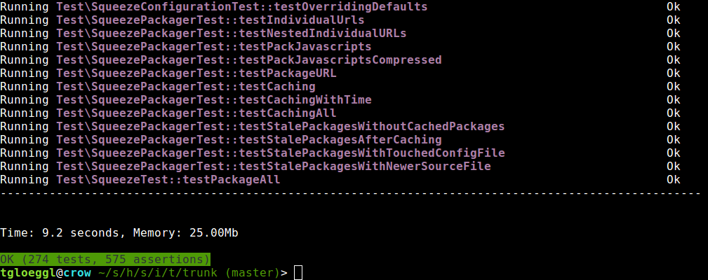

# Welches Tool verwenden wir?

Um Stud.IP mit Tests zu versehen verwenden wir seit der Version 3.2 die Testsuite Codeception, siehe http://codeception.com/.

Codeception beinhaltet PHPUnit für Unit- und API-Tests und ermöglicht das Schreiben von Acceptance-Tests ebenfalls in PHP. Die Acceptance-Tests können dann mit einem internen PHPBrowser ausgeführt werden oder auch durch einfaches umschalten in der Konfiguration mit einem Selenium-Server (http://www.seleniumhq.org/).

Um Codeception zu installieren, verwenden wir Composer. Dabei handelt es sich um einen Dependency-Manager, der einem dabei hilft Dinge wie Codeception zu installiern und auf dem aktuellsten Stand zu halten, siehe https://getcomposer.org/.

PHPUnit ist ein Testframework für PHP, es bietet weitreichende Möglichkeiten für den Unit-Test, die Arbeitsweise ist der offiziellen Dokumentation unter https://phpunit.de/documentation.html zu entnehmen.

## Wie installiere ich composer

Auf den Seite von composer wird gut erklärt, wie man diesen installiert: https://getcomposer.org/doc/00-intro.md.

Befindet man sich unter Linux, so geht das im einfachsten Fall mit folgendem Befehl:

```shell
curl -sS https://getcomposer.org/installer | php
```

Dabei wird in das aktuelle Verzeichnis eine composer.phar gelegt, die man dann dann wie ein Kommandozeilentool verwenden kann. Genau das werden dann im nächsten Schritt tun.

## Wie installiere ich codeception

Nachdem man composer installiert hat, kann man codeception ganz bequem über folgenden Befehl installieren:
```shell
php composer.phar install
```

oder, falls man composer in seinem Suchpfad hinterlegt hat (z.B. durch Installation via eines Paketmanagers):
```shell
composer install
```

Danach wird im Stud.IP-Hauptverzeichnis ein Verzeichnis namens "composer" angelegt worin alle nötigen Dateien hinterlegt sind.

# Wie führe ich die Tests aus?

Standardmäßig werden nur die Unit-Tests ausgeführt, da man für Acceptance- und API-Tests noch ein wenig seine Testumgebung konfigurieren muss, bevor die sinnvoll durchführbar sind.

Um die Unit-Tests auszuführen (s.u.) reicht folgender Befehl
```shell
make test
```

Das Makefile definiert dabei einen Fallback auf PHPUnit, welches verwendet wird, wenn keine Codeception-Installation gefunden wurde.

Dadurch werden alle Unit-Test mit PHPUnit durchgeführt. Die Ausgabe sieht dann ungefähr so aus (bei erfolgreichem durchlaufen der Tests):



# Mit Codeception arbeiten

Codeception besitzt ein Kommandozeilen-Tool mit dem man die nötigen Operationen durchführen kann. Die genaue Dokumentation der Arbeitsweise findet man auf den Seiten von Codeception unter http://codeception.com/. Die im folgenden typischen Anwendungsfälle sollen dabei nur ergänzend als Einstiegshilfe sein.

## Verzeichnisstruktur

Codeception arbeitet im Verzeichnis *tests*. Dort liegen die einzelnen Testsuiten in den entsprechenden Untervezeichnissen, also *acceptance*, *unit* usw. Es gibt für jede Testsuite eine eigene Konfigurationsdatei die auf *.suite.yml* endet. Dort hinterlegt sind die Einstellungen für die entsprechende Testsuite.

## Tests ausführen, the educated way

Wie weiter oben beschrieben reicht normalerweise `make test` um die Unit-Tests auszuführen. Was dabei tatsächlich passiert ist der Aufruf des Befehls
```shell
./composer/bin/codecept run unit
```

Es wird dabei nur eine bestimmte Testsuite ausgeführt (siehe zweiter Parameter, "unit"). Möchte man alle Testsuiten ausführen, so verwendet man folgenden Befehl:
```shell
./composer/bin/codecept run
```

Dieser wird allerdings fehlschlagen, wenn die anderen Testsuiten noch nicht fertig konfiguriert wurden. Wie das geht steht in den folgenden Abschnitten.

Es ist auch möglich nur einen bestimmten TestCase zu berücksichtigen. Möchte man zum Beispiel lediglich den StudipFileloaderTest durchführen, ruft man codeception wie folgt auf:

```shell
./composer/bin/codecept run unit lib/classes/StudipFileloaderTest.php
```

Das hilft einem beim Schreiben neuer Tests - man muss nicht alle momentan irrelevanten Unit-Tests mit durchlaufen lassen um zu sehen ob der neu gebaute Test funktioniert.

## Acceptance-Tests

Acceptance-Test sind Test die auf oberster Ebene arbeiten und einen Stud.IP-Nutzer simulieren. Sie werden verwendet um Funktionalität aus Nutzersicht sicherzustellen und reichen dabei von einfachen, allgemeinen Tests wie "Kann sich ein Nutzer einloggen" bis zu sehr spezifischen Anforderungen wie  "Kann ein Nutzer mit der Rechtestufe autor in einer offenen Veranstaltung einen Forums-Eintrag innerhalb eine Bereiches schreiben".

Die offizielle Dokumentation für Acceptance-Tests befindet sich hier: http://codeception.com/docs/03-AcceptanceTests

Codeception bietet PHP-Funktionen an, um Acceptance-Tests zu schreiben. Diese werden dann je nach Einstellung mit einem internen PHP-Browser ausgeführt oder in Selenium-Tests übersetzt und an einen Selenium-Server weitergereicht.

### Testen mit PHPBrowser

Um die vorhandenen Tests ausführen zu können, benötigt man eine lauffähige Version des Stud.IPs, sprich es muss über einen Webbrowser aufrufbar und verwendbar sein. Ist das erledigt, trägt man die URL zu diesem System in die Konfiguration der Acceptance-Tests ein. Diese befindet sich in folgender Datei:
`tests/acceptance.suite.yml`

Dort trägt man unter "url" den Pfad zum public-Verzeichnis der Stud.IP-Testinstallation ein:

```json
class_name: WebGuy
modules:
    enabled:
        - PhpBrowser
        - WebHelper
    config:
        PhpBrowser:
            url: 'http://localhost/pfad/zu/studip/public/'
```

**Wichtig**: Nach jeder Änderung an der Konfiguration sollte 
man einmal den Befehl `./composer/bin/codecept build` ausführen um z.B. neu konfigurierte Module zur Verfügung zu haben.

Nun kann man mittels
```shell
./composer/bin/codecept run acceptance
```
die Tests durchlaufen lassen. Üblicherweise sollte man die Datenbank vor jedem Testdurchlauf auf einen definierten Stand bringen. 
Wie das funktioniert, steht im Abschnitt "Testen mit Datenbank"


### Testen mit Selenium

Um die Tests mit Selenium ausführen zu lassen, benötigt man zuerst einen Selenium-Server. Dabei handelt es sich um ein Java-Programm, welches man auf http://www.seleniumhq.org/download/ im Abschnitt "Selenium Server" herunterladen und danach mit
```shell
java -jar selenium-server-standalone-VERSION..jar
```
starten kann.

Ist das erledigt weißt man Codeception an, für die Acceptance-Tests nun den Selenium-Server zu verwenden. Dafür editiert man wiederum
```shell
tests/acceptance.suite.yml
```
und ergänzt um einen weiteren Eintrag und ändert die aktivierten Module, so dass die Konfiguration nun ungefähr wie folgt aussieht:

```json
class_name: WebGuy
modules:
    enabled:
        - WebDriver
        - WebHelper
    config:
        PhpBrowser:
            url: 'http://localhost/pfad/zu/studip/public/'
        WebDriver:
            url: 'http://localhost/pfad/zu/studip/public/'
            browser: 'firefox'
```

Bei "browser" kann der verwendete Browser definiert werden. Es ist auch möglich, dieselben Tests in verschiedenen Browser laufen zu lassen, das wird gut im Abschnitt "Environment" auf http://codeception.com/docs/07-AdvancedUsage#Environments erklärt.

**Wichtig**: Nach jeder Änderung an der Konfiguration sollte man einmal den Befehl `./composer/bin/codecept build` ausführen um z.B. neu konfigurierte Module zur Verfügung zu haben.

## REST-API-Tests

Möchte man Tests für Webservices schreiben, so findet man gute Dokumentation dafür unter
http://codeception.com/docs/10-WebServices

Grob zusammengefasst muss man eine Testsuite generieren (lassen), z.B. mit dem Namen api, dort platziert man dann seine Tests. Man hat dort dann die Möglichkeit HTTP-Requests (GET, POST, PUT, DELETE, etc.) abzusetzen und das Ergebnis zu überprüfen. Zusätzlich dazu macht es Sinn, die Datenbank vorher immer auf einen definierten Stand setzen zu lassen (siehe den Abschnitt "Testen mit Datenbank")

# Testen mit Datenbank

Insbesondere bei Acceptance-Tests ist es sinnvoll, die Datenbank vor dem Testen auf einen definierten Zustand zu setzen. Das geht Dank Codeception sehr bequem.
Man legt dafür lediglich einen Datenbankdump in das Verzeichnis *tests/_data* und konfiguriert die gewünschte Testsuite.
Möchte man also bei den AcceptanceTest die Datenbank auf einen definierten Zustand setzen, editiert man die Datei
`tests/acceptance.suite.yml`
und ergänzt die Konfiguration für die Datenbank.

Das sieht dann ungefähr so aus:
```json
class_name: WebGuy
modules:
    enabled:
        - WebDriver
        - WebHelper
        - Db
    config:
        PhpBrowser:
            url: 'http://localhost/pfad/zu/studip/public/'
        WebDriver:
            url: 'http://localhost/pfad/zu/studip/public/'
            browser: 'firefox'
        Db:
            dsn: 'mysql:host=localhost;dbname=studip'
            user: 'root'
            password: 'passwort'
            dump: tests/_data/studip_acceptance_test.sql
```

Man hat nun darüber hinaus auch die Möglichkeit direkt bei den Tests Datenbankinhalte zu überprüfen. Ausführliche Dokumentation findet sich auch hier wieder bei Codeception, siehe http://codeception.com/docs/modules/Db.


# Testen von SORM-Klassen

Zum Testen von SORM-Klassen ist es nicht notwendig, eine externe Datenquelle einzurichten. Es können direkt in der Codeception-Testklasse SORM-Objekte erzeugt werden und für Tests verwendet werden. Hierzu müssen in die _before()- und _after()-Methode der Codeception-Testklasse ein paar Codezeilen eingefügt werden.

In die _before()-Methode der Codeception-Testklasse wird Code eingefügt, welcher die folgenden Aktionen durchführt:

* Erstellen der Stud.IP-Datenbankverbindung
* Starten einer Datenbank-Transaktion
* Setzen der Datenbankverbindung im DBManager
* Gegebenenfalls Erzeugung von SORM-Objekten, welche für die Tests benötigt werden


Der Code innerhalb der `_before()`-Methode der Testklasse kann z.B. folgendermaßen aussehen:

```php
//Erstellen der Stud.IP-Datenbankverbindung:
$this->db_handle = new \StudipPDO(
    'mysql:host='
        . $GLOBALS['DB_STUDIP_HOST']
        . ';dbname='
        . $GLOBALS['DB_STUDIP_DATABASE'],
    $GLOBALS['DB_STUDIP_USER'],
    $GLOBALS['DB_STUDIP_PASSWORD']
);

//Starten einer Datenbank-Transaktion:
$this->db_handle->beginTransaction();

//Setzen der Datenbankverbindung im DBManager:
\DBManager::getInstance()->setConnection('studip', $this->db_handle);

//Falls notwendig: Erzeugen von SORM-Objekten:
$u = new User();
$u->username = 'sorm_test_user';
[...]
$u->store();
```


In der _after()-Methode der Codeception-Testklasse wird nur die Datenbank-Transaktion zurückgesetzt (ein "Rollback" durchgeführt), um die Änderungen an der Datenbank, welche innerhalb der Tests durchgeführt wurden, rückgängig zu machen. Die _after()-Methode enthält also folgende Codezeile:

```php
$this->db_handle->rollBack();
```
