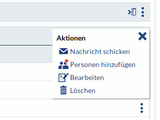

### Interaction elements
Text still needs to be updated

* What should be clickable?
    * Navigation elements
    * Buttons with text
    * Text links: Text links should not appear in the body text of system components (e.g. in info boxes), even if this has often been done in the past. Text links only appear in the body text of a field (user input or system field) and are provided with the link icon by the formatting functions in this case. Only in this case can the user easily distinguish this link from the body text.
    * Icons: In principle, icons should only be clickable in the blue variant (the color corresponds to the normal link color), exceptions currently exist on the "My events" page and for some object icons. The exceptions should remain exceptions, i.e. new clickable icons should always be in blue. For actions such as creating, deleting or moving, there are additions (usually red) that indicate the special function of this icon. (see under [Icons](Visual-Style-Guide#Icons))

* When do you use a text link for interaction, when a tab, when a button with text and when an icon?
    * Tab: Switching between different views/aspects of an object
    * Text link: Navigation to another page, not an "action" in the strict sense.
    * Icon: Triggering an action
    * Button: Triggering an action
    * When to use an icon and when to use a button?

* How should buttons be named?
    * Example: "accept" vs. "send" vs. "OK" vs. "save" vs. ...

* Which icons stand for which actions?
    * Example: yellow double arrow (sort? move objects? copy objects? scroll further?)
    * Would have to be gone through for all icons.
    * Icon list

* Basic information
    * What are icons used for?
    * When should interactive icons be used, when buttons, when text links?
    * Buttons
        * for triggering actions
            * in the content area
    * Icons
        * to trigger actions
        * outside the content area
        * or where there is not enough space for buttons (e.g. in tables)
    * Text links
        * to switch to other pages within Stud.IP or from Stud.IP
        * not for triggering actions
        * everywhere (in the content area, in info boxes etc.)

### Buttons

Stud.IP uses clearly recognizable buttons to confirm and complete actions and occasionally to initiate main actions in the system.  The main purpose of buttons is to complete actions, especially at the end/footer of a dialog or when deleting objects.
The rule of thumb for when a button and when an icon can be used is as follows:

* Initiation: In the Rel, most actions in Stud.IP are initiated by icons (sometimes with text placed next to them). Typical examples are the sidebar, icons in table headers or rows and all icons in the main navigation. On the one hand, this is due to size restrictions (icons require significantly less space) or the presence of a large number of actions (three or more icons next to or even below each other are easier to display for usability than the same number of buttons). However, there are also contexts in which buttons can be used for initiation. This is particularly useful if the environment of the page offers sufficient space and no standard elements (tables or content boxes generally only use icons) are used. At the same time, buttons can be used if an action is particularly important (e.g. deleting an object).
* Confirmation and completion: A good use of a button is always to confirm and complete an action, for example at the end of a dialog after entering a large amount of data. Deleting at the end of a dialog or a form and canceling dialogs are also typical uses of a button.

It should be noted that a button always shows an action as a written word, but usually without an icon. Icons, on the other hand, are often only visible in their graphic form, but are often supplemented with text (sidebar, action menu). Nevertheless, a button is always the "weightier" interaction element, as it is larger, offers a hover effect and is also easier to use (compared to icons) due to its large surface area. This is especially true for touch devices.

#### Labeling and labeling

Buttons are usually labeled with the action of the name as nouns (the "Complete", the "Cancel" and the "Save"). Noun-verb constructions should be avoided ("Save" would be preferable to "Save file"). Entire sentences ("Save this file.") are not permitted. A button containing only one word is therefore ideal.
The label should describe the function of the button as clearly as possible. It should be clear what will happen when the button is pressed.
However, specific substantive verbs should be used in the choice of words. "OK" is not a good button, as it is not clear what will happen. "Save", on the other hand, describes a button correctly.
In the standard design, the label is automatically centered.

#### Appearance
Buttons appear in Stud.IP as white buttons with a thick, dark blue border. Buttons are always colored blue as a clickable object. Red or green or other colored buttons are not allowed. A dangerous action (e.g. "Delete") must be protected on the one hand by suitable placement of the button and by further safeguards (warning dialog), but not by warning colors of the button.
In some cases, icons can still be seen in buttons (tick, X or similar). This addition of icons to a button is no longer permitted.

#### Placement and alignment of buttons

Buttons must not be placed in the text flow and must always be free-standing. Ideally, there should be no other objects to the left or right of one or more buttons in the designable area (e.g. dialog, table row, content box).
In forms, buttons should be left-aligned, in dialogs centered. However, there are exceptions if the function of the button implies a certain position. For example, "Back" and "Next" buttons within a dialog should be left-aligned and right-aligned accordingly.

#### Sequence of several buttons next to each other:
A specific sequence should be followed for buttons:
1. positive, confirming button ("Save", "Apply", "Yes")
2. negative button ("No")
3. harmless/cancel button that does not change the status ("Cancel", "Close")

### Behavior
In addition to active buttons, Stud.IP also has inactive buttons. These are grayed out and cannot be clicked, but indicate that under other circumstances this button would be clickable (here an info "i" icon with tooltip next to it can explain why the button is not clickable).
If a default button is defined that is activated when a key is pressed (e.g. Enter), this must always be a harmless button ("No", "Cancel" or "Close"). In the event that data has already been entered in an associated form, there is a property (at least in dialogs) that prevents the dialog from being closed after input without further confirmation. In general, it is important to ensure that a default option cannot result in data loss.

----

**General** \\
Use confirmation buttons according to the following design patterns:

| **Pattern** | **Commit buttons** |
| ---- | ---- |
| Question dialog (with buttons) | One of the following specific identifier groups: Yes/No, Yes/No/Cancel, [Do it]/Cancel, [Do it]/[Don't do it], [Do it]/[Don't do it]/Cancel|
| Selection dialogs | **Modal dialog:** OK/Cancel or (Do it)/Cancel
|**Non-modal dialog**: Close button in the dialog box and the title bar|

## Action menus

An action menu encapsulates a list of context-related actions and can be used in the following places:
* For actions for an element in a list or table.
    * Examples: Participants, events, questionnaires
* For actions for an area that encloses content and does not have its own action buttons.
    * Examples: Tables, groups of people, widgets on the start page

In this case, the action menu is on the far right, where the action icons are usually listed individually. In general, an action menu should be used instead of a list of icons if there are more than three actions directly next to each other (including inactive or hidden actions) or if the icons are not self-explanatory and should be explained by text.

General guidelines when using an action menu:
* The primary action of an element (e.g. Edit, Show, Expand) is not part of the menu.
* The primary action is always accessible by clicking on the element itself (or its icon).
* If the element can be expanded, expand or collapse is always the primary action.
* Inactive actions should not be completely hidden, but only displayed as inactive (gray, not clickable).
* If the primary action is not available, the element is not clickable, only the actions in the menu are available.
* Up to two icons may be placed outside the menu (i.e. in front of it) if they are used frequently.
* If a column of a table uses the action menu, all rows of the table should use it consistently.
* Icons in the action menu should not be used to indicate the status of an object.

Suggested order of actions in the menu, if the individual actions are available:
* View (or Preview)
* Download
* Update
* Edit
* Add (or Assign)
*
* Move
* Copy
* Export
*
* Delete (or unsubscribe)

Open questions:
* Should the menu be broken down into individual action icons on sufficiently wide displays or by a user setting?
* Should the action menu also appear with three or fewer actions on mobile devices or "small" display widths?
    * Does this also include any icons (up to two) explicitly placed in front of the menu?
* Should the action icons generally have a hover effect? Example: Cliqr
