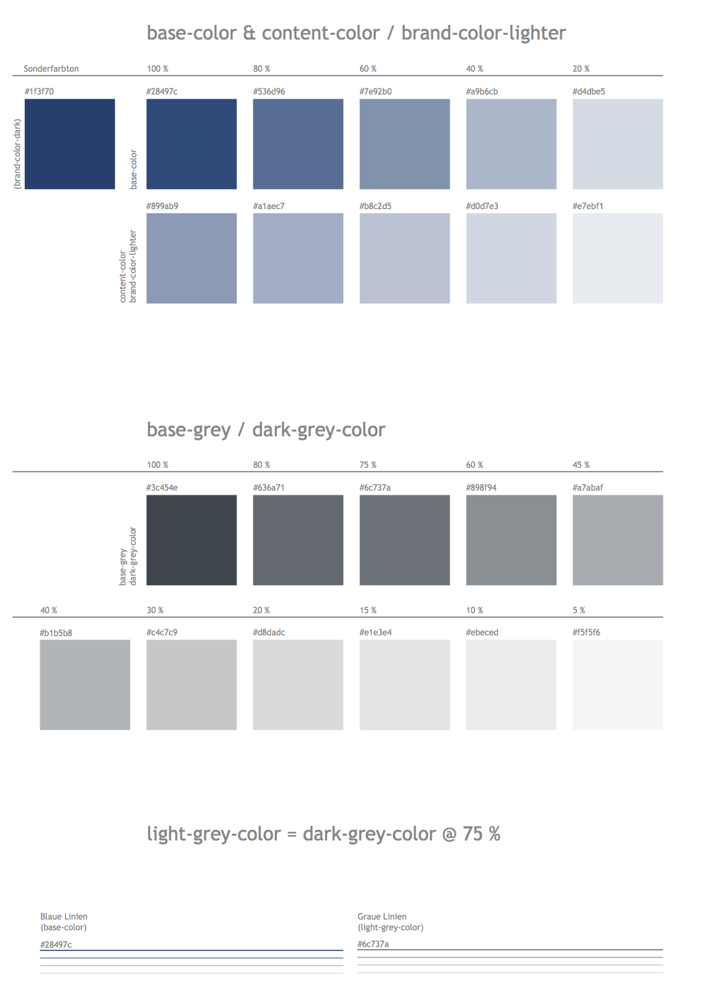
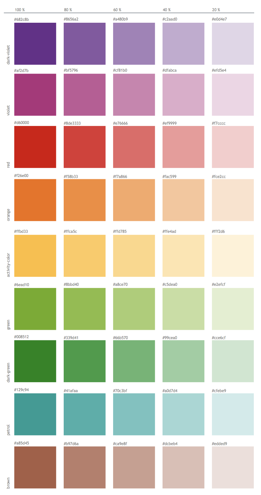

## Colors and color space
Colors are one of the most important design tools. Used correctly, colors can help users to perform tasks more easily.

The standard colors of the current Stud.IP design were determined by the Core Group
GUI managers in collaboration with a designer.

The color scheme is based on a few basic colors and fixed contrast distances.

In principle, every Stud.IP installation can be changed in color by adapting the CSS files. It should be noted, however, that only the base color should be adjusted. This will change other colors according to the specified color values.
(However, this assumes that the colors in the less files are adjusted and compiled with the less compiler. It should also be noted that the complete implementation of the Stud.IP CSS files will only be implemented in future versions).
The color climate includes 20% attenuations of all basic colors, which are automatically generated by the less compiler.

## Meaning and selection of colors in Stud.IP

Colors should be chosen with care, as they act like visual methaphors and appeal to emotions. It is therefore important to use colors consistently. So far, colors have been used in Stud.IP as follows:

PDF Download: [170804_Studip-Farbset.pdf](../assets/6d14189aa9093eb042bfa56eae8c7dc2/170804_Studip-Farbset.pdf)

### Blue (base-color and content-color)
Blue is the default background color for the current Stud.IP theme in various shades.
The base color is #28497c. The color value #899ab9 is used as the base color for content (i.e. content within the page design).

Blue is also used for clickable objects, i.e. text links and clickable icons are marked in blue.

Blue is also the background color for [MessageBoxes](MessageBox) with information messages.

The base-color can be adapted by the operator to his own colors, e.g. to match his own CD. The content-color should not be adjusted.

### Gray (light-gray, dark-gray)

There are different shades of gray that can be used freely to highlight different areas (e.g. info boxes, navigation). The base values are #69767f (light-gray) and #3c454e (dark-gray).
Content (i.e. tables, text contributions, messages, forms) may only be highlighted with the content-color (blue). Other objects can also be highlighted in gray.

## Highlight colors

In addition to the basic colors, colors are also used for different markings/categorizations. The colors permitted for this are also defined:

### Red
Red is used as a signal color in several places:

On the one hand, red indicates critical actions and is therefore used, for example, as a frame color for error messages. The icon in an error message is also colored red.

On the other hand, everything new (from the point of view of the respective user) is highlighted in red. For example, red icons are used on the "My events" page if one of the areas of an event contains new content for the user. There are also red markings for new posts in several places in the event areas.

The base color for red is: `#d60000`

### Green
Green is only used for positive feedback. For example, green is the frame color for messages with confirmation of success.

Green must not be used in the design of Stud.IP content or other elements!

### Yellow (activity-indicator)
Yellow is only used as a marking color.

For example, the indicator of which view has been selected in a page with several views is a yellow arrow.

In the forum or the wiki, the color yellow marks locations in the hit list.

Yellow move arrows for rearranging objects are no longer permitted in the current design.

Base color is `#ffbd33`

### Black and white
Black and white are used as font and contrast colors. Font and symbols are drawn in black or white depending on the background.

### Notes
The hexadecimal values of the colors are defined in LESS files (`public/assets/stylesheets/mixins/colors.less`) and must be transferred to the stylesheets with an appropriate Less compiler for adjustments.
The manual adjustment of individual color units in the CSS files is expressly not recommended, as some colors are also defined/generated in dependencies on each other (e.g. from the base color).

The use of colors for icons is described in more detail in the section on [Icons](Visual-Style-Guide#Icons).

### General notes on color selection

#### Use colors carefully and sparingly
Colors should be used sparingly. To identify areas in the [content area of a Stud.IP page](http://hilfe.studip.de/develop/Style/DesignSeitenlayout) by color, ISO 9241-12 recommends using no more than six different colors (in addition to black and white). The colors used should be easily distinguishable by the user.

#### Do not use color as the sole visual aid
Colors should not be used as the only visual means to convey information or identify elements. For users with color vision deficiencies, it may be difficult to distinguish between two objects that differ only in color. Differences should also be indicated by, for example, different shapes, positions or a textual description.

#### Use colors with the same degree of saturation
In order to achieve a harmonious color design, colors with the same degree of saturation should be used. Saturation (or chroma) refers to the amount of grey in a color. The less grey a color contains, the brighter it appears.

Large areas should not be designed in bright (saturated) colors. These become difficult to read and can sometimes cause headaches.

#### Is the contrast between elements and their background sufficient?
If the hue of the foreground and background colors is too similar, differences are difficult to see.

Tips for checking the contrast of a color combination:
* To check whether there is sufficient contrast, it is advisable to print the page in black and white. If the printout is easy to read, there is typically sufficient contrast.
* The online tool [Color Contrast Checker](http://www.snook.ca/technical/colour_contrast/colour.html) can be used to check directly whether there is sufficient contrast between two colors.
* On some operating systems, the display can also be switched to grayscale as the default setting in order to test the contrasts.

#### Avoid cluttered and distracting backgrounds
Patterns or images in the background that cause uneven contrast, distract the eye from the text and thus make it difficult to read are unfavorable.

### Further links
* Tutorial: Colors in web design [http://metacolor.de/](http://metacolor.de/)
* [Color/contrast analyses with reference to a11y criteria](http://www.blog.mediaprojekte.de/grafik-design/farb-kontrast-analyse-die-accessibility-der-farben-testen)
* http://e-campus.uibk.ac.at/planet-et-fix/M8/8.5.2_Praesentationen/links/farben.html
