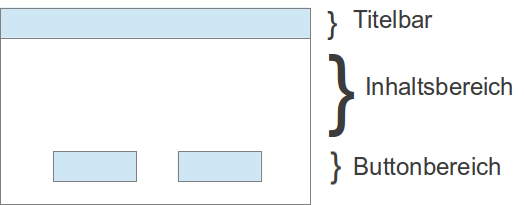

Dialoge werden verwendet um Eingaben oder Bestätigungen vom Benutzer einzuholen.
Seit der Einführung der Sidebar gelten Dialoge auch grundsätzlich als Repräsentation von Aktionen.
Aktionen verbleiben dabei auf der jeweiligen Seite und vermeiden einen Kontextwechsel

Trotzdem sollten Dialoge nicht inflationär eingesetzt werden. Wenn möglich sollte eine Interaktion direkt auf der Seite stattfinden,
auf der auch die zu bearbeitenden Informationen oder Elemente dargestellt werden.

## Allgemeines
Dialoge sollten einfach gehalten und nicht zu komplex sein, d. h. nur eine zugehörige Aktion sollte pro Dialog ausgeführt werden.

Dialoge sollten selbst erklärend sein und möglichst wenig (Erklärungs-) Texte enthalten.

Dialoge sollten nicht gestapelt werden, d. h. ein Dialog sollte sich nicht in einem Dialog öffnen (außer z . B. Datepicker, wo kein Button gedrückt werden muss). Für komplexere Dialoge sollten Wizards verwendet werden, in dene mehrere Dialoge hintereinander geschaltet sind oder Bereich innerhalb der Dialoge auf- und zugeklappt werden.

## Modale und nicht-modale Dialogfenster
Bei modalen Dialogfenstern kann der Benutzer nicht in anderen Fenstern der Anwendung weiterarbeiten, sondern nur im Dialogfenster. Im Unterschied dazu erlauben nicht-modale Dialogfenster dem Benutzer auch die Interaktion mit dem Hintergrundfenster. Nicht-modale Dialogfenster werden in Stud.IP beispielsweise beim Stundenplan zur Eingabe von Terminen verwendet. Die Mehrzahl der Dialoge in Stud.IP ist jedoch modal.

Beim Aufruf eines modalen Dialogfensters wird das Hintergrundfenster durch geeignete optische Manipulation ("Ausgrauen" bzw. abdunkeln mit einem Overlay in Dunkelblau) als inaktiv gekennzeichnet.

Dialoge sind abzugrenzen von Notifications, die nie modal sind und nicht als eigenes Fenster erscheinen.

## Popup-Fenster

Popup-Fenster, d. h. sich separat öffnende Fenster, dürfen nicht verwendet werden.

## Eigenschaften
Dialogfenster sind meist [formularartig](Visual-Style-Guide#Formulare) aufgebaut.

Dialoge sollten lesbar sein, ohne dass ein Scrollen im Dialog erforderlich wird. Eine Ausnahme bildet das vertikale Scrollen: Wenn es sich nicht vermeiden lässt (etwa weil Inhalte, lange Listen oder Aufklappelemente nicht das Dialogfenster passen) darf innerhalb des Dialogfensters gescrollt werden.

Die Seitengröße innerhalb eines Dialogfensters sollte sich während seiner Bearbeitung nicht ändern. Ausgenommen von dieser Einschränkung ist beispielsweise das dynamische Nachladen von Elementen einer Drop-Down-Liste oder das dynamische Einblenden von Ausfüllhinweisen bei Pflichtfeldern.

## Verhalten
Wenn man neben ein Dialogfester klickt, sollte sich dieses nicht schließen.

Wenn der Benutzer den Button Escape drückt, schließt sich das Dialogfenster, es sei denn, es wurden bereits Eingaben gemacht. Hier muss der Auto-Formsaver aktiviert werden, so dass der Nutzer auf eventuelle verlorengehende Inhalte hingewiesen wird.

### Schematischer Aufbau eines Dialogfensters

#### Layout/Design

Grundsätzlich sind Dialoge gestalterisch so aufgebaut, dass sie von einer dunkelblauen Kopfzeile (Stud.
IP-Brand-Color, siehe [design](Design)) eingeleitet werden und einen weißen Hintergrund haben. Sie haben einen 
dünnen weißen Rand, einen leichten Schatten und dunkeln die dahinterliegende Seite ab. Buttons haben einen separaten Footer, analog zu Tabellen oder Formularen.

Beispiel für das Design:

#### Text in der Titelleiste
Der Titeltext sollte aussagekräftig und spezifisch sein, damit Benutzer genau wissen, was sie tun sollen. Eine Dopplung zum Content muss vermeiden werden.

#### Buttons
Jeder Dialog ein X-Icon rechts in der Titelleiste, um den Dialog schließen zu können. Zusätzlich gibt es einen separaten "Abbrechen"/"Schließen"-Button, da viele Benutzer das x-Icon in der Titelleiste übersehen.

Auf dem Übernehmen-Button (accept-Button) wird ein Häkchen-Icon angezeigt.

Der Text auf dem Übernehmen-Button sollte ein spezifisches Verb sein wie beispielsweise "Löschen" oder "Anlegen" und nicht nur "OK".

### Sicherheitsabfragen
Sicherheitsabfragen werden verwendet insbesondere beim Löschen wichtiger Elemente oder bei anderen kritischen und unwiderruflichen Aktionen.

Sicherheitsabfrage sind eine vereinfachte Form des modalen Dialogs.

Sie enthalten einen Hinweis- oder Fragetext und zwei Buttons zum Bestätigen und Verwerfen.
