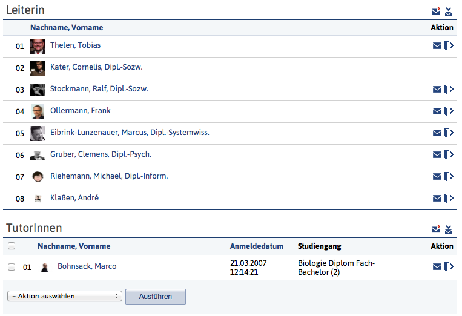

As a general rule, all elements in the content area must be enclosed by suitable objects.
These are usually content boxes (or field areas in forms) or tables.
Texts and input options may not be placed freely on the (white) background.

## Text
Continuous text should be structured in Stud.IP by using semantically appropriate HTML attributes. This also applies to the formatting of the text image. The content and logical structure of the text is thus transferred to the source code. This not only makes the text more readable for the developer, but also more accessible for screen readers.

### Overview of HTML markups

### Headings
Headings are no longer used in the content area since Stud.IP 4.0. Corresponding markups of headings may only be used in the content of the respective function (such as wiki texts, information pages or forum posts), but are no longer used to structure or describe the content area.

### Simple lists and enumerations
The `<ul>` markup is used to display simple lists in Stud.IP.
Corresponding list elements are inserted using `<li>`. Lists are also enclosed by structuring elements (usually content boxes).

Example:

```html
<ul>
<li> Entry 1</li>
<li> Entry 2</li>
...
<li> Entry N</li>
</ul>
```

## Audio / Video
TODO

## Lightbox
Simple image galleries can be created in Stud.IP by including and linking a preview of the image. This link is given the attribute `data-lightbox`, whereby the linked image is then displayed in a dialog-like "lightbox". If several images are to be combined, the attribute `data-lightbox` of all linked images must be filled with the unique name of the corresponding lightbox, e.g. `data-lightbox="blubber"`.

## Tables

Stud.IP has a standardized and simple table layout that should be used for all tabular representations. The core elements are a very easy-to-use CSS and a pleasant and unobtrusive graphic design.

A table is structured roughly as in this example of the participant page:



### Structure & elements
Each table consists of a label for the entire table, the header row with the column labels, optional separator rows to separate segments in tables, a footer row and the normal table rows. Tables themselves are transparent, the background color (simple white in Stud.IP) shines through.

The columns are structured as follows:

* Area for bulk actions: If bull actions are provided, these take up the first column. In this case, the first column consists of checkboxes; a checkbox for activating all checkboxes must be provided in the header.
* Icon: The appropriate icon for the object
* Name/Label: The name of the object that represents the table row. The name is usually clickable if it enables access to the object (e.g. download in the file area, link to the event on the "My events" page).
* Further columns with the name of the author/creator, further metadata of an object
* Action column: This either takes up to three action elements (in the form of icons), or, if more than three actions are possible, the action menu. This one is defined here:

Clicking on the header of a column sorts it, if sensibly possible. Another click reverses this sorting.

Action elements can also be found in the following places:

* Elements that refer to the entire table: Above the table (label row) in the form of icons/action menu.
* Elements that refer to a row: Per column on the right-hand side in the form of icons/action menu.
* Elements that refer to selected rows: In the footer of the page with associated checkboxes on the left-hand side in each table row (The checkbox in the table header next to the column headings marks all visible rows in the table).

### CSS

The following example illustrates a simple table that is structured according to current specifications:

```html
<table class="default">
  <caption>
      <span class="actions">
         <!-- Area for action icons that encompass the entire table -->
      </span>
    Tutors
  </caption>
  <colgroup>
      <col style="width: 20%">
      <col>
      <col style="width: 80%">
  </colgroup>
  <thead>
    <tr class="sortable">
      <th>No.</th>
      <th>Last name, first name</th>
      <th style="text-align: right">Actions</th>
    </tr>
  </thead>
  <tbody>
    <tr>
      <td style="text-align: right">01</td>
      <td>Kater, Cornelis</td>
      <td>
        <!-- Area for action icons that include the row table -->
      </td>
    </tr>
  </tbody>
  <tfoot>
    \\
    <tr>
      <td colspan="3">
        <!-- Area for action icons that cover the entire table -->\\
      </td>
    </tr>
  </tfoot>
</table>
```


The example shows that relatively few CSS styles need to be used to achieve the standard Stud.IP design. The table is defined as a default class, which already results in most of the appearance.
Not shown in the example is a separate class called `collapsable`, which is assigned in a `<tboby>` element
element if tables have sections that are divided into themselves (and can also be collapsed).

Further notes:

* Each table must have a label that clearly identifies the table
* Additional design elements should not be introduced (if necessary, please consult the GUI group)
* Table areas can be designed to be expandable and collapsible
* Hierarchical table structures are no longer planned for the future. Instead, selecting a node (which usually corresponds to a row) should jump to the next level, which is then displayed in full (higher levels are hidden). An example of this is the implementation of the file area as of Stud.IP 4.0
* This new table layout only applies to purely tabular displays. System areas that previously used tables to influence the general page layout must not be converted to these styles. It is recommended that you either retain the existing look (for the time being) or create new ones without HTML table structures. Forms are generally the better alternative here.
